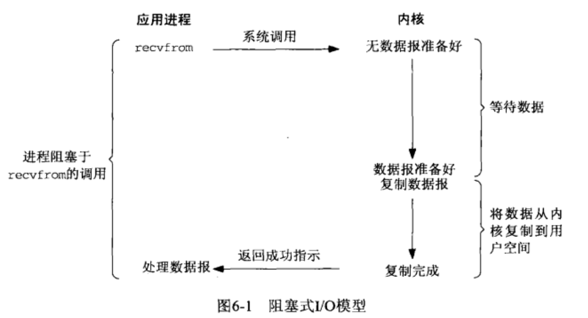
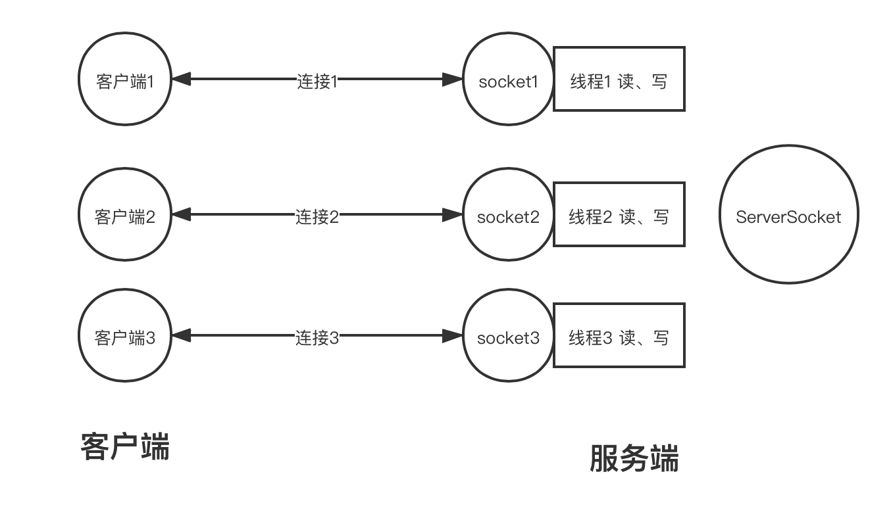
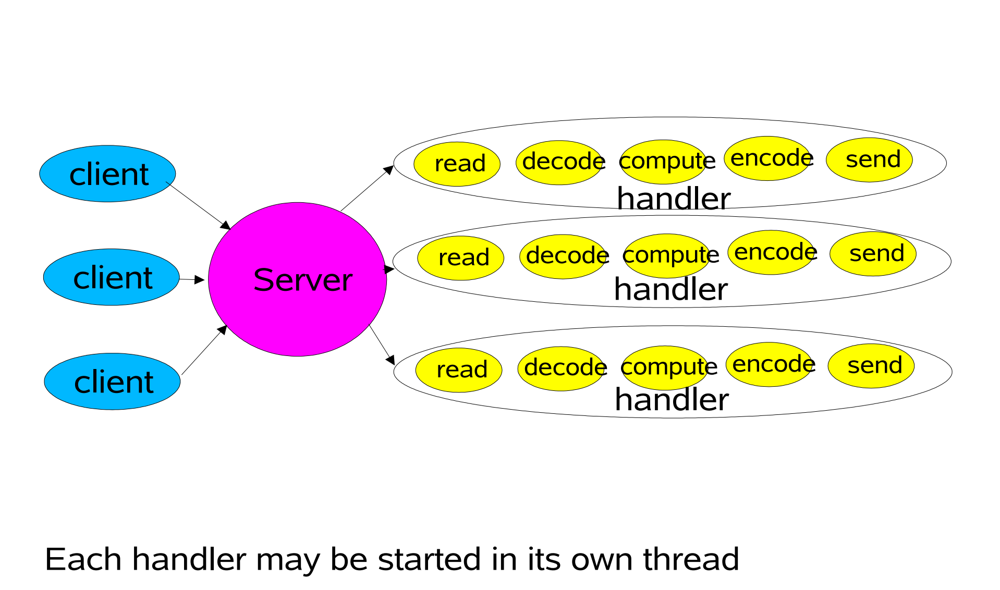
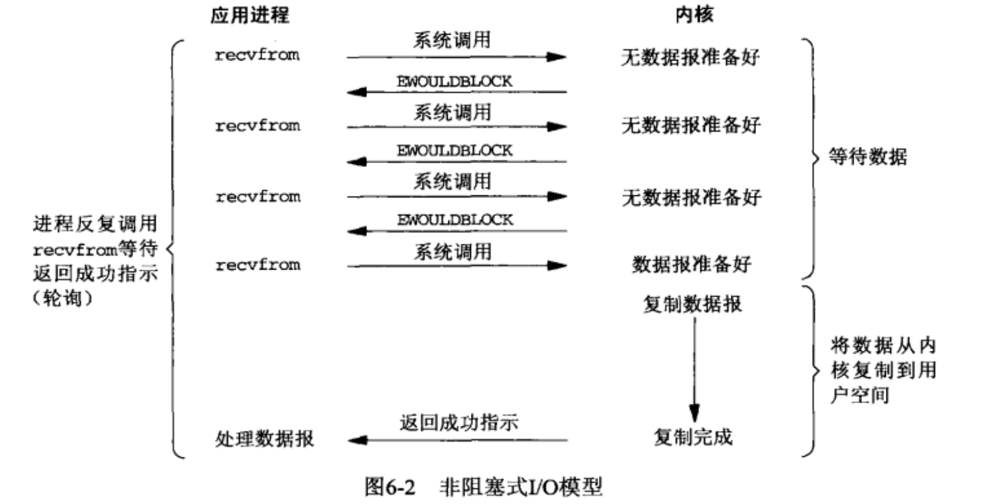
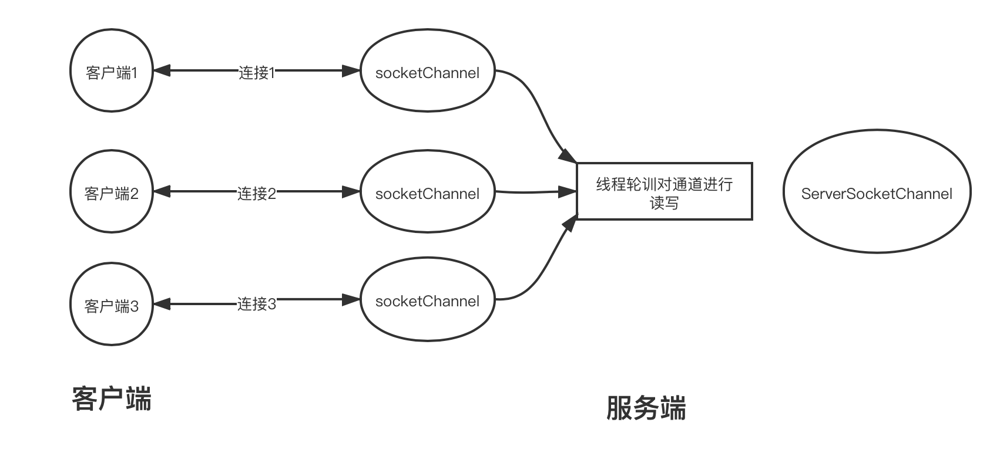
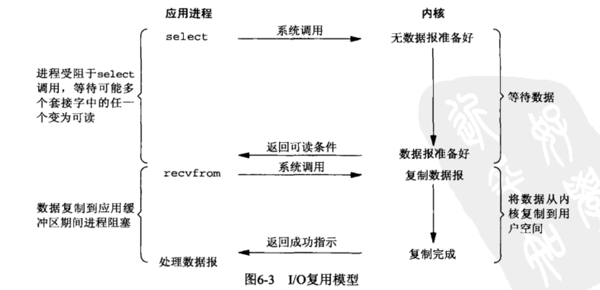
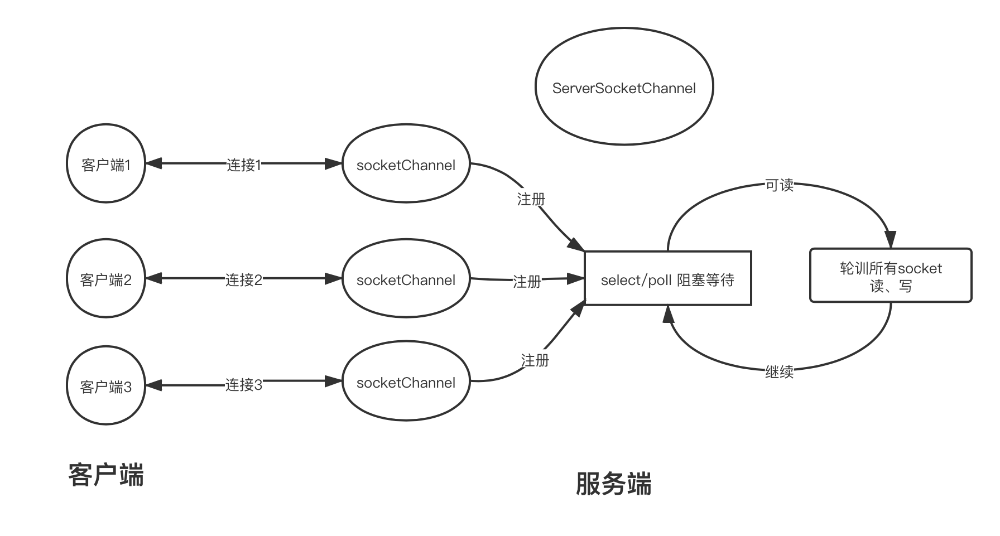
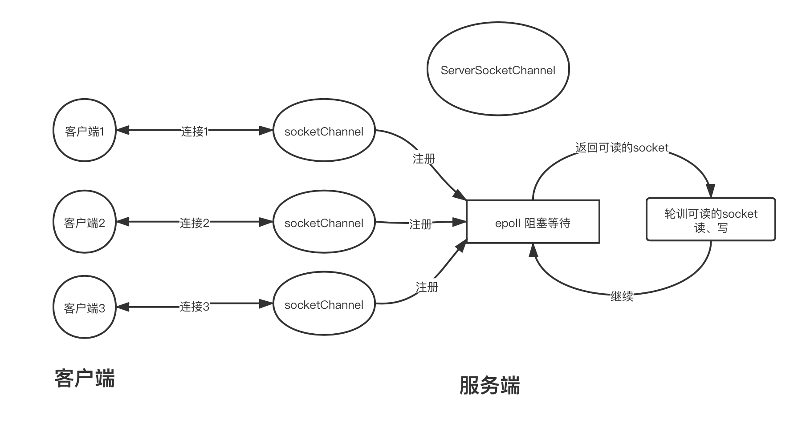

# I/O模型

## 阻塞式I/O

执行`recvfrom`系统调用时, 进程由用户态切换为内核态, 并等待数据(等待过程, 不会参与CPU调度). 直到磁盘/网卡数据准备完毕, 触发中断,  内核进程唤醒, 将数据读取至内核,并在切换为用户态前, 将数据从内核拷贝至用户空间

(图片摘自《UNIX网络编程》)


站在Java角度, 使用socket编程时, 如果采用的是阻塞式I/O, 那么socket进行`read()`时, 会阻塞当前线程; 为了不对其它socket(1个连接对应1对socket)产生影响, 会采用一线程一socket的方式; 这种方式, 在有大量连接时, 会创建大量的线程, 对服务端会造成很高的负载.



和Doug Lea大神画的图类似


## 非阻塞I/O

同样还是执行`recvfrom`系统调用 (socket被标记为非阻塞), 数据未准备好时, 会立即返回`EWOULDBLOCK`错误. 需要对`recvfrom`进行多次调用, 不断的对内核进行轮训, 直到返回成功.



不过, 这种方式打破了阻塞式I/O 1个socket1个线程的局限性, 可以采用单个线程对多个socket进行轮训, 节约资源

Java NIO中, 可通过`configureBlocking(boolean)`方法给`SocketChannel`和`ServerSocketChannel`配置非阻塞模式
```java
// Java NIO, 配置非阻塞
public abstract class AbstractSelectableChannel
    extends SelectableChannel
{
    public final SelectableChannel configureBlocking(boolean block) {
        // ...
    }
}
```



可以对socketChannel中数据的读、解码、处理、编码、写放在异步的线程池中进行处理, 避免一个socketChannel长时间的处理对其它通道的影响; 

该方式方式有一个明显的瓶颈, 就是随着连接数的增加, 轮训的效率会不断的降低, 如果有上万的连接, 那么每次则需要轮训1万次; 并且即时当前所有的通道都没有可读的数据, 也要进行轮训, 比较盲目, 白白的浪费CPU资源;

## 多路复用I/O

`select`, `poll`和`epoll`系统调用, 提供了多路复用I/O的支持, 可以在单个进程中等待多个文件描述符  



其中`select, poll`比较相似, 当其中某个socket可读时, `poll`或`select`方法才会返回, 但是之后还是要对所有的描述进行进行轮训



而`epoll`操作, 当其中某个socket可读时, 返回的是可读的文件描述符号, 避免了对所有描述符的轮训



## 信号驱动I/O

## 异步I/O