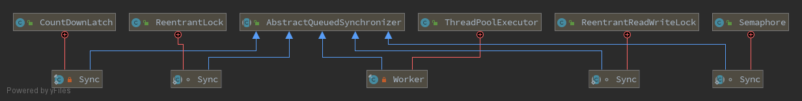

# Java队列同步器及相关组件
> 拖的稍微有点久了, 是时候写一下了...
## Java队列同步器
### 概述
队列同步器指的是`AbstractQueuedSynchronizer`简称`AQS`, 顾名思义, 它是一个以队列的方式来进行多线程同步的基础组件. 在Java中, 它是一个抽象类, 子类可以有选择的实现以下方法, 来定制不同功能的同步器.
```java
protected boolean tryAcquire(int arg)
protected boolean tryRelease(int arg)
protected int tryAcquireShared(int arg)
protected boolean tryReleaseShared(int arg)
protected boolean isHeldExclusively()
```
我们平常较为常见的`ReentrantLock`(可重入锁)、`CountDownLatch`(倒计时栓、发令枪)、`Semaphore`(信号量)、`ReentrantReadWriteLock`(可重入读写锁)等(其实也就这些O(∩_∩)O)都是基于它实现的, 另外在[线程池`ThreadPoolExecutor`](ThreadPoolExecutor.md)中也有它的影子.

这里我们先介绍`AQS`基本属性和同步队列, 之后再根据其各个组件深入分析.
### 基本属性
1. `exclusiveOwnerThread` 独占模式时的独占线程, 比如`ReentrantLock`以及`ReentrantReadWriteLock`中的`写锁`都是独占模式, 某个同步方法/块在同一时刻最多只能有一个线程能够访问. 
2. `state` 同步状态, 子类常常根据状态值, 来判断获取许可(`tryAcquire`或`tryAcquiredShared`)是否成功, 以及根据`compareAndSetState`CAS方法修改状态值来释放许可(`tryRelease`或`tryReleaseShared`)
```java
private volatile int state;

protected final int getState() {
    return state;
}

protected final void setState(int newState) {
    state = newState;
}

protected final boolean compareAndSetState(int expect, int update) {
    return unsafe.compareAndSwapInt(this, stateOffset, expect, update);
}
```
3. `head`和`tail` 队列的首尾节点, 初始时, 两个节点都为空(表示没有线程加入过等待队列)
```java
private transient volatile Node head;
private transient volatile Node tail;
```
### 同步队列
同步队列或者等待队列, 是一种**CLH**锁队列. 在Java AQS中, 它是一个双向队列, 除了头节点外, 每一个节点一般都会有一个等待线程, 并线程的控制信息(状态`status`)持有在节点的前驱节点中. 
> The wait queue is a variant of a "CLH" (Craig, Landin, and Hagersten) lock queue.
#### 等待节点
1. 节点类型  
    独占和共享, 用于表示节点的后置节点等待是一个独占锁还是共享锁. 一般同步器`ReentrantReadWriteLock`都只会采用一种模式除了, 独占模式(实现`tryAcquire`、`tryRelease`方法)或共享模式(实现`tryAcquireShared`、`tryReleaseShared`方法). 而在`ReentrantReadWriteLock`中, 独占节点则对应的是写锁, 共享节点则对应的是读锁.
    ```java
    static class Node {
        /** Marker to indicate a node is waiting in shared mode */
        static final Node SHARED = new Node();
        /** Marker to indicate a node is waiting in exclusive mode */
        static final Node EXCLUSIVE = null;

        Node nextWaiter;

        final boolean isShared() {
            return nextWaiter == SHARED;
        }
    }
    ```
2. 等待状态  
    **CANCELLED** 取消状态, 比如说等待线程被中断, 节点状态则会变为取消状态  
    **SIGNAL** 等待通知, 表示节点的后置节点的线程在park状态或不久就会被为park状态  
    **CONDITION** 条件等待, 当前节点在条件等待队列, `ReentrantLock`、`ReentrantReadWriteLock`  
    **PROPAGATE** 传播, 只有头节点会使用, 下一个`acquireShared`应该无条件传播?? **暂时不管**  
    ```java
    static class Node {
        /** waitStatus value to indicate thread has cancelled. */
        static final int CANCELLED =  1;
        /** waitStatus value to indicate successor's thread needs unparking. */
        static final int SIGNAL    = -1;
        /** waitStatus value to indicate thread is waiting on condition. */
        static final int CONDITION = -2;
        /**
            * waitStatus value to indicate the next acquireShared should
            * unconditionally propagate.
            */
        static final int PROPAGATE = -3;

        volatile int waitStatus;
    }
    ```
#### 相关方法
> 这里参考的Java 11版本的代码, 和Java 8会有些区别
1. 入队  
    队列初始状态, `head` = `tail` = null, 因此`tail`为`null`, 需要对队列进行初始化. 同时入队操作采用CAS修改尾部节点的方式来保证线程安全.
    ```java
    private Node enq(Node node) {
        for (;;) {
            Node oldTail = tail;
            if (oldTail != null) {
                node.setPrevRelaxed(oldTail);
                if (compareAndSetTail(oldTail, node)) {
                    oldTail.next = node;
                    return oldTail;
                }
            } else {
                initializeSyncQueue();
            }
        }
    }

    private Node addWaiter(Node mode) {
        Node node = new Node(mode);

        for (;;) {
            Node oldTail = tail;
            if (oldTail != null) {
                node.setPrevRelaxed(oldTail);
                if (compareAndSetTail(oldTail, node)) {
                    oldTail.next = node;
                    return node;
                }
            } else {
                initializeSyncQueue();
            }
        }
    }
    ```
2. CAS修改尾部节点  
    Java11中, 借助于VarHandle(Java 9中引入)实现
    ```java
    // @version 11
    private static final VarHandle TAIL;

    static {
        try {
            MethodHandles.Lookup l = MethodHandles.lookup();
            TAIL = l.findVarHandle(AbstractQueuedSynchronizer.class, "tail", Node.class);
        } catch (ReflectiveOperationException e) {
            throw new ExceptionInInitializerError(e);
    }

    private final boolean compareAndSetTail(Node expect, Node update) {
        return TAIL.compareAndSet(this, expect, update);
    }
    ```
    Java8中, 借助于Unsafe实现, 通过计算出`tail`在`AbstractQueuedSynchronizer`对象中的偏移地址, 通过CAS修改该地址处数据.  
    我们如果需要原子修改引用对象的话, 1.8版本可以借助于`AtomicReferenceFieldUpdater`来实现, 原理和这里类似. 如果Java版本为1.9以上版本时, 可以参考使用`VarHandle`. 至于性能, **TODO 以后可以做个测试**
    ```java
    // @version 1.8
    private static final Unsafe unsafe = Unsafe.getUnsafe();
    private static final long tailOffset;

    static {
        try {
            tailOffset = unsafe.objectFieldOffset
                (AbstractQueuedSynchronizer.class.getDeclaredField("tail"));
        } catch (Exception ex) { throw new Error(ex); }
    }

    private final boolean compareAndSetTail(Node expect, Node update) {
        return unsafe.compareAndSwapObject(this, tailOffset, expect, update);
    }
    ```
3. 队列初始化, 同样采用CAS操作保证并发初始化只有一次会成功 
    ```java
    /**
     * Initializes head and tail fields on first contention.
     */
    private final void initializeSyncQueue() {
        Node h;
        if (HEAD.compareAndSet(this, null, (h = new Node())))
            tail = h;
    }
    ```

至此, 基础部分介绍的差不多了, 接下来, 我们从以下同步器的实现来对ASQ进行进行深入分析.

## ReentrantLock

## CountDownLatch

## Semaphore

## ReentrantReadWriteLock