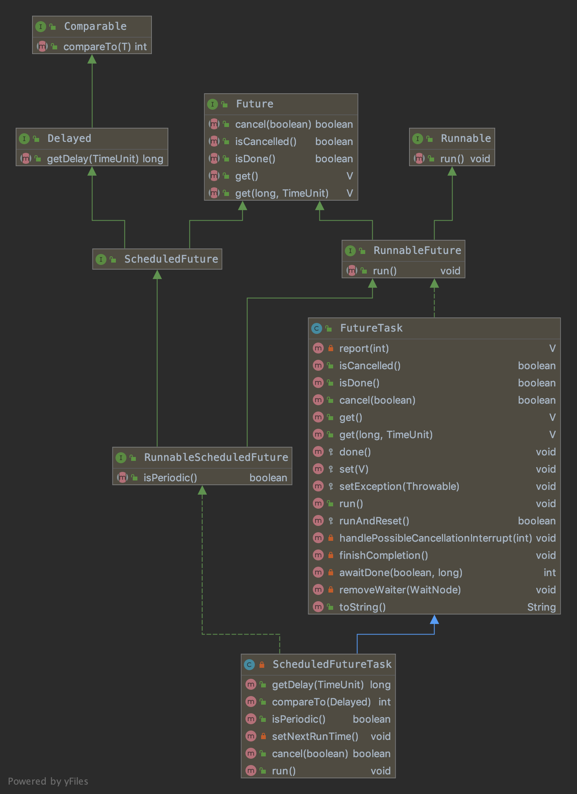
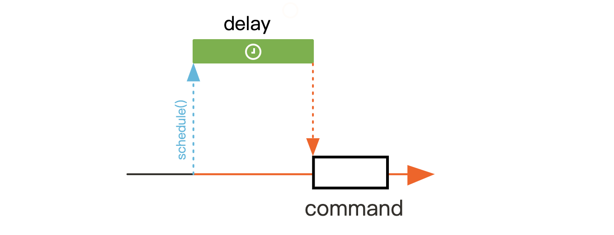
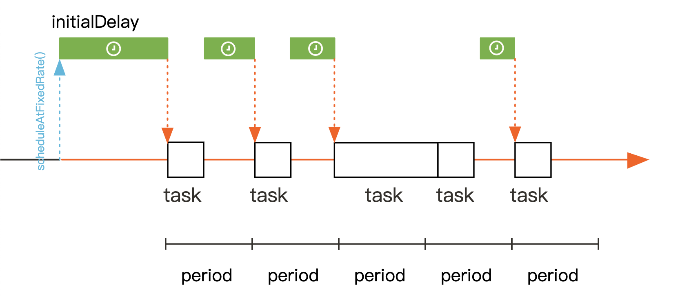
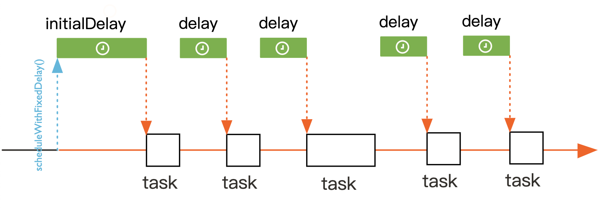

# Java任务调度

## 概述
Java并发包中`ScheduledExecutorService`接口定义了3种任务调度方式
1. 延迟执行
2. 固定频率执行
3. 固定延迟执行
```java
package java.util.concurrent;

public interface ScheduledExecutorService extends ExecutorService {
    // 延迟执行
    public ScheduledFuture<?> schedule(Runnable command, long delay, TimeUnit unit);
    
    // 延迟执行
    public <V> ScheduledFuture<V> schedule(Callable<V> callable, long delay, TimeUnit unit);

    // 周期性执行 固定频率
    public ScheduledFuture<?> scheduleAtFixedRate(Runnable command, long initialDelay,
                                                 long period, TimeUnit unit);
    // 周期性执行 固定延迟
    public ScheduledFuture<?> scheduleWithFixedDelay(Runnable command, long initialDelay,
                                                 long delay, TimeUnit unit);
}
```
`ScheduledThreadPoolExecutor`任务调度线程池是一个实现了`ScheduledExecutorService`接口的特殊线程池(ThreadPoolExecutor子类), 其工作队列采用的是延迟工作队列`DelayWorkQueue`(**一个由数组实现的堆结构**), 非核心线程或者允许核心线程超时时, 线程的存活时间默认为10毫秒. 
```java
package java.util.concurrent;

public class ScheduledThreadPoolExecutor
        extends ThreadPoolExecutor
        implements ScheduledExecutorService {

    private static final long DEFAULT_KEEPALIVE_MILLIS = 10L;

    public ScheduledThreadPoolExecutor(int corePoolSize) {
        super(corePoolSize, Integer.MAX_VALUE,
                DEFAULT_KEEPALIVE_MILLIS, MILLISECONDS,
                new DelayedWorkQueue());
    }

    // ...
}
```
## 调度任务
由于任务调度池所执行的任务是一种特殊的任务, 因此任务调度线程池中使用`ScheduledFutureTask`来表示调度执行的任务.  
有如下属性
1. `time` 任务开始时间、触发时间 
2. `period` 任务执行周期, 0表示非周期性任务, 正数表示固定频率执行, 负数表示固定延迟执行
3. `heapIndex` 表示该任务在堆中(`DelayWorkQueue`)的索引
```java
ScheduledFutureTask(Runnable r, V result, long triggerTime,
                    long sequenceNumber) {
    super(r, result);
    this.time = triggerTime;
    this.period = 0;
    this.sequenceNumber = sequenceNumber;
}

ScheduledFutureTask(Runnable r, V result, long triggerTime,
                    long period, long sequenceNumber) {
    super(r, result);
    this.time = triggerTime;
    this.period = period;
    this.sequenceNumber = sequenceNumber;
}
```
其类图如下


这里有三种调度任务类型
1. 延迟任务, 任务延迟一段时间后执行, triggerTime为当前时间+`delay`
```java
new ScheduledFutureTask<V>(callable, triggerTime(delay, unit)));
```


2. 固定频率执行, 任务第一次触发时间为当前时间+`initialDelay`, 第二次触发时间为第一次触发时间+`period`
```java
new ScheduledFutureTask<Void>(command, null, triggerTime(initialDelay, unit), unit.toNanos(period));
```

> 之前的错误理解❌: 固定频率执行时, 如果某次任务执行时间较长达到了下次任务的触发时间, 下次任务不会被调度执行(之前错误的认为下次任务会并行执行).

3. 固定延迟执行, 任务第一次触发时间为当前时间+`initialDelay`, 第二次触发时间为第一次任务结束时间+`delay`
```java
 new ScheduledFutureTask<Void>(command, null, triggerTime(initialDelay, unit), unit.toNanos(-delay));
```


## 延迟任务队列

## 工作机制
由于线程池提交的任务都是希望立即执行的(延迟为0), 而任务调度线程池提交的任务一般都不是立即执行, 甚至也有可能后提交的任务被先执行(延迟小). 因此两者的工作线程创建、任务缓存时机会有所不同
1. `ThreadPoolExecutor`在有新任务时, 如果工作线程大小小于核心线程, 则创建核心线程执行任务; 如果工作线程等于核心线程时并且队列没满, 则将任务缓存到队列中;
2. `ScheduledThreadPoolExecutor`在有新任务时, 会先将任务存储到**延迟工作队列**中, 之后如果工作线程大小小于核心线程大小, 则创建核心线程, 否则如果工作线程大小等于0(说明**核心线程大小为0**), 则创建非核心线程

### 调度任务创建
```java
public void execute(Runnable command) {
    schedule(command, 0, NANOSECONDS);
}

public ScheduledFuture<?> schedule(Runnable command,
                                    long delay,
                                    TimeUnit unit) {
    if (command == null || unit == null)
        throw new NullPointerException();
    RunnableScheduledFuture<Void> t = decorateTask(command,
        new ScheduledFutureTask<Void>(command, null,
                                        triggerTime(delay, unit),
                                        sequencer.getAndIncrement()));
    delayedExecute(t);
    return t;
}
```

## Spring任务调度实现