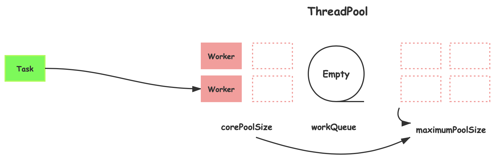
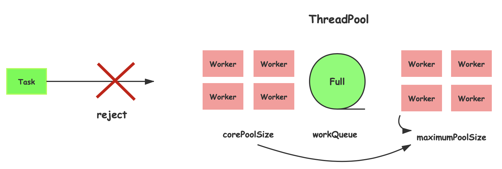
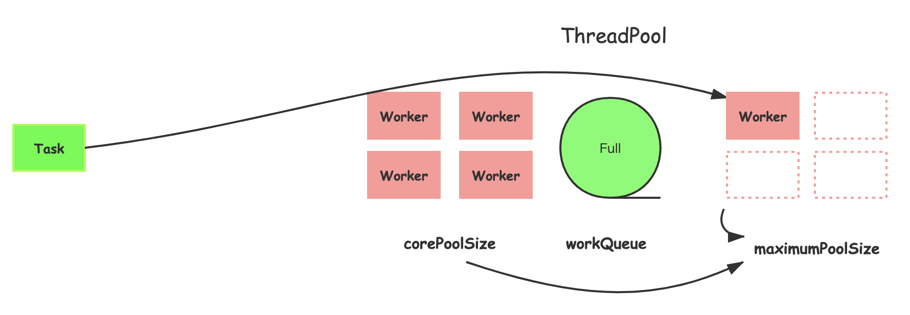
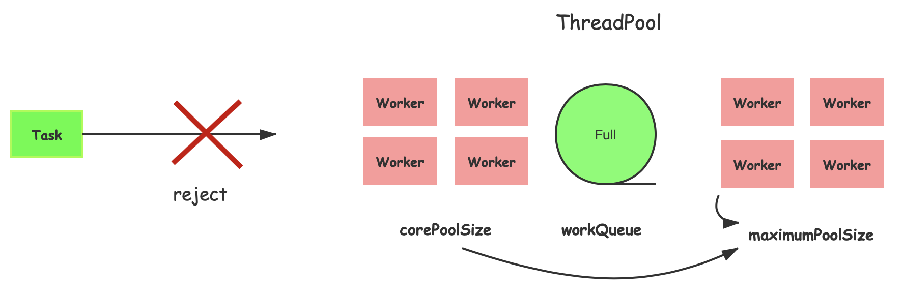
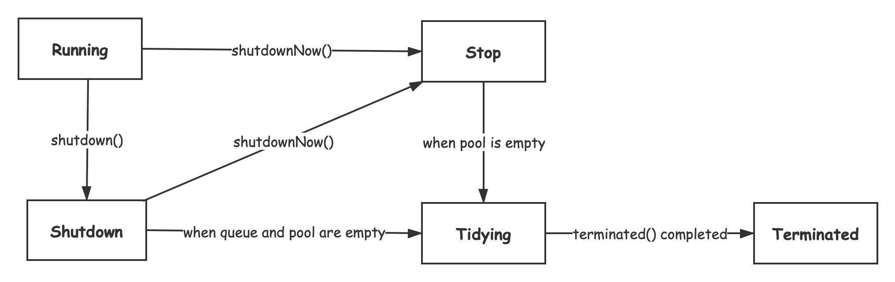

# 深入学习Java线程池及源码分析

- [核心参数](#核心参数)  
  - [corePoolSize](#corePoolSize)  
  - [workQueue](#workQueue)  
  - [maximunPoolSize](#maximunPoolSize)  
  - [keepAliveTime && unit](#keepAliveTime--unit)  
  - [rejectedExecutionHandler](#rejectedExecutionHandler)  
  - [ ] [参数动态配置](#参数动态配置)  
- [Executors介绍](#Executors介绍)  
- [线程池生命周期](#线程池生命周期)  
  - [运行状态](#运行状态)  
  - [生命周期方法](#生命周期方法)  
    - [shutdown()方法](#shutdown-方法)  
    - [shutdownNow()方法](#shutdownNow-方法)  
- [worker线程的生命周期(划重点)](#worker线程的生命周期划重点)  
  - [任务提交](#任务提交)  
  - [worker线程](#worker线程)  
  - [worker线程创建](#worker线程创建)  
  - [worker线程执行](#worker线程执行) 
  - [任务获取](#任务获取) 
  - [worker线程退出](#worker线程退出)  
    - [空闲线程主动退出](#空闲线程主动退出)  
    - [线程中断退出](#线程中断退出)  
    - [工作线程异常退出](#工作线程异常退出)

## 核心参数
`ThreadPoolExecutor`线程池构造函数如下:
```java
public ThreadPoolExecutor(int corePoolSize,
                          int maximumPoolSize,
                          long keepAliveTime,
                          TimeUnit unit,
                          BlockingQueue<Runnable> workQueue,
                          ThreadFactory threadFactory,
                          RejectedExecutionHandler handler)
```
### corePoolSize
corePoolSize 线程池核心大小、基本大小. 当线程池中线程大小小于corePoolSize时, 线程池会每一个新来的任务都创建一个工作线程. 如下图所示:


### workQueue
workQueue 任务队列. 当线程池中线程大小达到corePoolSize时, 新来的任务被放入到工作队列中, 等待空闲下来的工作线程去执行. 如下图所示:

workQueue是一个阻塞队列, 在线程池中常用的实现有: `LinkedBlockingQueue`、`ArrayBlockingQueue`、`PriorityBlockingQueue`、`SynchronousQueue`.

### maximunPoolSize
maimumPoolSize 线程池最大线程数量, 最大活动线程数量, 能同时活动的线程上限. 当工作队列满的时候, 才会创建超出corePoolSize但不会对于maximumPoolSize大小的线程. 如下图所示:


### keepAliveTime && unit
keepAliveTime && unit 线程空闲时间. 超出核心线程数量之外的线程, 如果发生空闲(工作队列为空, 没活干)并且空闲时间达到keepAliveTime时(是时候开除你了), 线程会退出.

### rejectedExecutionHandler
rejectedExecutionHandler 线程的拒绝策略、饱和策略, 即当工作队列填满并且活动线程数量为最大时, 饱和策略则开始生效, 如下图所示：

如下为RejectedExecutionHandler接口
```java
package java.util.concurrent;
public interface RejectedExecutionHandler {
   void rejectedExecution(Runnable r, ThreadPoolExecutor executor);
}
```
线程池有四种饱和策略
1. AbortPolicy 中止策略, 线程池默认的饱和策略, 在任务被拒绝时, 抛`RejectedExecutionException`异常
```java
public void rejectedExecution(Runnable r, ThreadPoolExecutor e) {
    throw new RejectedExecutionException("Task " + r.toString() +
                                         " rejected from " +
                                         e.toString());
}
```
2. DiscardPolicy 抛弃策略, 悄悄的抛弃任务, 不抛异常
```java
// does nothing
public void rejectedExecution(Runnable r, ThreadPoolExecutor e) {
}
```
3. DiscardOldestPolicy 抛弃下一个将被执行的任务, 通俗来说, 也就是最早的任务, 然后尝试重新提交新的任务
```java
public void rejectedExecution(Runnable r, ThreadPoolExecutor e) {
    if (!e.isShutdown()) {
        e.getQueue().poll();
        e.execute(r);
    }
}
```
> 如果队列为优先级队列, 则会移除优先级最高的任务, 因此不要将优先级队列和抛弃最旧饱和策略一起使用
4. CallerRunsPolicy 调用者执行策略, 即线程池不会执行任务, 而是由调用线程(主线程)去执行
```java
public void rejectedExecution(Runnable r, ThreadPoolExecutor e) {
    if (!e.isShutdown()) {
        r.run();
    }
}
```
虽说名字听起来有点高大上, 但是从代码上看起来还是很容易理解的

### 参数动态配置

## Executors介绍
熟悉线程池几个核心的参数后, 现在来看Executors创建线程池的几个静态方法, 会更容易理解.
### newFixedThreadPool 固定大小的线程池
```java
public static ExecutorService newFixedThreadPool(int nThreads) {
    return new ThreadPoolExecutor(nThreads, nThreads,
                                  0L, TimeUnit.MILLISECONDS,
                                  new LinkedBlockingQueue<Runnable>());
```
newFixedThreadPool 核心线程数量等于最大线程数量, 最大空闲时间为0, 线程不会空闲退出. `LinkedBlockingQueue`无参构造函数, 默认队列大小为`Integer.MAX_VALUE`, 因此newFixedThreadPool在任务的处理速度小于任务请求的速率, 那么队列中的任务可能会无限制的增加, 降低系统的吞吐量.
```java
public LinkedBlockingQueue() {
    this(Integer.MAX_VALUE);
}
```
### newCachedThreadPool 可缓存的线程池
```java
public static ExecutorService newCachedThreadPool() {
	return new ThreadPoolExecutor(0, Integer.MAX_VALUE,
    	                          60L, TimeUnit.SECONDS,
        	                      new SynchronousQueue<Runnable>());
```
newCachedThreadPool 核心线程数量为0, 最大线程数量为`Integer.MAX_VALUE`, 线程空闲时间为60s. 同样在任务到来速度如果大于任务处理速度时, 会带来如下问题:
1. 线程创建的开销本来就高, 延迟处理的请求
2. 大量线程频繁竞争CPU资源, 增加额外的性能开销
3. 线程也会大量占用系统资源如内存, 导致OOM

不过如果任务之间有依赖关系,使用newCacheThreadPool时, 不会发生死锁; 而使用有界线程池时, 则可能会导致线程饥饿死锁.
> `SynchronousQueue`用于避免任务排队, 能够将任务从生产者线程移交给工作着线程, 它不是一个真正的队列, 而是一种在线程之间进行移交的机制. <<Java并发编程实战>>

### newSingleThreadExecutor 单线程线程池
```java
public static ExecutorService newSingleThreadExecutor() {
    return new FinalizableDelegatedExecutorService
        (new ThreadPoolExecutor(1, 1,
                                0L, TimeUnit.MILLISECONDS,
                                new LinkedBlockingQueue<Runnable>()));
```

## 线程池生命周期
### 运行状态
线程池有以下5个状态
1. RUNNING 能够接收新任务和处理队列中的任务
2. SHUTDOWN 线程池不接收新任务, 但是会处理队列中的任务
3. STOP 不接受新任务, 也不会处理队列中的任务, 并且会中断处理中的任务
4. TIDYING 所有的任务都已结束, 并且工作线程数量为0, 到该状态后, 会执行行terminated()钩子方法
5. TERMINATED terminated()完成后

如下为线程池状态转化的有向无环图(DGA):


线程池使用了一个`AtomictInteger` ctl(control)来同时表示线程池运行状态以及worker线程数量. 其中Integer类型的高3位表示状态(5个状态, 至少需要3位来表示), 低29位表示工作线程数量(也就是工作线程数量最大为(2^29)-1, 目前肯定是够用的, 即使将来不够用了, 改为AtomicLong也很容易).
```java
private final AtomicInteger ctl = new AtomicInteger(ctlOf(RUNNING, 0));
private static final int COUNT_BITS = Integer.SIZE - 3; // 29
// 计数掩码
private static final int COUNT_MASK = (1 << COUNT_BITS) - 1; // 0b000111......1

// runState is stored in the high-order bits
// 0b111...111 << 29 = 0b111000...000
private static final int RUNNING    = -1 << COUNT_BITS;
//           0 << 29 = 0b000000...000
private static final int SHUTDOWN   =  0 << COUNT_BITS;
//           1 << 29 = 0b001000...000
private static final int STOP       =  1 << COUNT_BITS;
//           2 << 29 = 0b010000...000
private static final int TIDYING    =  2 << COUNT_BITS;
//           3 << 29 = 0b11000...000
private static final int TERMINATED =  3 << COUNT_BITS;

// Packing and unpacking ctl
private static int runStateOf(int c)     { return c & ~COUNT_MASK; }
private static int workerCountOf(int c)  { return c & COUNT_MASK; }
private static int ctlOf(int rs, int wc) { return rs | wc; }
```
`ctl`初始值为`0b111000...000`, 即为运行状态并且当前无工作线程.

**关于掩码**
> 掩码(mask) 在计算机学科及数字逻辑中指的是一串二进制数字，通过与目标数字的按位操作，达到屏蔽指定位而实现需求.
这里则使用了2个掩码
1. 计数掩码(高3位均为0, 低29位均为1)和ctl进行(`&`)与操作进行计数, 见`runStateOf(int c)`方法
2. 状态掩码(计数掩码求反, 高3位均为1, 低29位均为0)与ctl进行与操作获取线程池当前状态, 见`workerCountOf(int c)`方法

### 生命周期方法
```java
package java.util.concurrent;
public interface ExecutorService extends Executor {
    // 不接收新任务, 但是会处理队列中的任务 -> shutdown状态
    void shutdown();
    // 不接收新任务, 也不会处理队列中任务, 并且将队列中没处理的任务返回 -> stop状态
    List<Runnable> shutdownNow();
    // 是否为shutdown状态
    boolean isSutdown();
    // 是否为terminated状态
    boolean isTerminated();
    // 等待线程变为terminated状态
    boolean awaitTermination(long timeout, TimeUnit unit) throws InterruptedException;
}
```
#### shutdown() 方法
```java
public void shutdown() {
    final ReentrantLock mainLock = this.mainLock;
    mainLock.lock();
    try {
        checkShutdownAccess();
        advanceRunState(SHUTDOWN);
        interruptIdleWorkers();
        onShutdown(); // hook for ScheduledThreadPoolExecutor
    } finally {
        mainLock.unlock();
    }
    tryTerminate();
}
```
1. 将线程池运行状态修改为`shutdown`
2. 中断**空闲**线程, 空闲线程指的是工作队列workQueue为Empty
3. 执行onShutdown()钩子方法
4. 尝试终止, 对线程池状态进行判断, 如果满足terminate条件(无工作线程、队列为空、执行完terminated钩子方法), 则状态修改为terminated

#### shutdownNow() 方法
```java
public List<Runnable> shutdownNow() {
    List<Runnable> tasks;
    final ReentrantLock mainLock = this.mainLock;
    mainLock.lock();
    try {
        checkShutdownAccess();
        advanceRunState(STOP);
        interruptWorkers();
        tasks = drainQueue();
    } finally {
        mainLock.unlock();
    }
    tryTerminate();
    return tasks;
}
```
1. 将线程池运行状态修改为`stop`
2. 中断所有**工作**线程(正在执行任务的线程、当前没任务可做的空闲线程)
3. 执行drainQueue方法, 将任务队列中的任务全部移出, 并返回
4. 尝试终止, 此时工作队列已经为空了, 需要判断是否还有运行中的任务


## worker线程的生命周期(划重点)
### 任务提交
代码如下
```java
public void execute(Runnable command) {
    if (command == null)
        throw new NullPointerException();
    int c = ctl.get();
    // step1: 工作线程数量 < corePoolSize
    if (workerCountOf(c) < corePoolSize) {
        if (addWorker(command, true))
            return;
        c = ctl.get();
    }
    // stpe2: 工作线程数量 >= corePoolSize
    if (isRunning(c) && workQueue.offer(command)) {
        int recheck = ctl.get();
        if (! isRunning(recheck) && remove(command))
            reject(command);
        else if (workerCountOf(recheck) == 0) 
            addWorker(null, false);
    }
    // step3: workQueue is full
    else if (!addWorker(command, false))
        reject(command);
}
```
command指的是提交的任务, 这里有3个过程:
1. 如果工作线程数量小于核心线程数量, 则调用`addWorker(command, true)`方法创建一个worker线程去处理任务, 参数true表示创建的线程是核心线程. 
2. 到达这一步, 说明线程池线程大小>=核心线程数. 如果线程是running状态, 并且任务添加至队列成功(队列满了, 则添加失败执行第3步), 这时会重新检查线程状态, 重新检查主要是考虑到在上次检查后发生以下情况
    1. 线程池被shutdown()、shutdownNow(), 这时将该任务从队列中删除, 删除成功后则拒绝, 也有可能删除失败比如执行了shutdownNow()方法导致队列已经为空了
    2. 当前没有工作线程(上次检查后, 存在worker线程退出), 添加一个firstTask=null的工作线程, 它会从对列中拉取任务并执行
3. 到达这一步表明任务队列是满的状态, 这时会创建核心线程之外的线程, 如果线程创建失败(达到最大线程数量maximum), 将任务拒绝

### worker线程
Worker是线程池私有的一个内部类, 继承于`AbstractQueuedSynchronizer`(AQS, 同步器, Java中一些标准同步器都是在它基础上实现的, 如`ReentrantLock`可重入锁、`ReadWriteLock`读写锁, `CountDownLatch`闭锁), worker定制了一些基于`AQS`实现的方法如`lock()`、`tryLock()`、`unlock()`,  来实现[空闲线程中断退出](#被动中断退出)(shutdown()方法中会执行该过程), 保证不中断正在工作线程, 只中断空闲的线程.
```java
private final class Worker
    extends AbstractQueuedSynchronizer
    implements Runnable 
{
    final Thread thread;
    /** Initial task to run.  Possibly null. */
    Runnable firstTask;
    /** Per-thread task counter */
    volatile long completedTasks;

    Worker(Runnable firstTask) {
        setState(-1); // inhibit(禁止) interrupts until runWorker
        this.firstTask = firstTask;
        this.thread = getThreadFactory().newThread(this);
    }

    public void run() {
        runWorker(this);
    }

    protected boolean tryAcquire(int unused) {...}
    protected boolean tryRelease(int unused) {...}

    public void lock()        { acquire(1); }
    public boolean tryLock()  { return tryAcquire(1); }
    public void unlock()      { release(1); }
}
```

### worker线程创建
在任务提交时，会调用`boolean addWorker(firstTask, core)`方法来创建work工作线程, 返回`true`表示创建成功.
```java
private boolean addWorker(Runnable firstTask, boolean core) {
    retry:
    for (;;) {
        int c = ctl.get();
        int rs = runStateOf(c);

        // Check if queue empty only if necessary.
        if (rs >= SHUTDOWN &&
            ! (rs == SHUTDOWN &&
               firstTask == null &&
               ! workQueue.isEmpty()))
            return false;

        for (;;) {
            int wc = workerCountOf(c);
            if (wc >= CAPACITY ||
                wc >= (core ? corePoolSize : maximumPoolSize))
                return false;
            if (compareAndIncrementWorkerCount(c))
                break retry;
            c = ctl.get();  // Re-read ctl
            if (runStateOf(c) != rs)
                continue retry;
            // else CAS failed due to workerCount change; retry inner loop
        }
    }

    boolean workerStarted = false;
    boolean workerAdded = false;
    Worker w = null;
    try {
        w = new Worker(firstTask);
        final Thread t = w.thread;
        if (t != null) {
            final ReentrantLock mainLock = this.mainLock;
            mainLock.lock();
            try {
                // Recheck while holding lock.
                // Back out on ThreadFactory failure or if
                // shut down before lock acquired.
                int rs = runStateOf(ctl.get());

                if (rs < SHUTDOWN ||
                    (rs == SHUTDOWN && firstTask == null)) {
                    if (t.isAlive()) // precheck that t is startable
                        throw new IllegalThreadStateException();
                    workers.add(w);
                    int s = workers.size();
                    if (s > largestPoolSize)
                        largestPoolSize = s;
                    workerAdded = true;
                }
            } finally {
                mainLock.unlock();
            }
            if (workerAdded) {
                t.start();
                workerStarted = true;
            }
        }
    } finally {
        if (! workerStarted)
            addWorkerFailed(w);
    }
    return workerStarted;
}
```
这段代码的前段部分, 采用for循环+CAS操作，来保证工作线程数量的原子性.
后段部分则是创建worker对象这一实例, 并再次判断线程池状态, 是运行态或者shutdown状态但是firstTask不是空时, 则将worker添加对worers工作线程集合中, 之后调用t.start()方法来启动worker线程.

如果worker线程启动失败, 会将woker从wokers集合中移出, 并更新工作线程数量
```java
private void addWorkerFailed(Worker w) {
    final ReentrantLock mainLock = this.mainLock;
    mainLock.lock();
    try {
        if (w != null)
            workers.remove(w);
        decrementWorkerCount();
        tryTerminate();
    } finally {
        mainLock.unlock();
    }
}
```

### worker线程执行
```java
final void runWorker(Worker w) {
    Thread wt = Thread.currentThread();
    Runnable task = w.firstTask;
    w.firstTask = null;
    w.unlock(); // allow interrupts
    boolean completedAbruptly = true;
    try {
        while (task != null || (task = getTask()) != null) {
            w.lock();
            if ((runStateAtLeast(ctl.get(), STOP) ||
                 (Thread.interrupted() &&
                  runStateAtLeast(ctl.get(), STOP))) &&
                !wt.isInterrupted())
                wt.interrupt();
            try {
                beforeExecute(wt, task);
                try {
                    task.run();
                    afterExecute(task, null);
                } catch (Throwable ex) {
                    afterExecute(task, ex);
                    throw ex;
                }
            } finally {
                task = null;
                w.completedTasks++;
                w.unlock();
            }
        }
        completedAbruptly = false;
    } finally {
        processWorkerExit(w, completedAbruptly);
    }
}
                
```

这段代码有点难理解, 把线程中断相关的3个方法都用上了...
```java
if ((runStateAtLeast(ctl.get(), STOP) ||
     (Thread.interrupted() &&
      runStateAtLeast(ctl.get(), STOP))) &&
    !wt.isInterrupted())
    wt.interrupt();
```
1. 如果线程池是stop状态, 并且当前没有被中断(`isInterrupted`), 则将当前线程中断, 也就是确保线程是中断状态
2. 如果线程池不是stop状态, 则检查线程是否中断, 如果是中断的则**清除**中断标记, 再此判断是不是stop状态(即判断线程中断是不是因为shutdownNow()引起的), 是的话, 如果线程没有中断标记的话, 则进行中断

worker工作线程在`getTask()`获取任务后, 在w.lock()前, 如果发生了shutdown()操作, 这时候中断空闲线程`interruptedIdleWorkers`方法中的`w.tryLock()`是可以获取许可的, 这样worker线程就会有一个中断标记, 因此这段代码的作用是为了**清除误中断活跃worker线程的中断标记**.

### 任务获取
从runWorker方法中, 可以得知worker工作线程的生命周期与`getTask()`方法是息息相关的, 如何getTask()返回null, 那么工作线程就会退出; 返回不为null, 工作线程则为继续执行任务, 如果getTask()获取任务阻塞, 工作线程也会阻塞. 
```java
private Runnable getTask() {
    boolean timedOut = false; // Did the last poll() time out?

    for (;;) {
        int c = ctl.get();
        int rs = runStateOf(c);

        // Check if queue empty only if necessary.
        // 线程是SHTUDOWN状态、工作队列为空 或者 线程是stop状态, 则直接退出
        if (rs >= SHUTDOWN && (rs >= STOP || workQueue.isEmpty())) {
            decrementWorkerCount(); // 工作线程减1
            return null; // null, 工作线程将会结束
        }

        int wc = workerCountOf(c);

        // Are workers subject to culling?
        // 是否允许超时的线程退出
        boolean timed = allowCoreThreadTimeOut || wc > corePoolSize; 

        if ((wc > maximumPoolSize || (timed && timedOut))
            && (wc > 1 || workQueue.isEmpty())) { // 保证工作对列不为空时, 要至少还有一个工作线程
            if (compareAndDecrementWorkerCount(c))
                return null; // 工作线程减1成功, 工作线程退出
            continue; // 工作线程数量已经变化, 从新检验
        }

        try {
            Runnable r = timed ?
                workQueue.poll(keepAliveTime, TimeUnit.NANOSECONDS) :
                workQueue.take();
            if (r != null)
                return r;
            timedOut = true;
        } catch (InterruptedException retry) {
            timedOut = false;
        }
    }
}
```

getTask()在以下情况时会返回null, 而导致工作线程退出
1. 线程池是shutdown状态(`shutdown()`), 并且工作队列中无任务
2. 线程池是stop状态(`shutdownNow()`), 直接返回null
3. 工作线程**从工作队列中获取任务超时**, 并且当前线程允许超时退出(允许核心线程超时或者当前工作线程数量大于核心线程数量). 

### worker线程退出

#### 空闲线程主动退出
在允许核心线程超时时或者当前工作线程数量大于核心线程数量时, getTask()方法会采用`poll(keepAlive, timeUnit)`的方式从队列中获取任务, 以此实现空闲线程的退出

#### 线程中断退出
前面已经提到过`shutdown()`和`shutdownNow()`方法时, 都会引起工作的中断
1. 调用shutdown()方法时, 会将线程状态修改为'shutdown', 并中断空闲线程, 使`take()`和`poll()`因中断而结束阻塞, 并且在getTask()方法的下一层循环中, 确保对列为空时退出 
2. 调用shutdownNow()方法时, 会将线程状态修改为'stop', 并中断所有工作线程(空闲线程+非空闲线程), 空闲线程因中断结束阻塞后以及工作线程完成当前任务后, 会在getTask()方法中，因当前线程池状态是stop而返回null, 实现线程退出
```java
private Runnable getTask() {
    for(;;) {
    // ...
        if (rs >= SHUTDOWN && (rs >= STOP || workQueue.isEmpty())) {
            decrementWorkerCount(); // 工作线程减1
            return null; // null, 工作线程将会结束
        }
    // ...
    }
}
```

#### 工作线程异常退出
在runWorker方法中, task.run()方法可能会抛异常而导致工作线程跳出while循环, 而直接退出.