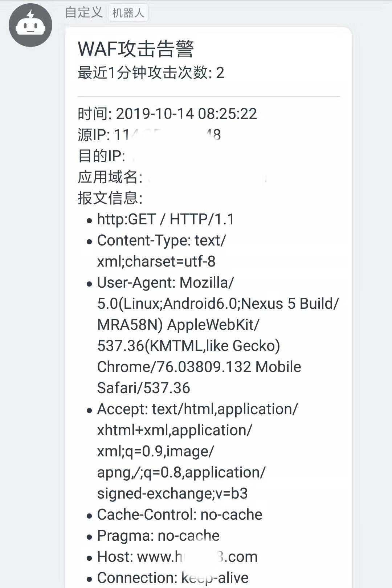

# ELK初体验-WAF攻击日志接入ELK并实现钉钉告警

最近借助ELK实现了WAF设备检测到攻击时的告警功能, 这里简单的记录下实现过程. 

## 远程日志推送至rsyslog
配置`/etc/rsyslog.conf`, 开启远程日志支持, 并配置模板, 远程日志写入`/var/log/remote/`中(这里只接收waf日志)
```conf
# Provides UDP syslog reception
$ModLoad imudp
$UDPServerRun 514

# Provides TCP syslog reception
$ModLoad imtcp
$InputTCPServerRun 514

template(name="waf-remote" type="string" string="/var/log/remote/%fromhost-ip%-waf.log")
if $fromhost-ip == '(此处填写WAF-IP地址)' then ?waf-remote
```

重启rsyslog服务
```shell
systemctl restart rsyslog
```  

## Filebeat日志收集及推送至logstash
### 配置
```yml
#=========================== Filebeat inputs =============================

filebeat.inputs:

- type: log

  # Change to true to enable this input configuration.
  enabled: true

  # Paths that should be crawled and fetched. Glob based paths.
  paths:
    - /var/log/remote/*-waf.log
  fields_under_root: true
  fields:
    type: wafLog

#----------------------------- Logstash output --------------------------------
output.logstash:
  # The Logstash hosts
  hosts: ["*.*.*.*:5044", "*.*.*.*:5044"]
```
### 启动
```shell
# 启动
./filebeat &

# 查看启动结果
tail -f logs/filebeat
```

## Logstash日志解析、增强

> Logstash进行相关配置后也可以直接作为一个`rsyslog`服务器, 前面的过程会有些多余, 不过也没什么关系

## Kibana
### 1.命中规则, 检索最近1分钟内满足`type:wafLog and tag:waf_log_websec`条件的日志, 并且每一分钟触发一次
```yml
"input": {
  "search": {
    "request": {
    "index": [
        "logstash-*"
    ],
    "body": {
        "query": {
        "bool": {
            "must": [
            {
                "match": {
                "type": "wafLog"
                }
            },
            {
                "match": {
                "tag": "waf_log_websec"
                }
            }
            ],
            "filter": {
            "range": {
                "@timestamp": {
                "gte": "now-1m/m",
                "lte": "now/m",
                "format": "epoch_millis"
                }
            }
            }
        }
        }
    }
    }
  }
},
"condition": {
  "script": {
    "script": "payload.hits.total >= 1"
  }
},
"trigger": {
    "schedule": {
    "later": "every 1 minutes"
    }
}
```
### 2.执行动作, 进行钉钉告警
```yml
"actions": {
  "webhook_955d873c-e0c8-4b6a-b738-be68e3bb58ce": {
    "name": "Webhook_waf",
    "throttle_period": "0",
    "webhook": {
    "priority": "low",
    "stateless": false,
    "method": "POST",
    "host": "oapi.dingtalk.com",
    "port": "443",
    "path": "/robot/send?access_token=******",
    "body": "{\"msgtype\":\"markdown\", \"at\":{\"atMobiles\":[\"15******71\"]}, \"markdown\":{\"title\":\"WAF攻击告警\", \"text\": \"## WAF攻击告警\n最近1分钟攻击次数: {{payload.hits.total}}\n{{#payload.hits.hits}}***\n时间: {{transformDate}}\n\n源IP: {{_source.src_ip}}\n\n目的IP: {{_source.dst_ip}}\n\n应用域名: {{_source.domain}}\n\n报文信息:\n- {{msg}}\n{{/payload.hits.hits}}\"}}",
    "params": {
        "watcher": "{{watcher.title}}",
        "payload_count": "{{payload.hits.total}}"
    },
    "headers": {
        "Content-Type": "application/json"
    },
    "auth": "",
    "message": "WAF安全攻击告警",
    "use_https": true
    }
  }
}
```
由于要展示每一条攻击日志的信息, 这里使用到了数组的迭代
```
{{#payload.hits.hits}}
    {{_source.*}}
{{/payload.hits.hits}}
```
> 在钉钉的告警信息中, 如果采用`text`方式的, 会出现许多转义字符: `/`会变为`&#x2F`、`=`会变为`&#x3D`. 采用`markdown`方式, 则不会出现此问题, 很是奇怪.
### 3.sentinl插件使用js脚本对消息进行加工
```yml
"transform": {
  "script": {
    "script": "payload.hits.hits.forEach(function(hit){hit.transformDate=(new Date(hit._source['@timestamp'])).toLocaleString();hit.msg=hit._source.httpMessage.replace(/#015/g,'\\n- ');});"
  }
}
```
## 结果展示

## 参考连接
1. [rsyslog官方文档](https://www.rsyslog.com/doc/master/index.html)
2. [UTF-8 encoding table and Unicode characters](https://www.utf8-chartable.de/unicode-utf8-table.pl?unicodeinhtml=hex)
3. [Logstash最佳实践](http://doc.yonyoucloud.com/doc/logstash-best-practice-cn/index.html)