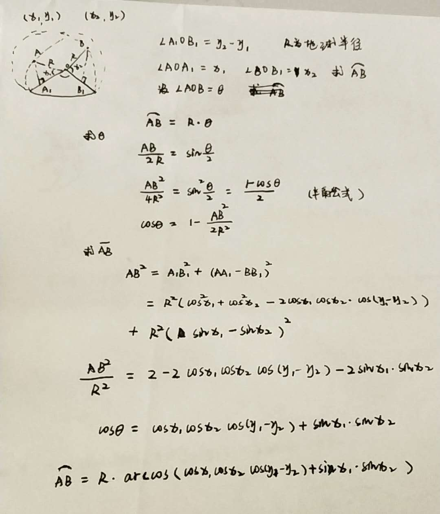

代码实现
```java
public int distanceFrom(Coordinate c2) {
    Coordinate c1 = this;
    double x1 = radian(c1.latitude), y1 = radian(c1.longitude);
    double x2 = radian(c2.latitude), y2 = radian(c2.longitude);
    double radian = Math.acos(Math.cos(x1) * Math.cos(x2) * Math.cos(y2 - y1) + Math.sin(x1) * Math.sin(x2));
    return (int) (EARTH_RADIUS * radian);
}
```