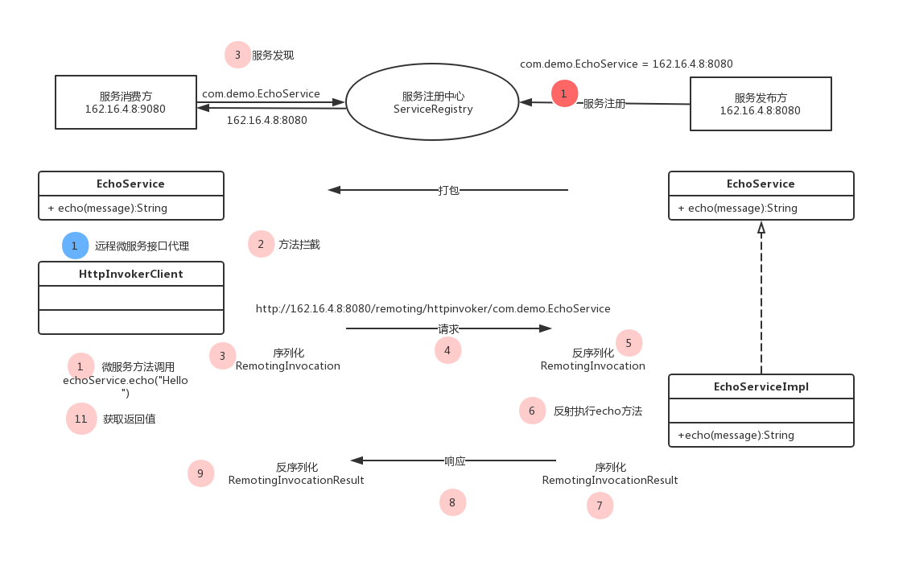

# 微服务--服务消费方

[TOC]

## 概述

想必有使用过铁犀牛微服务的同学对以下的程序都会比较熟悉。服务发布方，编写微服务接口(带有`@Remoting`注解的接口)及其实现，然后将微服务接口打包发送给服务消费方，服务消费方就能够像调用本地接口一样调用微服务接口。

```java
// 服务发布方
@Remoting
public interface EchoService {
    String echo(String message);
}

@Component
public class EchoServiceImpl {
    
    @Override
    public String echo(String message) {
        return message;
    }
}
```

```java
// 服务消费方
@Component
public class FooService {
    @Autowired
    private EchoService echoService;
    
    public void foo() {
        echoService.echo("Hello, world!");
    }
}
```
想必大家或多或少都会有这样一个疑问，微服务接口`EchoService`的实现`EchoServiceImpl`是在服务发布方，而服务消费方没有接口实现，那么为什么该接口能够被成功注入到消费方的组件中呢? 执行微服务接口方法时，消费方做了些什么以及服务发布方又做了些什么？

这里我们就重点分析下铁犀牛微服务的服务消费方。


## 注册微服务接口代理对象

虽然在服务消费方看不到微服务接口的直接实现，但是却能够成功注入到消费方组件中，说明服务消费方的容器中还是存在这样的一个Bean对象的，只是我们没有直接看到而已。

这里铁犀牛使用了Spring框架中的`BeanFactoryPostProcessor`和`FactoryBean`。

`BeanFactoryPostProcessor`是Spring提供的一种容器扩展机制，能够在Spring容器实例化Bean对象之前，对注入到容器的Bean进行修改，当然也可以对Bean进行注册。

```java
package org.springframework.beans.factory.config;

import org.springframework.beans.BeansException;
@FunctionalInterface
public interface BeanFactoryPostProcessor { 
    // 在bean实例化之前，对beanFactory中的bean进行修改
    void postProcessBeanFactory(ConfigurableListableBeanFactory beanFactory) throws BeansException;
}
```
铁犀牛中`AnnotationBeanDefinitionRegistryPostProcessor`通过实现该接口，实现了在容器启动时，通过扫描指定的注解类型(如`@Remoting`、`@JdbcRepository`、`@RestApi`)，来为**每一个**有该注解标注的类或接口都生成一个对应的FactoryBean, 并将该FactoryBean注册到容器中。 如示例中，`FooService`中的注入的`EchoService`就是某个FactoryBean所代理的对象。
```java
package org.ironrhino.core.spring.configuration;

public abstract class AnnotationBeanDefinitionRegistryPostProcessor<A extends Annotation, FB extends FactoryBean<?>>
		implements BeanDefinitionRegistryPostProcessor, EnvironmentAware {
    
    private final Class<A> annotationClass; // 注解类型

	private final Class<FB> factoryBeanClass; // FactoryBean类型

	@Getter
	@Setter
	private String[] packagesToScan; // 扫描的包路径
    
	// 略
}
```
> 注: FactoryBean与BeanFactory的区别, FactoryBean是一个Bean, 而BeanFactory是一个管理Bean的工厂

那么接下来就需要指定是用哪个FactoryBean来代理微服务接口了，如下可以看出铁犀牛中微服务接口是由`HttpInvokerClient`代理的。
```java
package org.ironrhino.core.remoting.client;

@Component
public class RemotingServiceRegistryPostProcessor
		extends AnnotationBeanDefinitionRegistryPostProcessor<Remoting, HttpInvokerClient> {

	@Override
	public void processBeanDefinition(Remoting annotation, Class<?> annotatedClass, RootBeanDefinition beanDefinition)
			throws BeansException {
		MutablePropertyValues propertyValues = new MutablePropertyValues();
		propertyValues.addPropertyValue("serviceInterface", annotatedClass.getName());
		beanDefinition.setPropertyValues(propertyValues);
	}
}
```
以上几个类的关系图如下：


如果对`FactoryBean`不是很熟悉的话，可以看如下示例：
```java
public interface BarService {
    String hello(String message);
} 

@Component
public class BarServiceImpl implements FactoryBean<BarService> {

	private final BarService service;

	public BarServiceImpl() {
		service = s -> s;

	}

	@Override
	public BarService getObject() throws Exception {
		return service;
	}

	@Override
	public Class<?> getObjectType() {
		return BarService.class;
	}

}


public class Main {
    @Autowired
    private BarService barService; 
    @Autowired
    private BarServiceImpl barServiceImpl;
    
    // 注：这里barService和barServiceImpl是不一样的，barService == barServiceImpl.getObject()
}
```


到此我们大概能够知道，在服务消费方容器启动时，`RemotingServiceRegistryPostProcessor`扫描微服务接口，每扫描到一个则向容器中注入一个代理该微服务接口`HttpInvokerClient`。


## HttpInvokerClient

在`FactoryBean`的示例中`BarServiceImpl`仅仅是代理了`BarService`，而`HttpInvokerClient`更为通用，能够代理任何有`@Remoting`标注的接口。
其类关系图如下：


可看出`MethodInterceptorFactoryBean`实现了`MethodInterceptor`方法拦截器，其伪代码如下：

```java
package org.ironrhino.core.spring;

public abstract class MethodInterceptorFactoryBean implements MethodInterceptor, FactoryBean<Object> {
    @Setter
    private volatile ExecutorService executorService; // 线程池 用来支持异步处理
    
    @Autowired(required = false)
    private Validator validator; // 校验器
    
    // ...
    	
    @Override
    public Object invoke(MethodInvocation methodInvocation) throws Throwable {
        // ...
        doInvoke(methodInvocation);
        // ...
    }
    
    protected abstract Object doInvoke(MethodInvocation methodInvocation) throws Throwable;
}
```

其中`invoke`方法做了如下事情：

1. 校验所拦截方法的参数，参数不合法时，可减少请求来回；
2. 如果方法为接口默认方法的话，则不需要向服务发布方发送调用请求；
3. 特殊方法返回类型的处理，如`Callable`、`Future`、`ListenbleFuture`, 通过在一个线程中向服务端发送请求(调用doInvoke方法)，来实现异步支持；
4. 调用doInvoke方法；
5. 返回结果的校验。

doInvoke是一个抽象方法，其具体的实现交给了`MethodInterceptorFactoryBean`子类去完成。

接下来是`FallbackSupportMethodInterceptorFactoryBean`, 用于在远程调用失败后，调用本地的实现(由@Fallback注解标注)，逼格高点的说法叫服务降级。

```java
package org.ironrhino.core.spring;
public abstract class FallbackSupportMethodInterceptorFactoryBean extends MethodInterceptorFactoryBean {
    
	private Object fallback; // 微服务远程接口的本地实现(以@FallFack标注)

	@Override
	public Object invoke(MethodInvocation methodInvocation) throws Throwable {
		try {
			return super.invoke(methodInvocation);
		} catch (Throwable ex) {
			if (shouldFallBackFor(ex)) {
			    // ...
			        
			    // ...
				return methodInvocation.getMethod().invoke(fallback, methodInvocation.getArguments());
			}
			throw ex;
		}
	}

	protected abstract boolean shouldFallBackFor(Throwable ex);

}
```
最后则是 `HttpInvokerClient`了
```java
package org.ironrhino.core.remoting.client;

public class HttpInvokerClient extends FallbackSupportMethodInterceptorFactoryBean {

	@Getter
    @Setter
    private Class<?> serviceInterface; // 远程微服务接口
	
	@Value("${httpInvoker.serializationType:}")
    private String serializationType; // 序列化类型，默认为Java
    
    @Setter
    @Autowired(required = false)
    private ServiceRegistry serviceRegistry; // 服务注册中心，这里用来服务发现
    
    protected Object doInvoke(MethodInvocation methodInvocation) throws Throwable {
        // ...
    }
}
```
这里`doInvoke`方法主要做了一下如下事情：

1. 获取服务发布方的地址。在服务消费方，服务注册中心用于发现服务，根据微服务接口的全限类型名，如`com.demo.service.EchoService`，来获取服务发布方的服务IP及端口；
   拼服务地址`serviceUrl`,如`http://162.16.4.8:8080/remoting/httpinvoker/com.demo.EchoService`

2. 将拦截到的方法信息以及方法参数信息封装到一个`RemotingInvocation`中，并序列化该对象，写入到请求的输入流中；
3. 发送HTTP请求；
4. 将响应输出流中的信息反序列化为`RemotingInvocationResult`对象，并从该对象中获取远程方法调用的结果。

## 执行流程


