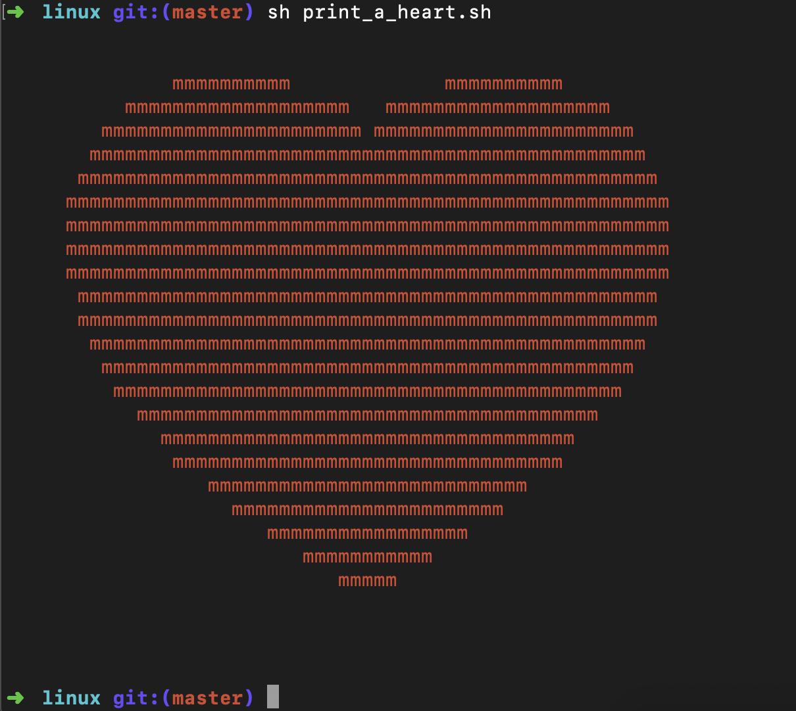

# 使用Shell在终端打印心形图案
这里没有直接使用笛卡尔的心形线公式(做出来有点像屁股), 参考的是知乎上[如何画心形函数](https://www.zhihu.com/question/267069065)的第一个回答.
## 实现过程
1. 心形线公式
```bash
# 心形线 (x^2+y^2-1)^3-(x^2*y^3) = 0
h=0
function heart() {
	h=`echo "$1" "$2"|awk '{printf("%f",($1*$1+$2*$2-1)**3-$1*$1*($2**3))}'`
}
```
2. 原点移动、y轴反转、以及单个字符宽和行高不一致要进行缩放
```bash
# 终端宽和高比例
SCALE="0.45" # 可结合实际结果进行微调
X_LENGTH=60
Y_LENGTH=28
X_LENGTH_HALF=$((X_LENGTH/2))
Y_LENGTH_HALF=$((Y_LENGTH/2))

# 心形线坐标系x坐标
x=0
function xl() {
	mul $(($1 - X_LENGTH_HALF)) $SCALE # 浮点数乘
	div $m 10
	x=$d
}

# 心形线实际y坐标
y=0
function yl() {
	div $((Y_LENGTH_HALF - $1)) 10 # 浮点数除
	y=$d
}
```

## 结果展示


