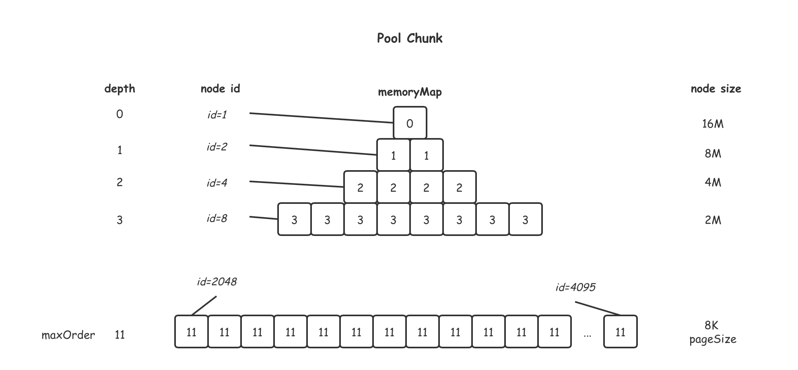
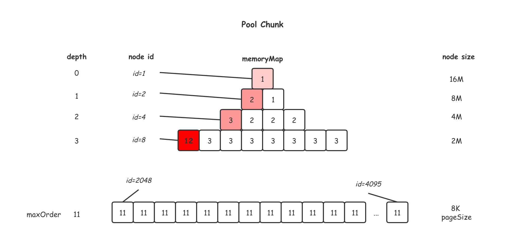
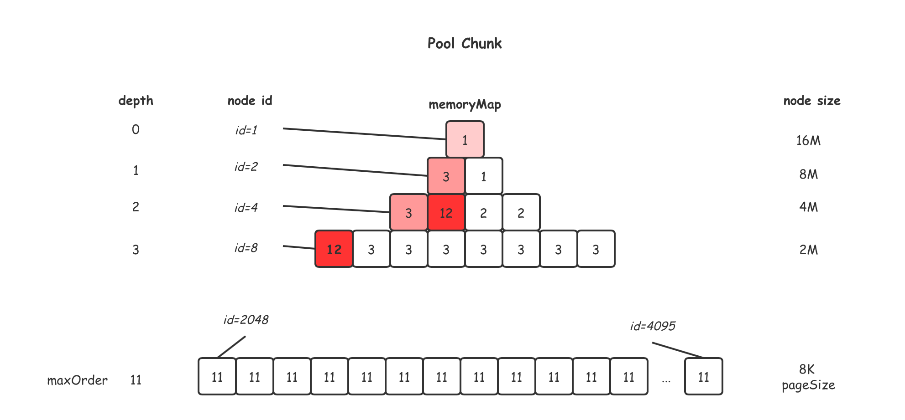
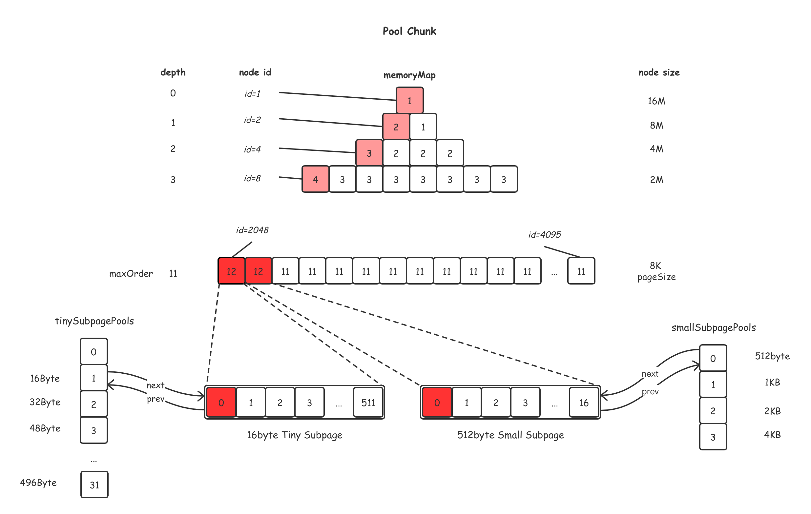

# Netty ByteBuf池化技术

**默认采用的是基于池的ByteBuf分配器**

```java
// DefaultChannelConfig.java
private volatile ByteBufAllocator allocator = ByteBufAllocator.DEFAULT;

// ByteBufAllocator.java
ByteBufAllocator DEFAULT = ByteBufUtil.DEFAULT_ALLOCATOR;

// ByteBufUtil.java
static final ByteBufAllocator DEFAULT_ALLOCATOR;

static {
    String allocType = SystemPropertyUtil.get(
            "io.netty.allocator.type", PlatformDependent.isAndroid() ? "unpooled" : "pooled");
    allocType = allocType.toLowerCase(Locale.US).trim();

    ByteBufAllocator alloc;
    if ("unpooled".equals(allocType)) {
        alloc = UnpooledByteBufAllocator.DEFAULT;
        logger.debug("-Dio.netty.allocator.type: {}", allocType);
    } else if ("pooled".equals(allocType)) {
        alloc = PooledByteBufAllocator.DEFAULT;
        logger.debug("-Dio.netty.allocator.type: {}", allocType);
    } else {
        alloc = PooledByteBufAllocator.DEFAULT;
        logger.debug("-Dio.netty.allocator.type: pooled (unknown: {})", allocType);
    }

    DEFAULT_ALLOCATOR = alloc;
}

// PooledByteBufAllocator.java
public static final PooledByteBufAllocator DEFAULT = new PooledByteBufAllocator(PlatformDependent.directBufferPreferred());
```

**默认优先分配堆外内存**

```java
// PlatformDependent.java
static {
    if (!isAndroid()) {
        // only direct to method if we are not running on android.
        // See https://github.com/netty/netty/issues/2604
        if (javaVersion() >= 9) {
            CLEANER = CleanerJava9.isSupported() ? new CleanerJava9() : NOOP;
        } else {
            CLEANER = CleanerJava6.isSupported() ? new CleanerJava6() : NOOP;
        }
    } else {
        CLEANER = NOOP;
    }

    // We should always prefer direct buffers by default if we can use a Cleaner to release direct buffers.
    DIRECT_BUFFER_PREFERRED = CLEANER != NOOP
                                && !SystemPropertyUtil.getBoolean("io.netty.noPreferDirect", false);    
}

public static boolean directBufferPreferred() {
    return DIRECT_BUFFER_PREFERRED;
}
```

## PooledByteBufAllocator 默认配置

```java

// 页大小
int DEFAULT_PAGE_SIZE = 8192; // (必须是2的次方数 (size & size - 1) == 0 ), 默认为8KB
int MIN_PAGE_SIZE = 4096

int DEFAULT_MAX_ORDER = 11; // [0, 14], 要满足 (pageSize << order) < (MAX_CHUNK_SIZE/2)

// 最大块大小
int MAX_CHUNK_SIZE = (int) (((long) Integer.MAX_VALUE + 1) / 2); // 2的30次方

// 默认每个块大小 
int defaultChunkSize = pageSize << order = 8192 << 11 = 2 << 24; // 16 MB 

// 块的个数, CPU核数的两被, 减少竞争
int defaultMinNumArena = NettyRuntime.availableProcessors() * 2;

// (考虑实际运行时, 堆内存, 堆外内存的大小)
// 堆内 块个数
int DEFAULT_NUM_HEAP_ARENA = Math.min(defaultMinNumArena, runtime.maxMemory() / defaultChunkSize / 2 / 3));
// 堆外 块个数
int DEFAULT_NUM_HEAP_ARENA = Math.min(defaultMinNumArena, PlatformDependent.maxDirectMemory() / defaultChunkSize / 2 / 3)));

int DEFAULT_TINY_CACHE_SIZE = SystemPropertyUtil.getInt("io.netty.allocator.tinyCacheSize", 512);
int DEFAULT_SMALL_CACHE_SIZE = SystemPropertyUtil.getInt("io.netty.allocator.smallCacheSize", 256);
int DEFAULT_NORMAL_CACHE_SIZE = SystemPropertyUtil.getInt("io.netty.allocator.normalCacheSize", 64);


// 32 kb is the default maximum capacity of the cached buffer. Similar to what is explained in
// 'Scalable memory allocation using jemalloc'
int DEFAULT_MAX_CACHED_BUFFER_CAPACITY = 32 *  1024 // 32 KB

boolean DEFAULT_USE_CACHE_FOR_ALL_THREADS = true;
int DEFAULT_DIRECT_MEMORY_CACHE_ALIGNMENT = 0;
```

## PooledByteBufAllocator 构造方法

```java
int chunkSize = 16MB;
int pageShifts =  8; // Integer.SIZE - 1 - Integer.numberOfLeadingZeros(pageSize); // 1 >> 13 = 8192


PoolArena<byte[]>[] heapArenas = newArenaArray(nHeapArena);
List<PoolArenaMetric> metrics = new ArrayList<PoolArenaMetric>(heapArenas.length);
for (int i = 0; i < heapArenas.length; i ++) {
    PoolArena.HeapArena arena = new PoolArena.HeapArena(this,
            pageSize, maxOrder, pageShifts, chunkSize,
            directMemoryCacheAlignment);
    heapArenas[i] = arena;
    metrics.add(arena);
}

PoolArena<ByteBuffer>[] directArenas = newArenaArray(nDirectArena);
List<PoolArenaMetric> metrics = new ArrayList<PoolArenaMetric>(directArenas.length);
for (int i = 0; i < directArenas.length; i ++) {
    PoolArena.DirectArena arena = new PoolArena.DirectArena(
            this, pageSize, maxOrder, pageShifts, chunkSize, directMemoryCacheAlignment);
    directArenas[i] = arena;
    metrics.add(arena);
}

// 维护16byte, 32byte, 48byte ... 496byte大小为单位的PoolSubpage头节点
// static final int numTinySubpagePools = 512 >>> 4; // 32
private final PoolSubpage<T>[] tinySubpagePools;

// 维护以512byte, 1KB, 2KB, 4KB大小为单位的PoolSubpage的头节点
// numSmallSubpagePools = pageShifts - 9; // 4
private final PoolSubpage<T>[] smallSubpagePools;
```

## 内存分配

### 归一化请求容量 

directMemoryCacheAlignment采用默认值(`0`)时

1. 请求容量大于等于512, 则返回不小于它并且离它最近的2的次方数
2. 请求容量小于512, 返回不小它并且离它最近的16的倍数

归一化后, 请求的容量则变为了 `16, 32, 48, 64, 80 ... 496`  `512, 1KB, 2KB, 4KB ...`

```java
// PoolArena.java
int normalizeCapacity(int reqCapacity) {
    if (!isTiny(reqCapacity)) { // >= 512
        // Doubled

        int normalizedCapacity = reqCapacity;
        normalizedCapacity --;
        normalizedCapacity |= normalizedCapacity >>>  1;
        normalizedCapacity |= normalizedCapacity >>>  2;
        normalizedCapacity |= normalizedCapacity >>>  4;
        normalizedCapacity |= normalizedCapacity >>>  8;
        normalizedCapacity |= normalizedCapacity >>> 16;
        normalizedCapacity ++;

        if (normalizedCapacity < 0) {
            normalizedCapacity >>>= 1;
        }
        assert directMemoryCacheAlignment == 0 || (normalizedCapacity & directMemoryCacheAlignmentMask) == 0;

        return normalizedCapacity;
    }


    if (directMemoryCacheAlignment > 0) {
        return alignCapacity(reqCapacity);
    }


    // Quantum-spaced
    if ((reqCapacity & 15) == 0) {
        return reqCapacity;
    }

    return (reqCapacity & ~15) + 16;
}
```

### Pool Chunk 内存分配
首次内存分配, 会从`PoolArena<byte[]> poolArena`中创建 (以分配堆内存为例) 一个`Pool Chunk`内存块, 内部维护一个16M大小的字节数组
```java
// PoolArena$HeapArena.java
@Override
protected PoolChunk<byte[]> newChunk(int pageSize, int maxOrder, int pageShifts, int chunkSize) {
    return new PoolChunk<byte[]>(this, newByteArray(chunkSize), pageSize, maxOrder, pageShifts, chunkSize, 0);
}
```

```java
// PoolChunk.java
PoolChunk(PoolArena<T> arena, T memory, int pageSize, int maxOrder, int pageShifts, int chunkSize, int offset) {
    // ...
    unusable = (byte) (maxOrder + 1);

    maxSubpageAllocs = 1 << maxOrder;

    // Generate the memory map.
    memoryMap = new byte[maxSubpageAllocs << 1];
    depthMap = new byte[memoryMap.length];
    int memoryMapIndex = 1;
    for (int d = 0; d <= maxOrder; ++ d) { // move down the tree one level at a time
        int depth = 1 << d;
        for (int p = 0; p < depth; ++ p) {
            // in each level traverse left to right and set value to the depth of subtree
            memoryMap[memoryMapIndex] = (byte) d;
            depthMap[memoryMapIndex] = (byte) d;
            memoryMapIndex ++;
        }
    }
}
```

这里使用二位数组模拟树形结构, 其中`depthMap`代表节点深度,`memoryMap`代表示节点当前值, 初始值为其深度值. 如果节点值大于`unusable`, 表示当前节点及其子节点不可分配, 如果节点值大于节点深度值, 则表明存在可分配的子节点, 但当前节点不可分配.

如下是一个初始`pool chunk`



如果申请1个2M的内存



再申请1个4M的内存




```java
// PoolChunk.java
private long allocateRun(int normCapacity) { // 2M
    int d = maxOrder - (log2(normCapacity) - pageShifts); // d = 3
    int id = allocateNode(d); // id = 8
    if (id < 0) {
        return id;
    }
    freeBytes -= runLength(id); // 空闲内存减少2M
    return id;
}

private int allocateNode(int d) { // d为希望分配的节点深度值
    int id = 1; // 根节点 id为1 
    int initial = - (1 << d); // has last d bits = 0 and rest all = 1
    byte val = value(id);
    if (val > d) { // unusable 根节点的值大于d, 表示没有充足的内存空间, 不可分配
        return -1;
    }

    // (id & initial) == 0 表示id的深度小于等于d
    while (val < d || (id & initial) == 0) { // id & initial == 1 << d for all ids at depth d, for < d it is 0
        id <<= 1; // 下一层
        val = value(id);
        if (val > d) { 
            // id父节点值小于等于d, id节点值大于d, id右节点值必然小于等于d
            id ^= 1; // id为左节点, id^1则为右节点 (这段代码也太秀了)
            val = value(id);
        }
    }
    byte value = value(id);
    assert value == d && (id & initial) == 1 << d : String.format("val = %d, id & initial = %d, d = %d",
            value, id & initial, d);
    setValue(id, unusable); // mark as unusable
    updateParentsAlloc(id); // 更新父节点的值, 为两个子节点的最小值
    return id;
}
```

### 子页(Tiny/Small)内存分配

容量小于1个PageSize时, 从`tinySubpagePools`或`smallSubpagePools`中找到对应链表的头指针

```java
// PoolArena.java
PoolSubpage<T> findSubpagePoolHead(int elemSize) {
    int tableIdx;
    PoolSubpage<T>[] table;
    if (isTiny(elemSize)) { // < 512
        tableIdx = elemSize >>> 4; // 16 => 1, 32 => 2, 48 => 3, ... 496 => 31
        table = tinySubpagePools;
    } else {
        tableIdx = 0;
        elemSize >>>= 10;
        while (elemSize != 0) {
            elemSize >>>= 1;
            tableIdx ++;
        }
        table = smallSubpagePools; // 512 => 0, 1024 => 1, 2048 => 2, 4096 => 3
    }

    return table[tableIdx];
}
```

```java
// PoolArena.java
private long allocateSubpage(int normCapacity) {
    // Obtain the head of the PoolSubPage pool that is owned by the PoolArena and synchronize on it.
    // This is need as we may add it back and so alter the linked-list structure.
    PoolSubpage<T> head = arena.findSubpagePoolHead(normCapacity);
    int d = maxOrder; // subpages are only be allocated from pages i.e., leaves
    synchronized (head) {
        int id = allocateNode(d); // 寻找空闲页(深度为maxOrder, 节点大小为1页)
        if (id < 0) {
            return id;
        }

        final PoolSubpage<T>[] subpages = this.subpages;
        final int pageSize = this.pageSize;

        freeBytes -= pageSize;

        int subpageIdx = subpageIdx(id); // 当前页对应的subpage, 总页数为2048, sugpages最多也为2048
        PoolSubpage<T> subpage = subpages[subpageIdx];
        if (subpage == null) {
            // 创建PoolSubpage
            subpage = new PoolSubpage<T>(head, this, id, runOffset(id), pageSize, normCapacity);
            subpages[subpageIdx] = subpage;
        } else {
            subpage.init(head, normCapacity);
        }
        return subpage.allocate();
    }
}

private int subpageIdx(int memoryMapIdx) {
    return memoryMapIdx ^ maxSubpageAllocs; // remove highest set bit, to get offset
}
```

创建并初始化子页

```java
PoolSubpage(PoolSubpage<T> head, PoolChunk<T> chunk, int memoryMapIdx, int runOffset, int pageSize, int elemSize) {
    this.chunk = chunk;
    this.memoryMapIdx = memoryMapIdx;
    this.runOffset = runOffset;
    this.pageSize = pageSize;
    bitmap = new long[pageSize >>> 10]; // pageSize / 16 / 64
    init(head, elemSize);
}

void init(PoolSubpage<T> head, int elemSize) {
    doNotDestroy = true;
    this.elemSize = elemSize;
    if (elemSize != 0) {
        maxNumElems = numAvail = pageSize / elemSize; // 可分为多少个elemSize大小的块
        nextAvail = 0;
        bitmapLength = maxNumElems >>> 6; // 位图长度(使用long数组表示, 1个long能够表示64个bit的状态)
        if ((maxNumElems & 63) != 0) {
            bitmapLength ++;
        }

        for (int i = 0; i < bitmapLength; i ++) {
            bitmap[i] = 0;
        }
    }
    addToPool(head);
}

// 追加值head后面
private void addToPool(PoolSubpage<T> head) {
    assert prev == null && next == null;
    prev = head;
    next = head.next;
    next.prev = this;
    head.next = this;
}
```

子页分配

```java
long allocate() {
    if (elemSize == 0) {
        return toHandle(0);
    }

    if (numAvail == 0 || !doNotDestroy) {
        return -1;
    }

    final int bitmapIdx = getNextAvail();
    int q = bitmapIdx >>> 6; // 位图数组索引
    int r = bitmapIdx & 63; // long中第几个bit
    assert (bitmap[q] >>> r & 1) == 0;
    bitmap[q] |= 1L << r; // 设为1 表示已使用

    if (-- numAvail == 0) {
        removeFromPool(); // 满了从链表中删掉
    }

    return toHandle(bitmapIdx); // 
}

// 位图句柄 (高32位 位图索引, 低32位 memoryMap索引)
private long toHandle(int bitmapIdx) {
    return 0x4000000000000000L | (long) bitmapIdx << 32 | memoryMapIdx;
}
```

```java
// PoolChunk.java
void initBuf(PooledByteBuf<T> buf, ByteBuffer nioBuffer, long handle, int reqCapacity) {
    int memoryMapIdx = memoryMapIdx(handle);
    int bitmapIdx = bitmapIdx(handle);
    if (bitmapIdx == 0) {
        // 大于等于1页的分配
        byte val = value(memoryMapIdx);
        assert val == unusable : String.valueOf(val);
        buf.init(this, nioBuffer, handle, runOffset(memoryMapIdx) + offset,
                reqCapacity, runLength(memoryMapIdx), arena.parent.threadCache());
    } else {
        // subpage分配
        initBufWithSubpage(buf, nioBuffer, handle, bitmapIdx, reqCapacity);
    }
}
```

后续如果有分配好的子页, 直接使用
```java
    private void allocate(PoolThreadCache cache, PooledByteBuf<T> buf, final int reqCapacity) {
        final int normCapacity = normalizeCapacity(reqCapacity);
        if (isTinyOrSmall(normCapacity)) { // capacity < pageSize

            // ...

            final PoolSubpage<T> head = table[tableIdx];

            /**
                * Synchronize on the head. This is needed as {@link PoolChunk#allocateSubpage(int)} and
                * {@link PoolChunk#free(long)} may modify the doubly linked list as well.
                */
            synchronized (head) {
                final PoolSubpage<T> s = head.next;
                if (s != head) {
                    assert s.doNotDestroy && s.elemSize == normCapacity;
                    long handle = s.allocate(); // 已有分配好的elemSize等于normCapacity的subpage
                    assert handle >= 0;
                    s.chunk.initBufWithSubpage(buf, null, handle, reqCapacity);
                    incTinySmallAllocation(tiny);
                    return;
                }
            }
        }

        // ...
    }
```

如下从初始PoolChunk中连续分配16字节, 512字节的ByteBuf示意图

