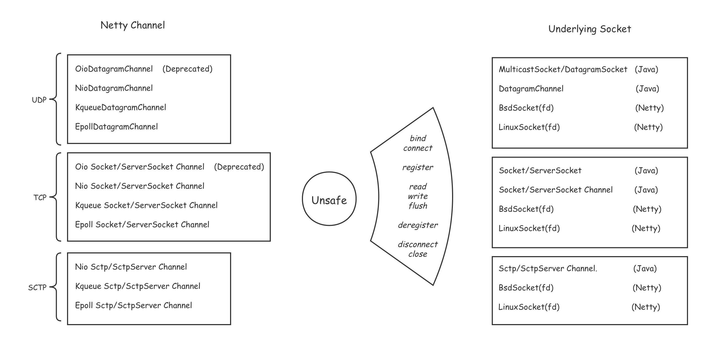
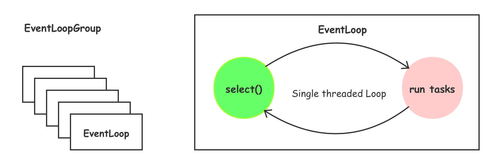
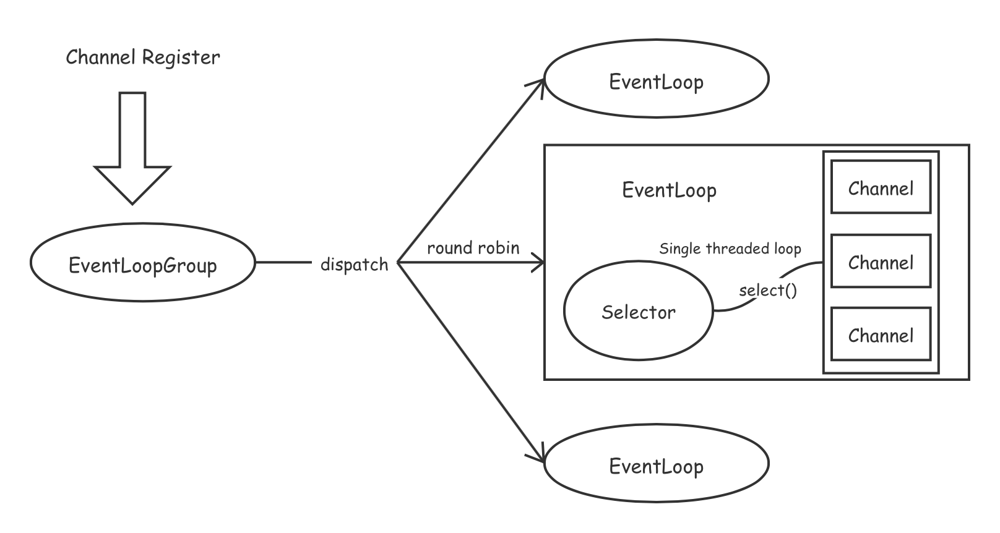
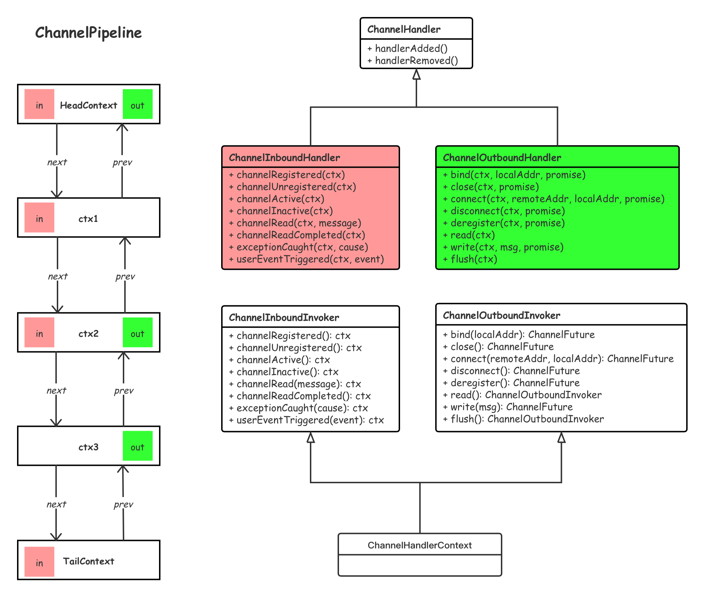

# Netty 组件

## Channel

Netty自己定义了一套`channel`的API, 可通过其`unsafe()`中相关方法来操控底层`Socket`. 可以和Java里面的`Socket`或`SocketChannel`对应起来理解



## EventLoopGroup 和 EventLoop

EventLoop 事件循环, 单线程不断执行获取到的任务(事件). 一个事件循环对应一个`selector`, 可以注册多个`channel`

EventLoopGroup 事件循环组, 由一组事件循环组成. 组中有多少个事件循环, 则会创建多少个线程.



通常`channel`的注册, 是注册至事件循环组中, 之后循环组采用负载均衡的方式注册到某个事件循环中



## ChannelHandler和ChannelPipeline

`ChannelHandler` 通道处理器, 用来处理`channel`的各种事件.

`ChannelPipeline` 由`ChannelHandlerContext`组成的双向链表, 每一个`ChannelHandler`在`pipeline`中以`ChannelHandlerContext`的形式存在



## ServerBootstrap和Bootstrap

ServerBootstrap 服务端启动类

`group()`方法用于指定*父事件循环组*, *子事件循环组*

`channel()`表示向`父事件循环组`注册的通道类型, 后续绑定端口时, 会通过反射初始化一个`父通道`注册至`父事件循环组`中.

`handler()`用于向父通道管道中添加通道处理器, 其中在通道初始化时, 默认会添加`ServerBootstrapAcceptor`处理器, 用于处理连接, 将生成的`子通道`(如SocketChannel)注册至`子事件循环组`中

`childHandler()`向`子通道`管道中添加通道处理器


```java
EventLoopGroup boss = new NioEventLoopGroup(1);
EventLoopGroup worker = new NioEventLoopGroup();

try {
    ServerBootstrap serverBootstrap = new ServerBootstrap();
    serverBootstrap.group(boss, worker).channel(NioServerSocketChannel.class).childHandler(new ChannelInitializer<NioSocketChannel>() {
        @Override
        protected void initChannel(NioSocketChannel ch) throws Exception {
            ChannelPipeline cp = ch.pipeline();
            cp.addLast(new LengthFieldBasedFrameDecoder(Integer.MAX_VALUE, 0, 4, 0, 4));
            cp.addLast(new LengthFieldPrepender(4));
            cp.addLast(new StringDecoder(StandardCharsets.UTF_8));
            cp.addLast(new StringEncoder(StandardCharsets.UTF_8));
            cp.addLast(new EchoServerHandler());
        }
    });
    ChannelFuture channelFuture = serverBootstrap.bind(8080).sync();
    channelFuture.channel().closeFuture().sync();
} finally {
    boss.shutdownGracefully();
    worker.shutdownGracefully();
}
```

Bootstrap 客户端启动类

```java
EventLoopGroup worker = new NioEventLoopGroup();
try {
    Bootstrap bootstrap = new Bootstrap();
    bootstrap.group(worker).channel(NioSocketChannel.class).handler(new ChannelInitializer<NioSocketChannel>() {
        @Override
        protected void initChannel(NioSocketChannel ch) throws Exception {
            ChannelPipeline cp = ch.pipeline();
            cp.addLast(new LengthFieldBasedFrameDecoder(Integer.MAX_VALUE, 0, 4, 0, 4));
            cp.addLast(new LengthFieldPrepender(4));
            cp.addLast(new StringDecoder(StandardCharsets.UTF_8));
            cp.addLast(new StringEncoder(StandardCharsets.UTF_8));
            cp.addLast(new EchoClientHandler());
        }
    });
    ChannelFuture channelFuture = bootstrap.connect("localhost", 8080).sync();
    channelFuture.channel().closeFuture().sync();
} finally {
    worker.shutdownGracefully();
}
```