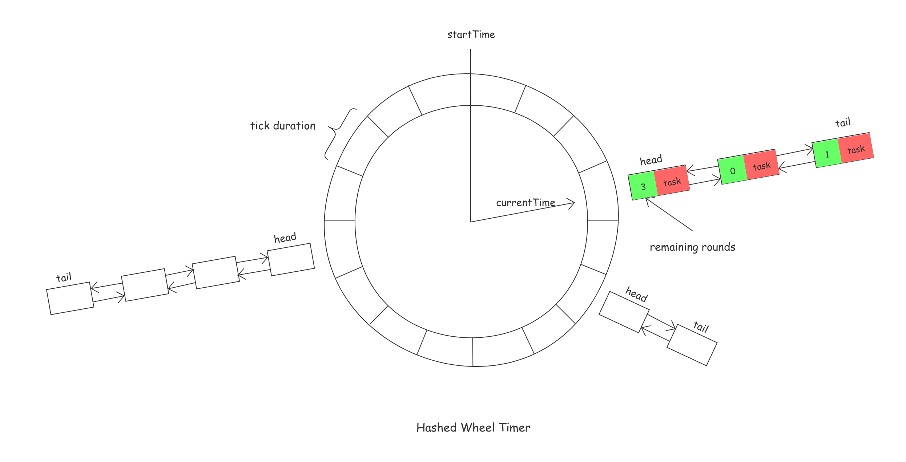

# Netty 时间轮

Netty 中的`HashedWheelTimer`时间轮用于单线程的任务调度, 通过hash将任务以链表的形式分配在不同的桶中, 新增任务、删除任务的时间复杂度为O(1), 而Java中的任务调度池`ScheduledThreadPoolExecutor`, 由于采用的是优先级队列(最小堆), 新增任务、删除任务的时间复杂度为O(log(n)), `HashedWheelTimer`在处理大量的任务时有着更高的性能.



## 初始化过程

### 默认参数值

1. 线程工厂 ThreadFactory

2. 滴答周期 tickDuration 默认 100ms, 最少为1ms

3. 每轮刻度 ticksPerWheel 默认 512

4. 泄漏检测 leakDetection 默认 true

5. 最大代办任务数 maxPendingTimeouts 默认 -1 添加新任务时, 不会检查

### 创建HashedWheelBuckets

格式化每轮刻度数(2的次方数), 并创建Hash桶

```java
private static HashedWheelBucket[] createWheel(int ticksPerWheel) {
    // ...
    ticksPerWheel = normalizeTicksPerWheel(ticksPerWheel);
    HashedWheelBucket[] wheel = new HashedWheelBucket[ticksPerWheel];
    for (int i = 0; i < wheel.length; i ++) {
        wheel[i] = new HashedWheelBucket();
    }
    return wheel;
}
```

每一个Hash桶是由`HashedWhellTimeout`组成的链表, 维护首尾节点

```java
private static final class HashedWheelBucket {
    // Used for the linked-list datastructure
    private HashedWheelTimeout head;
    private HashedWheelTimeout tail;
}
```

### 创建工作线程

woker 是一个 Runnable, 后续再做分析

```java
workerThread = threadFactory.newThread(worker);
```

## 添加延迟任务

示例如下

```java
timer.newTimeout(timeout -> System.out.println(new Date()), 1000, TimeUnit.MILLISECONDS);
````

具体实现

1. 任务数检查

2. 启动工作线程 (并发访问控制, 通过 CAS 保证只启动一次)

3. 添加任务至 timeouts 多生产单消费队列 (由worker线程消费, 移动到具体的某个桶里)

```java
@Override
public Timeout newTimeout(TimerTask task, long delay, TimeUnit unit) {
    // ...

    // 1. 任务数检查
    long pendingTimeoutsCount = pendingTimeouts.incrementAndGet();

    if (maxPendingTimeouts > 0 && pendingTimeoutsCount > maxPendingTimeouts) {
        pendingTimeouts.decrementAndGet();
        throw new RejectedExecutionException("Number of pending timeouts ("
            + pendingTimeoutsCount + ") is greater than or equal to maximum allowed pending "
            + "timeouts (" + maxPendingTimeouts + ")");
    }

    // 2. 启动工作线程
    start();

    // 3. 添加任务

    // 这里 startTime 指的是工作线程的开始时间
    long deadline = System.nanoTime() + unit.toNanos(delay) - startTime;

    if (delay > 0 && deadline < 0) {
        deadline = Long.MAX_VALUE;
    }
    HashedWheelTimeout timeout = new HashedWheelTimeout(this, task, deadline);

    // timeouts是一个多生产单消费的队列
    timeouts.add(timeout);
}
```

## worker工作线程处理流程

1. 初始化 startTime

2. 循环执行任务, 直到其它线程调用stop()方法
    1. 等待至下一个tick
    2. 计算当前tick所在的桶
    3. 处理取消的任务
    4. 将timeouts队列中的任务(新增的任务)移动至对应的桶中
    5. 执行到期任务
    6. tick递增

3. 未执行的任务添加至upprocessedTimeouts, 用于stop()方法返回

```java
private final class Worker implements Runnable {

    @Override
    public void run() {

        // 1. 初始化开始时间
        startTime = System.nanoTime();
        // ...

        // 2. 循环执行任务
        do {
            // 等待(睡眠)至下一个tick
            final long deadline = waitForNextTick();
            if (deadline > 0) {

                // 计算当前tick所在的桶
                int idx = (int) (tick & mask);

                // 处理取消的任务
                processCancelledTasks();
                HashedWheelBucket bucket =
                        wheel[idx];

                // 将timeouts队列中的任务(新增的任务)移动至对应的桶中
                transferTimeoutsToBuckets();
                // 执行到期任务
                bucket.expireTimeouts(deadline);
                tick++;
            }
        } while (WORKER_STATE_UPDATER.get(HashedWheelTimer.this) == WORKER_STATE_STARTED);

        // 3. 未执行的任务添加至upprocessedTimeouts
        for (HashedWheelBucket bucket: wheel) {
            bucket.clearTimeouts(unprocessedTimeouts);
        }
        for (;;) {
            HashedWheelTimeout timeout = timeouts.poll();
            if (timeout == null) {
                break;
            }
            if (!timeout.isCancelled()) {
                unprocessedTimeouts.add(timeout);
            }
        }
        processCancelledTasks();

    }
}
```

### 新增任务移动至对应桶中

```java
private void transferTimeoutsToBuckets() {
    // transfer only max. 100000 timeouts per tick to prevent a thread to stale the workerThread when it just
    // adds new timeouts in a loop.
    // 最多每 tick 只会传输 100000 个任务
    for (int i = 0; i < 100000; i++) {
        HashedWheelTimeout timeout = timeouts.poll();
        if (timeout == null) {
            // all processed
            break;
        }
        if (timeout.state() == HashedWheelTimeout.ST_CANCELLED) {
            // Was cancelled in the meantime.
            continue;
        }

        // 这里 deadline 是相对于 startTime 的纳秒数
        long calculated = timeout.deadline / tickDuration;
        timeout.remainingRounds = (calculated - tick) / wheel.length; // 剩余轮数

        final long ticks = Math.max(calculated, tick); // Ensure we don't schedule for past.
        int stopIndex = (int) (ticks & mask); // 桶索引

        HashedWheelBucket bucket = wheel[stopIndex];
        bucket.addTimeout(timeout); // 添加至具体的桶, 链表尾部
    }
}

// HashedWheelBucket.java
public void addTimeout(HashedWheelTimeout timeout) {
    assert timeout.bucket == null;
    timeout.bucket = this;
    if (head == null) {
        head = tail = timeout;
    } else {
        tail.next = timeout;
        timeout.prev = tail;
        tail = timeout;
    }
}
```

### 执行到期任务

删除并执行链表中的到期任务, 未到期任务递减剩余轮数

```java
// HashedWheelBucket.java
public void expireTimeouts(long deadline) {
    HashedWheelTimeout timeout = head;

    // 从头节点开始遍历链表
    // process all timeouts
    while (timeout != null) {
        HashedWheelTimeout next = timeout.next;

        // 剩余轮数为0, 从链表中删除, 并执行 expire() 方法
        if (timeout.remainingRounds <= 0) {
            next = remove(timeout);
            if (timeout.deadline <= deadline) {
                timeout.expire();
            } else {
                // The timeout was placed into a wrong slot. This should never happen.
                throw new IllegalStateException(String.format(
                        "timeout.deadline (%d) > deadline (%d)", timeout.deadline, deadline));
            }
        } else if (timeout.isCancelled()) {
            // 删除取消的任务
            next = remove(timeout);
        } else {
            // 剩余轮数递减
            timeout.remainingRounds --;
        }
        timeout = next;
    }
}

// HashedWheelTimeout.java
// expire() 中执行任务
public void expire() {
    if (!compareAndSetState(ST_INIT, ST_EXPIRED)) {
        return;
    }

    try {
        task.run(this);
    } catch (Throwable t) {
        if (logger.isWarnEnabled()) {
            logger.warn("An exception was thrown by " + TimerTask.class.getSimpleName() + '.', t);
        }
    }
}
```