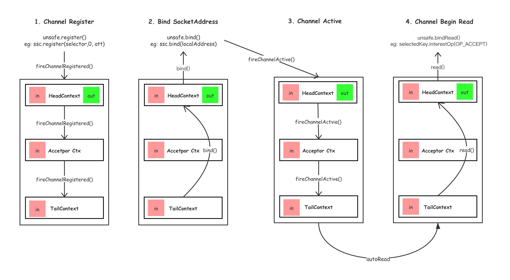

# Netty 服务端启动过程

## 启动

1. 通道初始化并注册至事件循环组中的事件循环 (主线程)

2. 通道注册 (通道所在的事件循环线程)
    + 通道注册 (channel.register(selector, 0))
    + 回调所有通道处理器的 `handleAdd(ctx)`方法
    + 回调管道中`in`类型通道处理器的`channelRegister()`方法

4. 通道绑定(主线程), 向通道所在事件循环提交`通道绑定`任务

5. 通道绑定(事件循环线程)
    + (**逆向**)回调管道中`out`类型通道处理器的`bind()`方法
    + `HeadContext`中执行`unsafe.bind()`, 去调用底层`serverSocketChannel`端口绑定
    + (如果通道bind前未激活, bind后激活状态), 执行步骤6 (已在事件循环中, 不需要向事件循环提交任务, 直接执行(无锁化串行))

6. 通道激活(事件循环线程)
    + 回调管道中`in`类型通道处理器的`channelActive()`方法
    + `HeadContext`中回调完成后, 如果`channel`配置自动读(默认), 执行步骤7

7. 通道读取(事件循环线程)
    + (**逆向**)回调管道中`out`类型通道处理器的`read()`方法
    + `HeadContext`中执行`unsafe.beginRead()`
    > `unsafe.beginRead()`不同的`socket`有不同的实现. `nio`中, `beginRead()`方法, 则是给`selector`设置感兴趣的**读**操作. 这里的读和Java NIO的有些不一样, 在Netty中, 服务端通道`ServerSocketChannel`的`SelectionKey.OP_ACCEPT`和客户端通道的`SocketChannel`的`SelectionKey.OP_READ`都是读

## 接收连接
    
1. 当有新连接时, `select()`方法返回, 处理selectedKeys (事件循环线程)
2. 如果是`ACCEPT`操作, 则调用`unsafe.read()`方法, 该方法中继续调用`NioServerSocketChannel.doReadMessage()`方法, `accept`连接, 生成一个新的`SocketChannel`子通道(selectedKeys中有多少个'ACCEPT'的keys, 则会创建多少个连接)
3. 回调管道中`in`类型通道处理器的`channelRead()`方法
    + ServerBoostrap默认会添加`ServerBootstrapAcceptor`处理器, 其`channelRead()`方法, 会向子通道的管道中添加`childHandler`(由serverBootstrap.childHanlder()方法配置, 是不是串起来了 哈哈), 然后将子通道注册至子事件循环组中
4. (子通道的事件循环线程) 通道处理器添加、通道注册、通道激活、通道读取(这里的读则是`OP_READ`)

## 通道关闭

1. 通道关闭 (主线程)
    + (**逆向**)回调管道中`out`类型通道处理器的`close()`方法, 在`TailContext`处会由于当前线程不是循环线程, 将后续回调提交至事件循环线程

2. 通道关闭 (事件循环线程)
    + 继续回调处理器的`close()`方法, 最后在`HeadContext`中执行`unsafe.close()`, 调用底层socket的close方法
    + 步骤3

3. 通道取消注册 (事件循环线程)
    + 从`selector`中取消通道. `selector.cancel(selectionKey)`
    + 回调管道中`in`类型通道处理器的`channelInactive()`方法
    + 回调管道中`in`类型通道处理器的`channelUnregistered()`方法, 在`HeadContext`中, 回调完成后, 执行步骤4

4. 通道处理器的删除 (事件循环线程)
    + 所有的通道处理器从管道中删除, 并回调其`handleRemoved()`方法
    > 不过代码的实现, 超难理解的... 