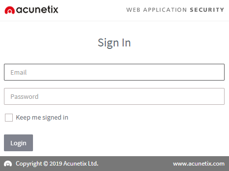
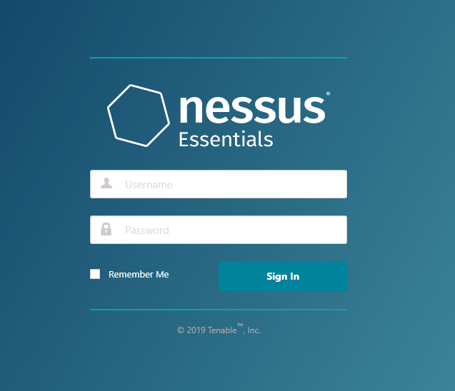
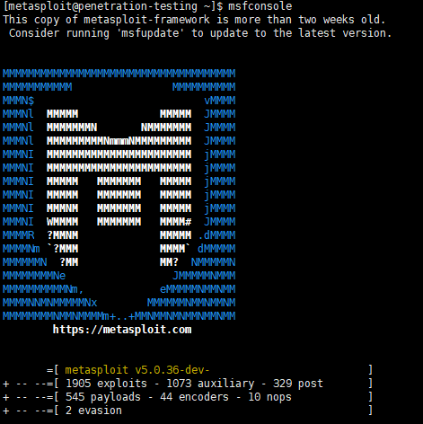
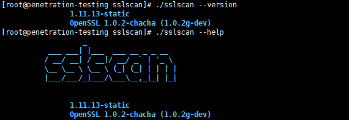
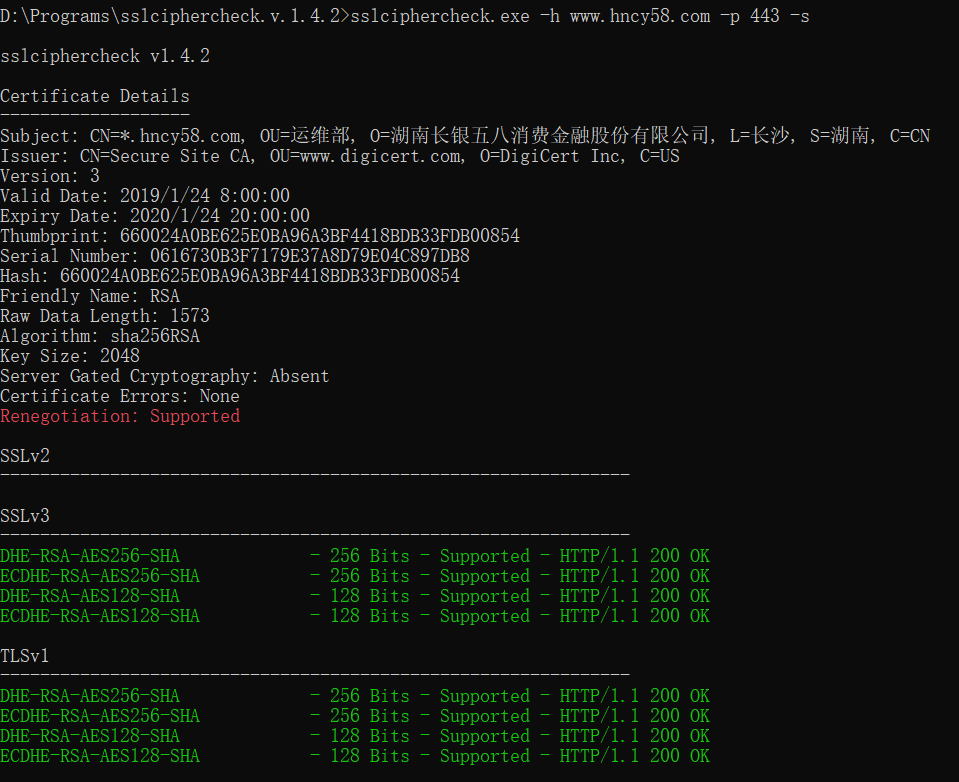
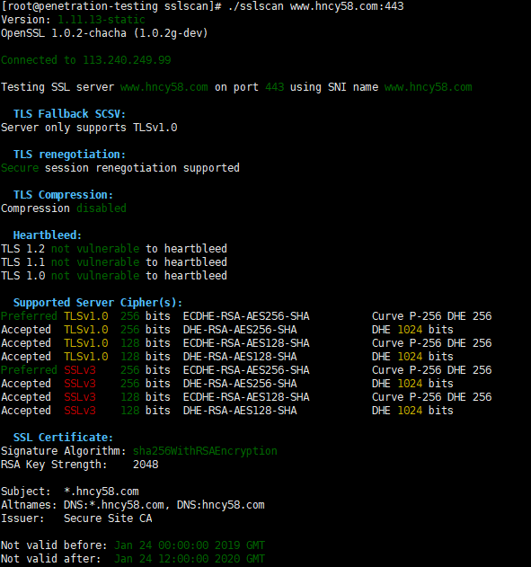
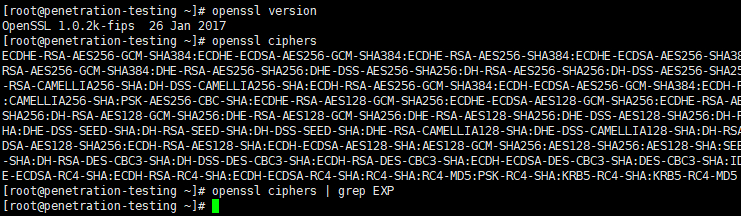

# 渗透测试

## 相关工具

### 1. Nmap 端口扫描工具
```shell
[root@penetration-testing sslscan]# nmap --version

Nmap version 6.40 ( http://nmap.org )
Platform: x86_64-redhat-linux-gnu
```
基本使用
```shell
目标
    hostname ip地址 网段
    -iL <ip地址列表>
主机发现
    -sL: 扫描的目标主机集合
    -sn: ping扫描(ping没有通过, 则认为主机不在线)
    -Pn: 认为所有的主机都是在线的(有些主机不能够ping通, 但是一些端口可以访问)
端口扫描
    -p <端口范围> 如 -p22 -p1-65535
操作系统探测
    -O 开启操作系统探测
输出
    -oN/-oX/-oS/-oG <输出文件>
    -A OS探测、版本探测、链路探测

例子：
nmap -v -Pn -p1-65535 {ip} -oN output.txt
nmap -v -Pn -p1-65535 {ip}/24 -oN output.txt
nmap -p 1-65535 -T4 -A -v -Pn -iL ip_lists.txt -o output.txt
```

### 2. AWVS 应用漏洞扫描工具
支持SQL注入、XSS等漏洞的扫描, 应用的页面采集. windows上安装比较方便，在centos操作系统上安装则比较麻烦. 安装成功后, 根据提示访问13443端口, 可进入到登录页面
```shell
Please visit https://penetration:13443/ to access Acunetix UI
```


### 3. Nessus 主机漏洞扫描工具
官方上有提供Essentials基础免费版, 下载及安装比较麻烦. 安装后, 访问https_8834端口, 可进入到登录界面


### 4. Burpsuite 抓包工具
一款十分强大的抓包工具, 可抓取网络应用、手机APP(代理+APP模拟器)、微信公众号等网络请求包. 可拦截请求, 篡改请求包后, 继续提交, 以绕过前端检查. 

### 5. Metasploit 漏洞检测工具
用于辅助渗透测试 Github开源免费



### 6. sslscan SSL/TLS扫描工具
ssl加密算法探测, heartbleed漏洞扫描



### 7. sslciphercheck ssl加密算法和位数探测工具
用于windows平台
```shell
D:\Programs\sslciphercheck.v.1.4.2>sslciphercheck -v

sslciphercheck v1.4.2

The host must be supplied (-h)

Usage: sslciphercheck.exe -h <Host> -p <Port> -u <URL> -c <CSV File> -i <Timeout (MS)> -t <HTML Response Dir> -m <Keyword(s) Match> -s -n

Options:
    -h, --host=VALUE           Host
    -p, --port=VALUE           Port
    -u, --url=VALUE            Url
    -s, --supported            Show only (s)upported ciphers
    -c, --csv=VALUE            Output (C)sv file
    -i, --timeout=VALUE        T(i)meout
    -t, --html=VALUE           H(t)ml response directory
    -m, --match=VALUE          Match keyword(s)
    -?, --help                 Show Help
```

## 攻击类型、攻击原理、检测及修复方式

### 安全与授权类
1. 密码明文传输
2. 用户名可枚举漏洞, 不存在的用户名登录返回"用户不存在"
3. 暴力攻击, 对登录进行大量尝试
4. 会话固定漏洞, 会话标识跟新不及时
5. 未授权访问
6. 文件上传漏洞、任意文件上传
7. 目录遍历, 任意文件下载
8. 弱SSL加密算法
    OpenSSL的FREAK Attack漏洞, 此问题存在于OpenSSL版本0.9.8zd前, 或1.0.0p之前的1.0.0(*1.0.0a ~ 1.0.0o*), 或1.0.1k之前的1.0.1

    检测方式如下
    1. **sslciphercheck工具检测**
    
        

    2. **sslscan扫描工具**

        

    3. **openssl命令远程检查方法**
       
        ```shell
        [root@penetration-testing ~]# openssl s_client -connect wx.hncy58.com:443 -cipher EXPORT
        Error with command: "-cipher EXPORT"
        140177590765456:error:1410D0B9:SSL routines:SSL_CTX_set_cipher_list:no cipher match:ssl_lib.c:1383:
        ```
        资料上说, 出现"alert handshake failure"说明是网站是安全的. 这里应该是测试机上openssl版本没有EXPORT算法
        
        

    4. **服务器上版本查看**(这里仅仅为了演示命令, 实际要去生产环境查看)
       
        ```shell
        [root@penetration-testing ~]# rpm -qa|grep openssl
        openssl-1.0.2k-16.el7_6.1.x86_64
        openssl-devel-1.0.2k-16.el7_6.1.x86_64
        openssl-libs-1.0.2k-16.el7_6.1.x86_64
        ```
    修复方式
    1. 升级
    2. 禁止弱口令加密算法

9. 越权访问(横向越权、纵向越权)

### 命令执行类
1. Struts2远程命令执行
2. JBoss远程代码执行

### 逻辑攻击类
1. 验证码失效、功能缺陷
2. 并发漏洞
3. 短信攻击

### 注入攻击类
1. SQL注入
2. 宽字节注入
3. XML注入
4. HTTP响应头拆分
5. XFF注入(X-Forwarded-for)
6. XPATH注入
7. 框架注入、链接注入
8. JSON劫持漏洞、JSON注入攻击

### 客户端攻击类
1. XSS跨站脚本、反射型XSS
2. 跨站请求伪造CSRF
3. URL重定向、跳转漏洞

### 信息泄露类
1. 目录浏览、网站目录可列
2. Web容器、中间件、Web服务器控制台地址泄露
3. POODLE信息泄露漏洞
4. SVN信息泄露、版本管理工具文件信息泄露、源码泄露
5. 备份文件泄露
6. 内网IP地址泄露
7. Cookie信息泄露、Cookie安全性漏洞、Cookie未设置HttpOnly属性
8. 敏感信息泄露
9. Robots文件信息泄露

### 其它
1. 慢速攻击
2. 不安全的HTTP方法
3. 跨域访问漏洞
4. DNS域传送漏洞
5. 多余端口开放
6. Http Host头攻击
7. SSRF攻击
8. TLS1/SSLv3 重协商漏洞
    采用sslciphercheck检测, 如下图红色字段:
    
    修复方式: 关闭renegotiation协议或限制SSL重协商数
9. Web服务器解析漏洞

