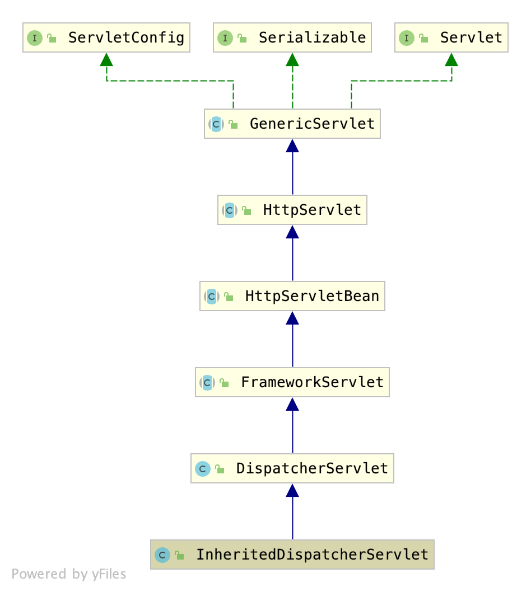
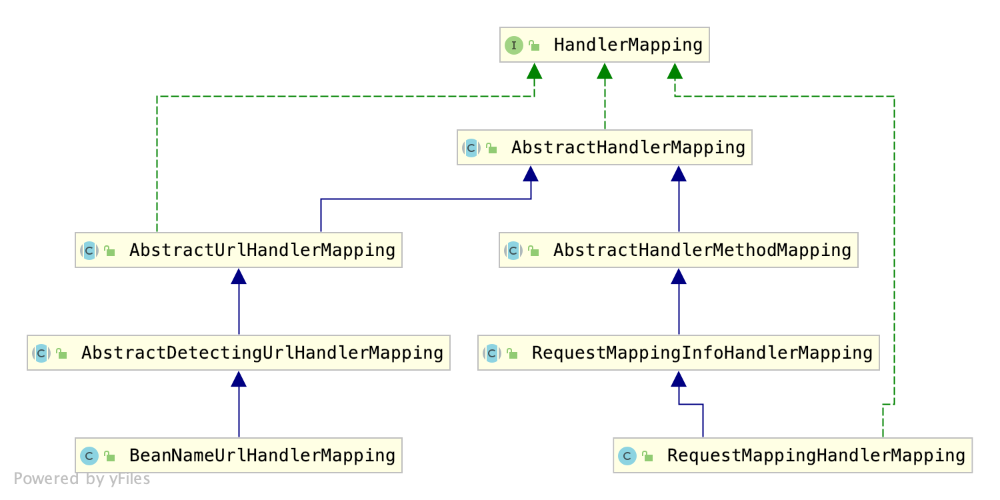

# 微服务-服务发布方

[TOC]

## 上期回顾

上期讲述了铁犀牛微服务服务消费方的实现，我们知道了服务消费方能够像使用本地组件一样使用微服务接口(也就是`@Autowired`能够注入成功)，是因为有`HttpInvokerClient`这个的一个工厂bean(`FactoryBean`)，在消费方的容器启动时，会为每一个微服务接口创建这样的一个代理对象。

其中服务消费方的执行流程如下：

1. 微服务接口方法拦截
2. 将方法签名和方法参数值封装到`RemotingInvocation`中
3. **序列化**`RemotingInvocation`到请求的输入流中
4. 发送http请求, 其中请求地址格式为 `http://ip:port/remoting/httpinvoker/${interaceName}`
5. 将响应的输出流中的数据**反序列化**为`RemotingInvocationResult`
6. 其中`RemotingInvocationResult`封装的便是远程调用的结果

据此，我们大致可以猜测出微服务的服务发布方的处理流程：

1. 从请求的的URL中获取微服务接口名，从容器中获取接口的具体实现
2. 将请求的输入流中的数据**反序列化**为`RemotingInvocation`
3. 根据`RemotingInvocation`所封装的方法签名和方法参数值，反射执行该方法
4. 将反射执行的结果封装到`RemotingInvocationResult`中
5. 最后**序列化**`RemotingInvocationResult`到响应的输出流中

那么接下来，我们就具体看看服务方是如何对请求进行处理的。

## 容器启动阶段

### Servlet注册

我们最初学习Servlet时，都是通过`web.xml`来给容器注册并配置`servlet`，而Spring框架提供了一个`WebApplicationInitializer`接口，允许我们以代码的方式来注册`servlet`，铁犀牛则利用该接口进行**去XML化**。

如下`RemotingServerInitializer`注册了一个的`InheritedDispatcherServlet`来处理请求地址为`/remoting/*`格式的请求。

```java
package org.ironrhino.core.remoting.server;

public class RemotingServerInitializer implements WebApplicationInitializer {

	@Override
	public void onStartup(ServletContext servletContext) throws ServletException {
		String servletName = HttpInvokerServer.class.getName();
    // 注册配置类
		AnnotationConfigWebApplicationContext ctx = new AnnotationConfigWebApplicationContext();
		ctx.setId(servletName);
		ctx.register(RemotingServerConfiguration.class);
    // 注册Servlet
		ServletRegistration.Dynamic dynamic = servletContext.addServlet(servletName,
				new InheritedDispatcherServlet(ctx));
		dynamic.addMapping("/remoting/*");
		dynamic.setAsyncSupported(true);
		dynamic.setLoadOnStartup(Integer.MAX_VALUE - 1);
	}

}
```

`InheritedDispatcherServlet`继承了Spring MVC的`DispatcherServlet`，`DispatcherServlet`用于分发请求，也就是对url进行匹配，将不同url的请求分发给不同的请求处理器来处理，如我们比较熟悉的`Controller`本质上也是一个请求处理器。`InheritedDispatcherServlet`的类图如下：



### 请求处理器注册

`InheritedDispatcherServlet`注册时，容器中注册了`RemotingServerConfiguration`这样的一个配置类，如下：

```java
package org.ironrhino.core.remoting.server;

public class RemotingServerConfiguration {

	@Bean(name = "/httpinvoker/*")
	public HttpInvokerServer httpInvokerServer() {
		return new HttpInvokerServer();
	}

}
```

`HttpInvokerServer`实现了Spring MVC提供的请求处理器接口`HttpRequestHandler`

```java
package org.ironrhino.core.remoting.server;

public class HttpInvokerServer implements HttpRequestHandler {
}
```


## 请求处理阶段

### 请求映射



### 请求处理

```java
package org.ironrhino.core.remoting.server;
public class HttpInvokerServer implements HttpRequestHandler {

  @Autowired
	private ServiceRegistry serviceRegistry;

  @Override
	public void handleRequest(HttpServletRequest request, HttpServletResponse response)
			throws ServletException, IOException {
    
  }
}
```

```java
// 获取微服务接口名
String uri = request.getRequestURI();
String interfaceName = uri.substring(uri.lastIndexOf('/') + 1);
// 从Request请求头中获取序列化类型
HttpInvokerSerializer serializer = HttpInvokerSerializers.forRequest(req);
// 反序列化RemoteInvocation
RemoteInvocation invocation = serializer.readRemoteInvocation(
			ClassUtils.forName(interfaceName, null),
			req.getInputStream());
// 从注册中心获取接口的具体实现
Object target = serviceRegistry.getExportedServices().get(interfaceName);
// 反射执行
Object value = invocation.invoke(target); /
// 结果封装到RemotingInvocationResult
RemoteInvocationResult result = new RemoteInvocationResult(value);
// 序列化到response的输出流中
serializer.writeRemoteInvocationResult(invocation, result, response.getOutputStream());
```

## 总结