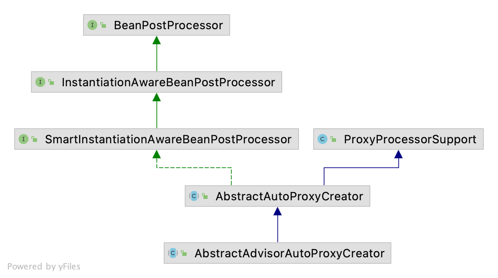

# Spring AOP 代理类的生成与调用过程

## 基于ProxyFacotryBean的代理类生成

### 示例

```java
@Configuration
public class DebugConfiguration {

    // ProxyFactoryBean 生成 JDK 动态代理类
    @Bean
    public ProxyFactoryBean greetingService() {
        ProxyFactoryBean factoryBean = new ProxyFactoryBean();
        factoryBean.setTarget(new GreetingServiceImpl());
        factoryBean.setInterceptorNames("tracingInterceptor");
        return factoryBean;
    }

    // ProxyFactoryBean 生成 CGLIB 动态代理类
    @Bean
    public ProxyFactoryBean echoService() {
        ProxyFactoryBean factoryBean = new ProxyFactoryBean();
        factoryBean.setTarget(new EchoService());
        factoryBean.setInterceptorNames("tracingInterceptor");
        return factoryBean;
    }

    // 通知 Advise
    @Bean
    public TracingInterceptor tracingInterceptor() {
        return new TracingInterceptor();
    }
}
```

`ProxyFactoryBean`实现了`FactoryBean`接口, 众所周之`FactoryBean`是一个工厂类型的`Bean`, 其`getObject()`方法用于生成(获取)Bean对象.
该方法在`ProxyFactoryBean`的实现则是通过`CGLIB`字节码生成技术或者JDK的动态代理来生成代理对象. 其中target是代理的目标对象, interceptorsName是一些通知的Bean名(根据Bean名, 可从容器中`BeanFactory`拿到具体的通知对象)

`TracingInterceptor`则实现了`MethodInterceptor`接口, 是一个`Advise`通知类

```java
public class TracingInterceptor implements MethodInterceptor {

    private final Logger log = LoggerFactory.getLogger(this.getClass());

    @Override
    public Object invoke(MethodInvocation invocation) throws Throwable {
        String invocationDescription = getInvocationDescription(invocation);
        log.info("Entering " + invocationDescription);
        try {
            Object result = invocation.proceed();
            log.info("Exiting " + invocationDescription);
            return result;
        } catch (Throwable ex) {
            log.error("Exception thrown in " + invocationDescription, ex);
            throw ex;
        }
    }

    // ...
}
```

```java
package org.aopalliance.intercept;

public interface MethodInterceptor extends Interceptor {
    Object invoke(@Nonnull MethodInvocation invocation) throws Throwable;
}

package org.aopalliance.intercept;
public interface Interceptor extends Advice {
}
```

```java
// ProxyFactoryBean.java
public Object getObject() throws BeansException {
    initializeAdvisorChain();
    if (isSingleton()) {
        return getSingletonInstance();
    }
    else {
        return newPrototypeInstance();
    }
}
```

### 初始化通知链

根据通知名从容器中获取具体的通知对象, 适配为`Advisor`对象后, 添加到链中(`List<Advisor>`)

```java
private synchronized void initializeAdvisorChain() throws AopConfigException, BeansException {
    // 标记: 保证只初始化一次
    if (this.advisorChainInitialized) {
        return;
    }

    if (!ObjectUtils.isEmpty(this.interceptorNames)) {

        // ...

        // Materialize interceptor chain from bean names.
        for (String name : this.interceptorNames) {

            // ...

            // If we get here, we need to add a named interceptor.
            // We must check if it's a singleton or prototype.
            Object advice;
            if (this.singleton || this.beanFactory.isSingleton(name)) {
                // Add the real Advisor/Advice to the chain.
                advice = this.beanFactory.getBean(name);
            }
            else {
                // It's a prototype Advice or Advisor: replace with a prototype.
                // Avoid unnecessary creation of prototype bean just for advisor chain initialization.
                advice = new PrototypePlaceholderAdvisor(name);
            }
            addAdvisorOnChainCreation(advice);
        }
    }

    this.advisorChainInitialized = true;
}

private void addAdvisorOnChainCreation(Object next) {
		// We need to convert to an Advisor if necessary so that our source reference
		// matches what we find from superclass interceptors.
		addAdvisor(namedBeanToAdvisor(next));
}

// 适配
private Advisor namedBeanToAdvisor(Object next) {
    try {
        return this.advisorAdapterRegistry.wrap(next);
    }
}
```

适配规则

1. 是`Advisor`对象, 直接返回
2. 不是`Advisor`, 也不是`Advice`, 则抛异常
3. 是`MethodInterceptor`, 则返回`DefaultPointcutAdvisor`对象 (直译: 默认切入点通知对象)
4. 遍历适配器, 看是否支持, 支持则返回`DefaultPointcutAdvisor`对象

```java
// DefaultAdvisorAdapterRegistry.java
@Override
public Advisor wrap(Object adviceObject) throws UnknownAdviceTypeException {
    if (adviceObject instanceof Advisor) {
        return (Advisor) adviceObject;
    }
    if (!(adviceObject instanceof Advice)) {
        throw new UnknownAdviceTypeException(adviceObject);
    }
    Advice advice = (Advice) adviceObject;
    if (advice instanceof MethodInterceptor) {
        // So well-known it doesn't even need an adapter.
        return new DefaultPointcutAdvisor(advice);
    }
    for (AdvisorAdapter adapter : this.adapters) {
        // Check that it is supported.
        if (adapter.supportsAdvice(advice)) {
            return new DefaultPointcutAdvisor(advice);
        }
    }
    throw new UnknownAdviceTypeException(advice);
}
```

当前有3个通知适配器 ( Around环绕通知呢 ? )

```java
new MethodBeforeAdviceAdapter();    --> MethodBeforeAdvice
new AfterReturningAdviceAdapter();  --> AfterReturningAdvice
new ThrowsAdviceAdapter();          --> ThrowsAdviceAdapter
```

### 创建AopProxy

单例实例只会实例化一次

```java
// ProxyFactoryBean.java
private synchronized Object getSingletonInstance() {
    if (this.singletonInstance == null) {
        this.targetSource = freshTargetSource();
        // 自动探测代理接口 (默认 true)
        // 代理的接口数为0
        // 非代理目标类 (默认 proxyTargetClass 为 false)
        if (this.autodetectInterfaces && getProxiedInterfaces().length == 0 && !isProxyTargetClass()) {
            // Rely on AOP infrastructure to tell us what interfaces to proxy.
            Class<?> targetClass = getTargetClass();
            if (targetClass == null) {
                throw new FactoryBeanNotInitializedException("Cannot determine target class for proxy");
            }
            // 获取目标类的所有接口 并设置
            setInterfaces(ClassUtils.getAllInterfacesForClass(targetClass, this.proxyClassLoader));
        }
        // Initialize the shared singleton instance.
        super.setFrozen(this.freezeProxy);
        this.singletonInstance = getProxy(createAopProxy());
    }
    return this.singletonInstance;
}
```

通过 AopProxyFactory 创建 AopProxy

```java
// ProxyCreatorSupport.java
public ProxyCreatorSupport() {
	this.aopProxyFactory = new DefaultAopProxyFactory();
}

protected final synchronized AopProxy createAopProxy() {
    if (!this.active) {
        activate();
    }
    return getAopProxyFactory().createAopProxy(this);
}
```

默认 AopProxyFactory 实现

```java
// DefaultAopProxyFactory.java
public AopProxy createAopProxy(AdvisedSupport config) throws AopConfigException {
    // 探测是不是 GraalVM 本地镜像环境 (好强, 意思是GraalVM镜像, 可直接走JDK动态代理?)
    // isOptimize() 默认 false
    // isProxyTargetClass() 默认 false
    // hasNoUserSuppliedProxyInterfaces 是否没有用户提供的代理接口
    if (!NativeDetector.inNativeImage() &&
            (config.isOptimize() || config.isProxyTargetClass() || hasNoUserSuppliedProxyInterfaces(config))) {
        Class<?> targetClass = config.getTargetClass();
        if (targetClass == null) {
            throw new AopConfigException("TargetSource cannot determine target class: " +
                    "Either an interface or a target is required for proxy creation.");
        }

        // 代理的目标类是接口 或者 Proxy子类, 使用 JDK动态代理
        if (targetClass.isInterface() || Proxy.isProxyClass(targetClass)) {
            return new JdkDynamicAopProxy(config);
        }
        // Cglib 代理
        return new ObjenesisCglibAopProxy(config);
    }
    else {
        return new JdkDynamicAopProxy(config);
    }
}
```

简单点来说, 如果探测到代理的目标对象实现了某个接口则使用 JDKDynamicAopProxy, 否则使用 ObjenesisCglibAopProxy

#### JDKDynamicAopProxy

```java
public JdkDynamicAopProxy(AdvisedSupport config) throws AopConfigException {
    Assert.notNull(config, "AdvisedSupport must not be null");
    if (config.getAdvisorCount() == 0 && config.getTargetSource() == AdvisedSupport.EMPTY_TARGET_SOURCE) {
        throw new AopConfigException("No advisors and no TargetSource specified");
    }
    this.advised = config;
    this.proxiedInterfaces = AopProxyUtils.completeProxiedInterfaces(this.advised, true);
    findDefinedEqualsAndHashCodeMethods(this.proxiedInterfaces);
}
```

被代理的接口 = 用户接口 + SpringProxy, Advised, DecoratingProxy

```java
// AopProxyUtils.java
static Class<?>[] completeProxiedInterfaces(AdvisedSupport advised, boolean decoratingProxy) {
    // 原始接口 (用户接口)
    Class<?>[] specifiedInterfaces = advised.getProxiedInterfaces();

    // ... 

    // 非用户接口
    // 用户接口中 是否包含 SpringProxy
    boolean addSpringProxy = !advised.isInterfaceProxied(SpringProxy.class);
    // 用户接口中 是否包含 Advised.class
    boolean addAdvised = !advised.isOpaque() && !advised.isInterfaceProxied(Advised.class);
    boolean addDecoratingProxy = (decoratingProxy && !advised.isInterfaceProxied(DecoratingProxy.class));
    // 非用户接口数
    int nonUserIfcCount = 0;
    if (addSpringProxy) {
        nonUserIfcCount++;
    }
    if (addAdvised) {
        nonUserIfcCount++;
    }
    if (addDecoratingProxy) {
        nonUserIfcCount++;
    }
    Class<?>[] proxiedInterfaces = new Class<?>[specifiedInterfaces.length + nonUserIfcCount];
    System.arraycopy(specifiedInterfaces, 0, proxiedInterfaces, 0, specifiedInterfaces.length);
    int index = specifiedInterfaces.length;
    if (addSpringProxy) {
        proxiedInterfaces[index] = SpringProxy.class;
        index++;
    }
    if (addAdvised) {
        proxiedInterfaces[index] = Advised.class;
        index++;
    }
    if (addDecoratingProxy) {
        proxiedInterfaces[index] = DecoratingProxy.class;
    }
    return proxiedInterfaces;
}
```

#### ObjenesisCglibAopProxy

```java
public ObjenesisCglibAopProxy(AdvisedSupport config) {
   super(config);
}
```

### 生成代理对象

#### JDK动态代理创建代理对象

利用 Java Proxy.newProxyInstance 生成代理对象
```java
// JdkDynamicAopProxy.java
public Object getProxy(@Nullable ClassLoader classLoader) {
    if (logger.isTraceEnabled()) {
        logger.trace("Creating JDK dynamic proxy: " + this.advised.getTargetSource());
    }
    return Proxy.newProxyInstance(classLoader, this.proxiedInterfaces, this);
}

// Proxy.java
public static Object newProxyInstance(ClassLoader loader, Class<?>[] interfaces, InvocationHandler h) {...}
```

调用过程无非就是 invocationHandler 接口的 invoke() 方法, 而 JdkDynamicAopProxy 实现了该接口, 后续再分析该方法

```java
package java.lang.reflect;
public interface InvocationHandler {
    public Object invoke(Object proxy, Method method, Object[] args) throws Throwable;
}

package org.springframework.aop.framework;
final class JdkDynamicAopProxy implements AopProxy, InvocationHandler, Serializable {
    // ...
}
```

#### Cglib创建代理对象

```java
// CglibAopProxy.java
@Override
public Object getProxy(@Nullable ClassLoader classLoader) {
    try {
        Class<?> rootClass = this.advised.getTargetClass();
        Assert.state(rootClass != null, "Target class must be available for creating a CGLIB proxy");

        // 代理对象父类
        Class<?> proxySuperClass = rootClass;
        if (rootClass.getName().contains(ClassUtils.CGLIB_CLASS_SEPARATOR)) {
            proxySuperClass = rootClass.getSuperclass();
            Class<?>[] additionalInterfaces = rootClass.getInterfaces();
            for (Class<?> additionalInterface : additionalInterfaces) {
                this.advised.addInterface(additionalInterface);
            }
        }

        // Validate the class, writing log messages as necessary.
        validateClassIfNecessary(proxySuperClass, classLoader);

        // Configure CGLIB Enhancer...
        Enhancer enhancer = createEnhancer();
        if (classLoader != null) {
            enhancer.setClassLoader(classLoader);
            if (classLoader instanceof SmartClassLoader &&
                    ((SmartClassLoader) classLoader).isClassReloadable(proxySuperClass)) {
                enhancer.setUseCache(false);
            }
        }
        // 代理类
        enhancer.setSuperclass(proxySuperClass);
        // 代理接口
        enhancer.setInterfaces(AopProxyUtils.completeProxiedInterfaces(this.advised));
        // 类命名策略
        enhancer.setNamingPolicy(SpringNamingPolicy.INSTANCE);
        enhancer.setStrategy(new ClassLoaderAwareGeneratorStrategy(classLoader));

        // Callback 回调
        Callback[] callbacks = getCallbacks(rootClass);
        Class<?>[] types = new Class<?>[callbacks.length];
        for (int x = 0; x < types.length; x++) {
            types[x] = callbacks[x].getClass();
        }
        // fixedInterceptorMap only populated at this point, after getCallbacks call above
        enhancer.setCallbackFilter(new ProxyCallbackFilter(
                this.advised.getConfigurationOnlyCopy(), this.fixedInterceptorMap, this.fixedInterceptorOffset));
        enhancer.setCallbackTypes(types);

        // Generate the proxy class and create a proxy instance.
        return createProxyClassAndInstance(enhancer, callbacks);
    }
    catch (CodeGenerationException | IllegalArgumentException ex) {
        throw new AopConfigException("Could not generate CGLIB subclass of " + this.advised.getTargetClass() +
                ": Common causes of this problem include using a final class or a non-visible class",
                ex);
    }
    catch (Throwable ex) {
        // TargetSource.getTarget() failed
        throw new AopConfigException("Unexpected AOP exception", ex);
    }
}

protected Object createProxyClassAndInstance(Enhancer enhancer, Callback[] callbacks) {
    enhancer.setInterceptDuringConstruction(false);
    enhancer.setCallbacks(callbacks);
    return (this.constructorArgs != null && this.constructorArgTypes != null ?
            enhancer.create(this.constructorArgTypes, this.constructorArgs) :
            enhancer.create());
}
```

```java
private Callback[] getCallbacks(Class<?> rootClass) throws Exception {
    // ...

    // Choose an "aop" interceptor (used for AOP calls).
    Callback aopInterceptor = new DynamicAdvisedInterceptor(this.advised);

    
    // Choose a "straight to target" interceptor. (used for calls that are
	// unadvised but can return this). May be required to expose the proxy.
    Callback targetInterceptor;
    if (exposeProxy) {
        targetInterceptor = (isStatic ?
                new StaticUnadvisedExposedInterceptor(this.advised.getTargetSource().getTarget()) :
                new DynamicUnadvisedExposedInterceptor(this.advised.getTargetSource()));
    }
    else {
        targetInterceptor = (isStatic ?
                new StaticUnadvisedInterceptor(this.advised.getTargetSource().getTarget()) :
                new DynamicUnadvisedInterceptor(this.advised.getTargetSource()));


    Callback[] mainCallbacks = new Callback[] {
        aopInterceptor,  // for normal advice
        targetInterceptor,  // invoke target without considering advice, if optimized
        new SerializableNoOp(),  // no override for methods mapped to this
        targetDispatcher, this.advisedDispatcher,
        new EqualsInterceptor(this.advised),
        new HashCodeInterceptor(this.advised)
    }

    // ...
}
```

比较重要的也就是 DynamicAdvisedInterceptor 了, 通知链的调用细节则在它里面进行


## 基于注解的自动代理

使用自动代理的话, 需要标注 @EnableAspectJAutoProxy 注解, 会在容器启动时, 向容器中注册 AnnotationAwareAspectJAutoProxyCreator

```java
@Import(AspectJAutoProxyRegistrar.class)
public @interface EnableAspectJAutoProxy {
    // ...
}
```

```java
// AspectJAutoProxyRegistrar.class
public void registerBeanDefinitions(
        AnnotationMetadata importingClassMetadata, BeanDefinitionRegistry registry) {

    AopConfigUtils.registerAspectJAnnotationAutoProxyCreatorIfNecessary(registry);
    
    // ...
}
```

```java
// AopConfigUtils.java
@Nullable
public static BeanDefinition registerAspectJAnnotationAutoProxyCreatorIfNecessary(BeanDefinitionRegistry registry) {
    return registerAspectJAnnotationAutoProxyCreatorIfNecessary(registry, null);
}

@Nullable
public static BeanDefinition registerAspectJAnnotationAutoProxyCreatorIfNecessary(
        BeanDefinitionRegistry registry, @Nullable Object source) {

    return registerOrEscalateApcAsRequired(AnnotationAwareAspectJAutoProxyCreator.class, registry, source);
}

@Nullable
private static BeanDefinition registerOrEscalateApcAsRequired(Class<?> cls, BeanDefinitionRegistry registry, @Nullable Object source){

    Assert.notNull(registry, "BeanDefinitionRegistry must not be null");

    if (registry.containsBeanDefinition(AUTO_PROXY_CREATOR_BEAN_NAME)) {
        BeanDefinition apcDefinition = registry.getBeanDefinition(AUTO_PROXY_CREATOR_BEAN_NAME);
        if (!cls.getName().equals(apcDefinition.getBeanClassName())) {
            int currentPriority = findPriorityForClass(apcDefinition.getBeanClassName());
            int requiredPriority = findPriorityForClass(cls);
            if (currentPriority < requiredPriority) {
                apcDefinition.setBeanClassName(cls.getName());
            }
        }
        return null;
    }

    // 向容器中注册 AnnotationAwareAspectJAutoProxyCreator
    RootBeanDefinition beanDefinition = new RootBeanDefinition(cls);
    beanDefinition.setSource(source);
    beanDefinition.getPropertyValues().add("order", Ordered.HIGHEST_PRECEDENCE);
    beanDefinition.setRole(BeanDefinition.ROLE_INFRASTRUCTURE);
    registry.registerBeanDefinition(AUTO_PROXY_CREATOR_BEAN_NAME, beanDefinition);
    return beanDefinition;
}
```

如下是 AbstractAdvisorAutoProxyCreator 类关系图, 实现了 `BeanPostPorcessor`



### Bean实例化前置处理

```java
// AbstractAutoProxyCreator.java
public Object postProcessBeforeInstantiation(Class<?> beanClass, String beanName) {
    Object cacheKey = getCacheKey(beanClass, beanName);

    if (!StringUtils.hasLength(beanName) || !this.targetSourcedBeans.contains(beanName)) {
        if (this.advisedBeans.containsKey(cacheKey)) {
            return null;
        }
        if (isInfrastructureClass(beanClass) || shouldSkip(beanClass, beanName)) {
            // 设置标记位, 不需要通知
            this.advisedBeans.put(cacheKey, Boolean.FALSE);
            return null;
        }
    }

    // ...
}

// AnnotationAwareAspectJAutoProxyCreator.java
@Override
protected boolean isInfrastructureClass(Class<?> beanClass) {
    return (super.isInfrastructureClass(beanClass) ||
            (this.aspectJAdvisorFactory != null && this.aspectJAdvisorFactory.isAspect(beanClass)));
}

// AspectJAwareAdvisorAutoProxyCreator.java
// 基础设施类 不需要代理
protected boolean isInfrastructureClass(Class<?> beanClass) {
    boolean retVal = Advice.class.isAssignableFrom(beanClass) ||
            Pointcut.class.isAssignableFrom(beanClass) ||
            Advisor.class.isAssignableFrom(beanClass) ||
            AopInfrastructureBean.class.isAssignableFrom(beanClass);
    if (retVal && logger.isTraceEnabled()) {
        logger.trace("Did not attempt to auto-proxy infrastructure class [" + beanClass.getName() + "]");
    }
    return retVal;
}

// 切面 不需要代理
@Override
public boolean isAspect(Class<?> clazz) {
    return (hasAspectAnnotation(clazz) && !compiledByAjc(clazz));
}

private boolean hasAspectAnnotation(Class<?> clazz) {
    return (AnnotationUtils.findAnnotation(clazz, Aspect.class) != null);
}
```

### Bean初始化后置处理(创建代理对象)

```java
// AbstractAutoProxyCreator.java
@Override
public Object postProcessAfterInitialization(@Nullable Object bean, String beanName) {
    if (bean != null) {
        Object cacheKey = getCacheKey(bean.getClass(), beanName);
        if (this.earlyProxyReferences.remove(cacheKey) != bean) {
            return wrapIfNecessary(bean, beanName, cacheKey);
        }
    }
    return bean;
}

protected Object wrapIfNecessary(Object bean, String beanName, Object cacheKey) {
    if (StringUtils.hasLength(beanName) && this.targetSourcedBeans.contains(beanName)) {
        return bean;
    }
    if (Boolean.FALSE.equals(this.advisedBeans.get(cacheKey))) {
        return bean;
    }
    // 跳过基础设施类
    if (isInfrastructureClass(bean.getClass()) || shouldSkip(bean.getClass(), beanName)) {
        this.advisedBeans.put(cacheKey, Boolean.FALSE);
        return bean;
    }

    // Create proxy if we have advice.
    // 获取满足满足条件的通知
    Object[] specificInterceptors = getAdvicesAndAdvisorsForBean(bean.getClass(), beanName, null);
    if (specificInterceptors != DO_NOT_PROXY) {
        // 通知不为空, 则生成代理对象
        this.advisedBeans.put(cacheKey, Boolean.TRUE);
        Object proxy = createProxy(
                bean.getClass(), beanName, specificInterceptors, new SingletonTargetSource(bean));
        this.proxyTypes.put(cacheKey, proxy.getClass());
        return proxy;
    }

    this.advisedBeans.put(cacheKey, Boolean.FALSE);
    return bean;
}
```

获取通知过程就不贴代码了(链太长了...), 大概过程就是遍历容器中注册带有 @Aspect 标注的类, 之后从容器中获取Bean (未初始化, 则会触发初始化), 之后通过 ReflectiveAspectJAdvisorFactory 获取切面中的所有的通知

```java
// AbstractAdvisorAutoProxyCreator.java
@Override
@Nullable
protected Object[] getAdvicesAndAdvisorsForBean(
        Class<?> beanClass, String beanName, @Nullable TargetSource targetSource) {

    List<Advisor> advisors = findEligibleAdvisors(beanClass, beanName);
    if (advisors.isEmpty()) {
        return DO_NOT_PROXY;
    }
    return advisors.toArray();
}
```

## JDKDynamicAopProxy代理类调用过程

```java
// JdkDynamicAopProxy.java
@Override
@Nullable
public Object invoke(Object proxy, Method method, Object[] args) throws Throwable {
    // ...
    Object retVal;

    // 从advised中获取所有的 interceptor 和 advice
    List<Object> chain = this.advised.getInterceptorsAndDynamicInterceptionAdvice(method, targetClass);

    // 新建 MethodInvocation 并执行其 proceed() 方法
    // We need to create a method invocation...
    MethodInvocation invocation = new ReflectiveMethodInvocation(proxy, target, method, args, targetClass, chain);
    // Proceed to the joinpoint through the interceptor chain.
    retVal = invocation.proceed();
}
```

在每次调用 ReflectiveMethodInvocation 的 proceed() 方法时, 会累计一个 currentInterceptorIndex 值(从-1开始), 调用每个 interceptor 的 invoke(this) 方法, 最后调用 invokeJoinpoint() 反射执行目标对象的原始方法

当然如果 在 interceptor 的 invoke(methodInvocation) 方法如果没有继续调用 methodInvocation.proceed() 方法的话, 是不会调用到原始方法的

```java
// ReflectiveMethodInvocation.java
@Override
@Nullable
public Object proceed() throws Throwable {
    // We start with an index of -1 and increment early.
    if (this.currentInterceptorIndex == this.interceptorsAndDynamicMethodMatchers.size() - 1) {
        return invokeJoinpoint();
    }

    Object interceptorOrInterceptionAdvice =
            this.interceptorsAndDynamicMethodMatchers.get(++this.currentInterceptorIndex);
    if (interceptorOrInterceptionAdvice instanceof InterceptorAndDynamicMethodMatcher) {
        // Evaluate dynamic method matcher here: static part will already have
        // been evaluated and found to match.
        InterceptorAndDynamicMethodMatcher dm =
                (InterceptorAndDynamicMethodMatcher) interceptorOrInterceptionAdvice;
        Class<?> targetClass = (this.targetClass != null ? this.targetClass : this.method.getDeclaringClass());
        if (dm.methodMatcher.matches(this.method, targetClass, this.arguments)) {
            return dm.interceptor.invoke(this);
        }
        else {
            // Dynamic matching failed.
            // Skip this interceptor and invoke the next in the chain.
            return proceed();
        }
    }
    else {
        // It's an interceptor, so we just invoke it: The pointcut will have
        // been evaluated statically before this object was constructed.
        return ((MethodInterceptor) interceptorOrInterceptionAdvice).invoke(this);
    }
}
```

## CglibAopProxy代理类调用过程

```java
// CglibAopProxy.java
private static class DynamicAdvisedInterceptor implements MethodInterceptor, Serializable {
    // ...

    // 同样 从advised中获取所有的 interceptor 和 advice
    List<Object> chain = this.advised.getInterceptorsAndDynamicInterceptionAdvice(method, targetClass);

    Object retVal;
    // Check whether we only have one InvokerInterceptor: that is,
    // no real advice, but just reflective invocation of the target.
    if (chain.isEmpty() && Modifier.isPublic(method.getModifiers())) {
        // We can skip creating a MethodInvocation: just invoke the target directly.
        // Note that the final invoker must be an InvokerInterceptor, so we know
        // it does nothing but a reflective operation on the target, and no hot
        // swapping or fancy proxying.
        Object[] argsToUse = AopProxyUtils.adaptArgumentsIfNecessary(method, args);
        retVal = methodProxy.invoke(target, argsToUse);
    }
    else {
        // 创建 CglibMethodInvocation 并执行 proceed 方法
        // We need to create a method invocation...
        retVal = new CglibMethodInvocation(proxy, target, method, args, targetClass, chain, methodProxy).proceed();
    }
    retVal = processReturnType(proxy, target, method, retVal);
    return retVal;

}

private static class CglibMethodInvocation extends ReflectiveMethodInvocation {
    // ...
}
```

这里 CglibMethodInvocation 刚好是 ReflectiveMethodInvocation 的子类那么实现则和上面基本一样