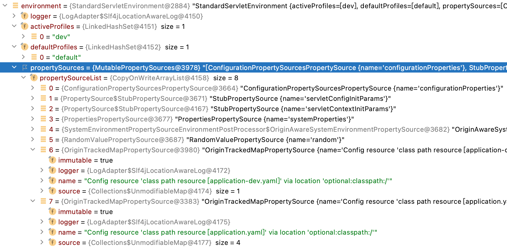
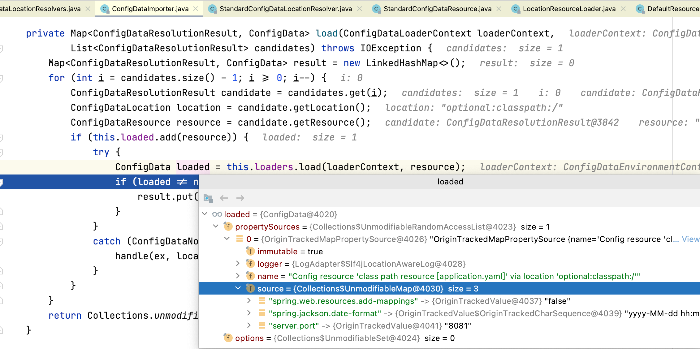
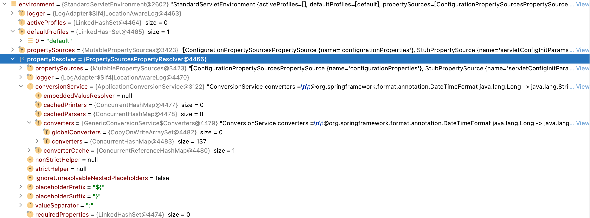
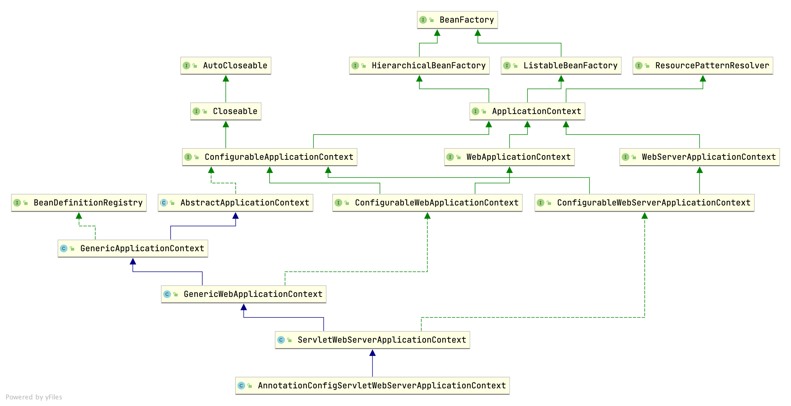
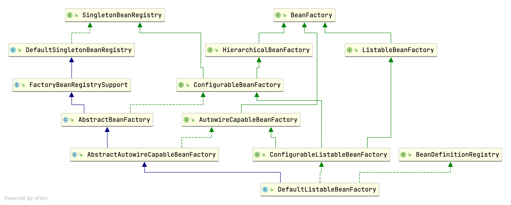
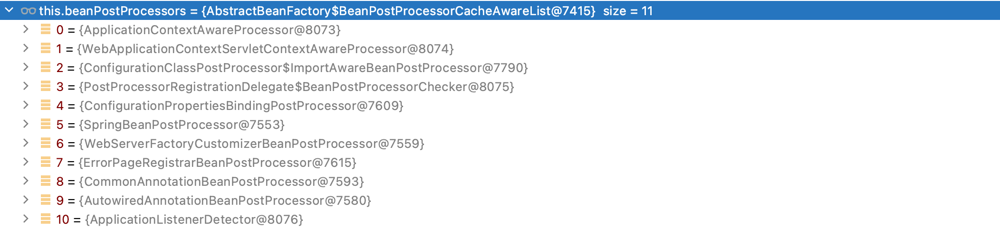
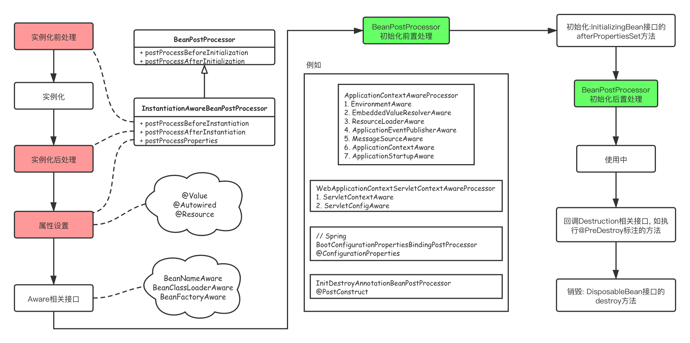

# SpringBoot  启动过程

* [一、环境准备](#一、环境准备)
	* [1.属性源PropertySources](#1.属性源PropertySources)
		* [1.1系统属性](#1.1系统属性)
		* [1.2环境变量](#1.2环境变量)
		* [1.3随机值属性源](#1.3随机值属性源)
		* [1.4配置数据](#1.4配置数据)
	* [2.属性处理器](#2.属性处理器)
* [二、打印横幅](#二、打印横幅)
	* [1.读取图片/文本横幅](#1.读取图片/文本横幅)
	* [2.默认横幅](#2.默认横幅)
* [三、应用上下文-创建](#三、应用上下文-创建)
* [四、应用上下文-准备](#四、应用上下文-准备)
	* [1.上下文初始化器初始化](#1.上下文初始化器初始化)
		* [SharedMetadataReaderFactoryContextInitializer](#SharedMetadataReaderFactoryContextInitializer)
		* [ContextIdApplicationContextInitializer](#ContextIdApplicationContextInitializer)
	* [2.创建Bean加载器](#2.创建Bean加载器)
	* [3.注册注解处理器](#3.注册注解处理器)
	* [4.主类注册](#4.主类注册)
* [六、应用上下文-刷新](#六、应用上下文-刷新)
	* [1.准备](#1.准备)
	* [2.注册Bean处理器](#2.注册Bean处理器)
	* [3.Bean注册](#3.Bean注册)
		* [(1)调用现有的工厂处理器](#(1)调用现有的工厂处理器)
		* [(2)调用实现PriorityOrdered的Bean注册处理器](#(2)调用实现PriorityOrdered的Bean注册处理器)
		* [配置类解析](#配置类解析)
		* [自动装配](#自动装配)
		* [条件](#条件)
		* [(3)调用实现Orderd的Bean注册处理器](#(3)调用实现Orderd的Bean注册处理器)
		* [(4)调用其它注册处理器,直到没有新的Bean注册处理器出现](#(4)调用其它注册处理器,直到没有新的Bean注册处理器出现)
		* [(5)回调工厂处理器后置处理方法](#(5)回调工厂处理器后置处理方法)
		* [(6)回调其它工厂处理器后置处理方法](#(6)回调其它工厂处理器后置处理方法)
	* [4.初始化所有的BeanPostProcessor](#4.初始化所有的BeanPostProcessor)
	* [5.进行刷新-onRefresh](#5.进行刷新-onRefresh)
	* [6.初始化所有单例Bean](#6.初始化所有单例Bean)
* [七、Bean初始化](#七、Bean初始化)
	* [1.实例化前处理](#1.实例化前处理)
	* [2.Bean实例化](#2.Bean实例化)
	* [3.实例化后处理](#3.实例化后处理)
	* [4.属性设置](#4.属性设置)
		* [(1)CommonAnnotationBeanPostProcessor](#(1)CommonAnnotationBeanPostProcessor)
		* [(2)AutowiredAnnotationBeanPostProcessor](#(2)AutowiredAnnotationBeanPostProcessor)
	* [5.调用Aware方法](#5.调用Aware方法)
	* [6.初始化前置处理](#6.初始化前置处理)
		* [(1)ApplicationContextAwareProcessor](#(1)ApplicationContextAwareProcessor)
		* [(2)WebApplicationContextServletContextAwareProcessor](#(2)WebApplicationContextServletContextAwareProcessor)
		* [(3)ConfigurationPropertiesBindingPostProcessor](#(3)ConfigurationPropertiesBindingPostProcessor)
		* [(4)CommonAnnotationBeanPostProcessor](#(4)CommonAnnotationBeanPostProcessor)
	* [7.初始化方法](#7.初始化方法)
	* [8.初始化后置处理](#8.初始化后置处理)
	* [9.Bean生命周期(图片)](#9.Bean生命周期(图片))

## 一、环境准备

```java
// SpringApplication.java
ConfigurableEnvironment environment = prepareEnvironment(listeners, bootstrapContext, applicationArguments);
```

### 1.属性源PropertySources



#### 1.1系统属性

```java
// StandardEnvironment.java
@Override
protected void customizePropertySources(MutablePropertySources propertySources) {
  propertySources.addLast(
    new PropertiesPropertySource(SYSTEM_PROPERTIES_PROPERTY_SOURCE_NAME, getSystemProperties()));
  propertySources.addLast(
    new SystemEnvironmentPropertySource(SYSTEM_ENVIRONMENT_PROPERTY_SOURCE_NAME, getSystemEnvironment()));
}
```

```java
// AbstractEnvironment.java
@Override
@SuppressWarnings({"rawtypes", "unchecked"})
public Map<String, Object> getSystemProperties() {
  try {
    return (Map) System.getProperties();
  }
  // ...
}
```

#### 1.2环境变量

```java
// AbstractEnvironment.java
@Override
@SuppressWarnings({"rawtypes", "unchecked"})
public Map<String, Object> getSystemEnvironment() {
  if (suppressGetenvAccess()) {
    return Collections.emptyMap();
  }
  try {
    return (Map) System.getenv();
  }
  // ...
}
```

#### 1.3随机值属性源

```java
// RandomValuePropertySourceEnvironmentPostProcessor.java
@Override
public void postProcessEnvironment(ConfigurableEnvironment environment, SpringApplication application) {
  RandomValuePropertySource.addToEnvironment(environment, this.logger);
}
```

以`random.`为前缀的属性, 返回随机数. 同时也支持`random.int`返回int类型随机数, `random.long`返回long类型随机数. 

#### 1.4配置数据

```java
// ConfigDataEnvironment.java
static {
  List<ConfigDataLocation> locations = new ArrayList<>();
  locations.add(ConfigDataLocation.of("optional:classpath:/"));
  locations.add(ConfigDataLocation.of("optional:classpath:/config/"));
  locations.add(ConfigDataLocation.of("optional:file:./"));
  locations.add(ConfigDataLocation.of("optional:file:./config/"));
  locations.add(ConfigDataLocation.of("optional:file:./config/*/"));
  DEFAULT_SEARCH_LOCATIONS = locations.toArray(new ConfigDataLocation[0]);
}

void processAndApply() {
  ConfigDataImporter importer = new ConfigDataImporter(this.logFactory, this.notFoundAction, this.resolvers, this.loaders);
  registerBootstrapBinder(this.contributors, null, DENY_INACTIVE_BINDING);
  // 初始处理 (application.yaml)    
  ConfigDataEnvironmentContributors contributors = processInitial(this.contributors, importer);
  ConfigDataActivationContext activationContext = createActivationContext(
      contributors.getBinder(null, BinderOption.FAIL_ON_BIND_TO_INACTIVE_SOURCE));
  contributors = processWithoutProfiles(contributors, importer, activationContext);
  // 获取当前激活的 profiles (spring.profiles.active)
  activationContext = withProfiles(contributors, activationContext);
  // 处理激活的profiles配置 (application-dev.yaml)
  contributors = processWithProfiles(contributors, importer, activationContext);
  
  applyToEnvironment(contributors, activationContext);
}
```

配置数据路径处理

```java
// ConfigDataLocationResolvers.java
List<ConfigDataResolutionResult> resolve(ConfigDataLocationResolverContext context, ConfigDataLocation location, Profiles profiles) {
  if (location == null) {
    return Collections.emptyList();
  }
  for (ConfigDataLocationResolver<?> resolver : getResolvers()) {
    if (resolver.isResolvable(context, location)) {
      return resolve(resolver, context, location, profiles);
    }
  }
  throw new UnsupportedConfigDataLocationException(location);
} 
```

```java
public class StandardConfigDataLocationResolver
		implements ConfigDataLocationResolver<StandardConfigDataResource>, Ordered {

  static final String CONFIG_NAME_PROPERTY = "spring.config.name";

  private static final String[] DEFAULT_CONFIG_NAMES = { "application" };

  @Override
  public List<StandardConfigDataResource> resolve(ConfigDataLocationResolverContext context,
      ConfigDataLocation location) throws ConfigDataNotFoundException {
    return resolve(getReferences(context, location));
  }

  // 处理profile
  @Override
  public List<StandardConfigDataResource> resolveProfileSpecific(ConfigDataLocationResolverContext context,
      ConfigDataLocation location, Profiles profiles) {
    return resolve(getProfileSpecificReferences(context, location, profiles));
  }

  // ... 

  private List<StandardConfigDataResource> resolveNonPattern(StandardConfigDataReference reference) {
    Resource resource = this.resourceLoader.getResource(reference.getResourceLocation());
    if (!resource.exists() && reference.isSkippable()) {
      logSkippingResource(reference);
      return Collections.emptyList();
    }
    return Collections.singletonList(createConfigResourceLocation(reference, resource));
  }
}
```

配置数据源加载



属性源加载器：`PropertiesPropertySourceLoader`, `YamlPropertySourceLoader`, 加载配置路径下配置文件

```java
public class PropertiesPropertySourceLoader implements PropertySourceLoader {

  private static final String XML_FILE_EXTENSION = ".xml";

  @Override
  public String[] getFileExtensions() {
    return new String[] { "properties", "xml" };
  }
  // ...
}
```

```java
public class YamlPropertySourceLoader implements PropertySourceLoader {

  @Override
  public String[] getFileExtensions() {
    return new String[] { "yml", "yaml" };
  }
  // ...
}
```

### 2.属性处理器



## 二、打印横幅

### 1.读取图片/文本横幅

```java
class SpringApplicationBannerPrinter {
  
  static final String BANNER_LOCATION_PROPERTY = "spring.banner.location";
  
  static final String BANNER_IMAGE_LOCATION_PROPERTY = "spring.banner.image.location";
  
  static final String DEFAULT_BANNER_LOCATION = "banner.txt";

  static final String[] IMAGE_EXTENSION = { "gif", "jpg", "png" };

  private static final Banner DEFAULT_BANNER = new SpringBootBanner();

  private final ResourceLoader resourceLoader;

  private final Banner fallbackBanner;

  // 从环境信息中读取横幅信息
  private Banner getBanner(Environment environment) {
    Banners banners = new Banners();
    banners.addIfNotNull(getImageBanner(environment));
    banners.addIfNotNull(getTextBanner(environment));
    if (banners.hasAtLeastOneBanner()) {
      return banners;
    }
    if (this.fallbackBanner != null) {
      return this.fallbackBanner;
    }
    return DEFAULT_BANNER; // 默认
  }
  
  // 图片横幅
  private Banner getImageBanner(Environment environment) {
    String location = environment.getProperty(BANNER_IMAGE_LOCATION_PROPERTY);// 横幅图片路径
    if (StringUtils.hasLength(location)) {
      Resource resource = this.resourceLoader.getResource(location);
      return resource.exists() ? new ImageBanner(resource) : null;
    }
    for (String ext : IMAGE_EXTENSION) {
      Resource resource = this.resourceLoader.getResource("banner." + ext); // 根路径下: banner.*图片
      if (resource.exists()) {
        return new ImageBanner(resource);
      }
    }
    return null;
  }
  
  // 文本横幅
  private Banner getTextBanner(Environment environment) {
    String location = environment.getProperty(BANNER_LOCATION_PROPERTY, DEFAULT_BANNER_LOCATION);// 默认根路径下：banner.txt
    Resource resource = this.resourceLoader.getResource(location);
    try {
      if (resource.exists() && !resource.getURL().toExternalForm().contains("liquibase-core")) {
        return new ResourceBanner(resource);
      }
    }
    catch (IOException ex) {
      // Ignore
    }
    return null;
	}
  
}
```

### 2.默认横幅

```java
class SpringBootBanner implements Banner {

  private static final String[] BANNER = { "", "  .   ____          _            __ _ _",
      " /\\\\ / ___'_ __ _ _(_)_ __  __ _ \\ \\ \\ \\", "( ( )\\___ | '_ | '_| | '_ \\/ _` | \\ \\ \\ \\",
      " \\\\/  ___)| |_)| | | | | || (_| |  ) ) ) )", "  '  |____| .__|_| |_|_| |_\\__, | / / / /",
      " =========|_|==============|___/=/_/_/_/" };

  private static final String SPRING_BOOT = " :: Spring Boot :: ";

  private static final int STRAP_LINE_SIZE = 42;
}
```


## 三、应用上下文-创建

```java
// SpringApplication.java
context = createApplicationContext();

protected ConfigurableApplicationContext createApplicationContext() {
  return this.applicationContextFactory.create(this.webApplicationType);
}
```

```java
public class AnnotationConfigServletWebServerApplicationContext extends ServletWebServerApplicationContext
		implements AnnotationConfigRegistry {
  
  public AnnotationConfigServletWebServerApplicationContext() {
    this.reader = new AnnotatedBeanDefinitionReader(this);
    this.scanner = new ClassPathBeanDefinitionScanner(this);
  }
}
```



## 四、应用上下文-准备

### 1.上下文初始化器初始化

```java
// SpringApplication.java
protected void applyInitializers(ConfigurableApplicationContext context) {
  for (ApplicationContextInitializer initializer : getInitializers()) {
    Class<?> requiredType = GenericTypeResolver.resolveTypeArgument(initializer.getClass(),
                                                                    ApplicationContextInitializer.class);
    Assert.isInstanceOf(requiredType, context, "Unable to call initializer.");
    initializer.initialize(context);
  }
}
```

```properties
# spring-boot-2.4.3.jar!/META-INF/spring.factories
# Application Context Initializers
org.springframework.context.ApplicationContextInitializer=\
org.springframework.boot.context.ConfigurationWarningsApplicationContextInitializer,\
org.springframework.boot.context.ContextIdApplicationContextInitializer,\
org.springframework.boot.context.config.DelegatingApplicationContextInitializer,\
org.springframework.boot.rsocket.context.RSocketPortInfoApplicationContextInitializer,\
org.springframework.boot.web.context.ServerPortInfoApplicationContextInitializer

# /spring-boot-autoconfigure-2.4.3.jar!/META-INF/spring.factories
# Initializers
org.springframework.context.ApplicationContextInitializer=\
org.springframework.boot.autoconfigure.SharedMetadataReaderFactoryContextInitializer,\
org.springframework.boot.autoconfigure.logging.ConditionEvaluationReportLoggingListener
```

#### SharedMetadataReaderFactoryContextInitializer

向上下文添加BeanFactory后置处理

```java
@Override
public void initialize(ConfigurableApplicationContext applicationContext) {
  BeanFactoryPostProcessor postProcessor = new CachingMetadataReaderFactoryPostProcessor(applicationContext);
  applicationContext.addBeanFactoryPostProcessor(postProcessor);
}
```

#### ContextIdApplicationContextInitializer

设置contentId

```java
@Override
public void initialize(ConfigurableApplicationContext applicationContext) {
  ContextId contextId = getContextId(applicationContext);
  applicationContext.setId(contextId.getId());
  applicationContext.getBeanFactory().registerSingleton(ContextId.class.getName(), contextId);
}
```

从环境中获取

```java
private String getApplicationId(ConfigurableEnvironment environment) {
  String name = environment.getProperty("spring.application.name");
  return StringUtils.hasText(name) ? name : "application";
}
```

### 2.创建Bean加载器

其中`sources`是主类(main class)

```java
// SpringApplication.java
BeanDefinitionLoader loader = createBeanDefinitionLoader(getBeanDefinitionRegistry(context), sources);

loader.load();
```

```java
// BeanDefinitionLoader.java
BeanDefinitionLoader(BeanDefinitionRegistry registry, Object... sources) {
   Assert.notNull(registry, "Registry must not be null");
   Assert.notEmpty(sources, "Sources must not be empty");
   this.sources = sources;
   this.annotatedReader = new AnnotatedBeanDefinitionReader(registry);
   this.xmlReader = (XML_ENABLED ? new XmlBeanDefinitionReader(registry) : null);
   this.groovyReader = (isGroovyPresent() ? new GroovyBeanDefinitionReader(registry) : null);
   this.scanner = new ClassPathBeanDefinitionScanner(registry);
   this.scanner.addExcludeFilter(new ClassExcludeFilter(sources));
}

private void load(Class<?> source) {
  if (isGroovyPresent() && GroovyBeanDefinitionSource.class.isAssignableFrom(source)) {
    // Any GroovyLoaders added in beans{} DSL can contribute beans here
    GroovyBeanDefinitionSource loader = BeanUtils.instantiateClass(source, GroovyBeanDefinitionSource.class);
    ((GroovyBeanDefinitionReader) this.groovyReader).beans(loader.getBeans());
  }
  if (isEligible(source)) { // 翻译：资格
    this.annotatedReader.register(source);
  }
}
```

### 3.注册注解处理器

初始化`AnnotatedBeanDefinationReader`时, 会向Bean Factory中注册一些注解处理器 (当前只是将其当作bean注册进来)

1. ConfigurationClassPostProcessor (工厂处理器)
2. AutowiredAnnotationBeanPostProcessor (Bean处理器)
3. CommonAnnotationBeanPostProcessor (Bean处理器)

```java
// AnnotatedBeanDefinationReader.java
AnnotationConfigUtils.registerAnnotationConfigProcessors(this.registry);

// AnnotationConfigUtils.java
RootBeanDefinition def = new RootBeanDefinition(ConfigurationClassPostProcessor.class);

RootBeanDefinition def = new RootBeanDefinition(AutowiredAnnotationBeanPostProcessor.class);

RootBeanDefinition def = new RootBeanDefinition(CommonAnnotationBeanPostProcessor.class);

// 其它...
```

### 4.主类注册

```java
// AnnotatedBeanDefinationReader.java
private <T> void doRegisterBean(****) {  
  AnnotatedGenericBeanDefinition abd = new AnnotatedGenericBeanDefinition(beanClass);
  
  // 条件评估器: 是否应跳过注册 (条件注解)
  if (this.conditionEvaluator.shouldSkip(abd.getMetadata())) {
    return;
  }
  
  // 处理 @Scope注解
  ScopeMetadata scopeMetadata = this.scopeMetadataResolver.resolveScopeMetadata(abd);
	abd.setScope(scopeMetadata.getScopeName());
  
  // 处理公共注解: @Lazy, @Primary, @DependsOn, @Role, @Description
  AnnotationConfigUtils.processCommonDefinitionAnnotations(abd);
  	
  // Bean注册, 别名注册(aliasMap中, key为alias, value为bean名)
  BeanDefinitionReaderUtils.registerBeanDefinition(definitionHolder, this.registry);
}
```

```java
// BeanDefinitionReaderUtils.java
public static void registerBeanDefinition(
  BeanDefinitionHolder definitionHolder, BeanDefinitionRegistry registry)
  throws BeanDefinitionStoreException {

  // Register bean definition under primary name.
  String beanName = definitionHolder.getBeanName();
  registry.registerBeanDefinition(beanName, definitionHolder.getBeanDefinition());

  // Register aliases for bean name, if any.
  String[] aliases = definitionHolder.getAliases();
  if (aliases != null) {
    for (String alias : aliases) {
      registry.registerAlias(beanName, alias);
    }
  }
}
```

## 六、应用上下文-刷新

### 1.准备

```java
// AbstractApplicationContext.java

// Prepare this context for refreshing.
prepareRefresh();

// Tell the subclass to refresh the internal bean factory.
ConfigurableListableBeanFactory beanFactory = obtainFreshBeanFactory();

// Prepare the bean factory for use in this context.
prepareBeanFactory(beanFactory);
```

### 2.注册Bean处理器

具体的ApplicationContext实现该方法，向工厂中注册`BeanPostProcessor`

```java
// AbstractApplicationContext.java
protected void postProcessBeanFactory(ConfigurableListableBeanFactory beanFactory) {
}
```

如下

```java
// ServletWebServerApplicationContext.java
@Override
protected void postProcessBeanFactory(ConfigurableListableBeanFactory beanFactory) {
  beanFactory.addBeanPostProcessor(new WebApplicationContextServletContextAwareProcessor(this));
  beanFactory.ignoreDependencyInterface(ServletContextAware.class);
  registerWebApplicationScopes();
}
```

### 3.Bean注册

```java
@FunctionalInterface
public interface BeanFactoryPostProcessor {
  // Bean已经加载(注册)至工厂, 还未实例化
  void postProcessBeanFactory(ConfigurableListableBeanFactory beanFactory) throws BeansException;
}

public interface BeanDefinitionRegistryPostProcessor extends BeanFactoryPostProcessor {
  // 向Bean工厂中注册Bean
  void postProcessBeanDefinitionRegistry(BeanDefinitionRegistry registry) throws BeansException;
}
```

其实也就是执行当前**所有**工厂后置处理器的这两个方法

```java
// PostProcessorRegistrationDelegate.java
public static void invokeBeanFactoryPostProcessors(
			ConfigurableListableBeanFactory beanFactory, List<BeanFactoryPostProcessor> beanFactoryPostProcessors) {
  // ...
}
```

#### (1)调用现有的工厂处理器

当前BeanFactory中只有两个工厂后置处理器 , 都是在[上下文初始器初始化](#1.上下文初始化器初始化)时，添加到bean工厂的


#### (2)调用实现PriorityOrdered的Bean注册处理器

```java
// First, invoke the BeanDefinitionRegistryPostProcessors that implement PriorityOrdered.
String[] postProcessorNames =
  beanFactory.getBeanNamesForType(BeanDefinitionRegistryPostProcessor.class, true, false);
for (String ppName : postProcessorNames) {
  if (beanFactory.isTypeMatch(ppName, PriorityOrdered.class)) {
    // 这里首次getBean会进行bean的实例化、初始化等
    currentRegistryProcessors.add(beanFactory.getBean(ppName, BeanDefinitionRegistryPostProcessor.class));
    processedBeans.add(ppName);
  }
}
sortPostProcessors(currentRegistryProcessors, beanFactory);
registryProcessors.addAll(currentRegistryProcessors);
invokeBeanDefinitionRegistryPostProcessors(currentRegistryProcessors, registry, beanFactory.getApplicationStartup());
```

#### 配置类解析

这里主要是`ConfigurationClassPostProcessor`

```java
// ConfigurationClassPostProcessor.java
@Override
public void postProcessBeanDefinitionRegistry(BeanDefinitionRegistry registry) {
  // ...

  processConfigBeanDefinitions(registry);
}

public void processConfigBeanDefinitions(BeanDefinitionRegistry registry) {
  // 获取当前所有带有 @Configuration注解的Bean
  String[] candidateNames = registry.getBeanDefinitionNames();
  // ...

  // 根据@Order排序
  configCandidates.sort((bd1, bd2) -> {
    int i1 = ConfigurationClassUtils.getOrder(bd1.getBeanDefinition());
    int i2 = ConfigurationClassUtils.getOrder(bd2.getBeanDefinition());
    return Integer.compare(i1, i2);
  });

  // 解析所有@Configuration标注的类
  // Parse each @Configuration class
  ConfigurationClassParser parser = new ConfigurationClassParser(
    this.metadataReaderFactory, this.problemReporter, this.environment,
    this.resourceLoader, this.componentScanBeanNameGenerator, registry);
  // ...
  parser.parse(candidates);

  Set<ConfigurationClass> configClasses = new LinkedHashSet<>(parser.getConfigurationClasses());

}
```

```java
// ConfigurationClassParser.java
protected void processConfigurationClass(ConfigurationClass configClass, Predicate<String> filter) throws IOException {
  // 满足条件的类才会被解析
  if (this.conditionEvaluator.shouldSkip(configClass.getMetadata(), ConfigurationPhase.PARSE_CONFIGURATION)) {
    return;
  }
  // ...
  sourceClass = doProcessConfigurationClass(configClass, sourceClass, filter);
  // ...
}
protected final SourceClass doProcessConfigurationClass(
  ConfigurationClass configClass, SourceClass sourceClass, Predicate<String> filter) throws IOException {
  // 1. 处理@Component 

  // 2. 处理@PropertySources、@PropertySource 添加属性源

  // 3. 处理@ComponentScans、@ComponentScan 包扫描, 并且扫描到bean上如果@Configuration注解, 递归解析
  // ComponentScanAnnotationParser.java
  // ClassPathBeanDefinitionScanner.java

  // 4. 处理@Import

  // 5. 处理@ImportResource

  // 6. 处理@Bean标注的方法

  // 7. 处理父类
}
```

回头看下，SpringBoot启动类注解

```java
@SpringBootConfiguration
@EnableAutoConfiguration
@ComponentScan(excludeFilters = { @Filter(type = FilterType.CUSTOM, classes = TypeExcludeFilter.class),
		@Filter(type = FilterType.CUSTOM, classes = AutoConfigurationExcludeFilter.class) })
public @interface SpringBootApplication {
}

@Configuration
public @interface SpringBootConfiguration {
}

@AutoConfigurationPackage
@Import(AutoConfigurationImportSelector.class)
public @interface EnableAutoConfiguration {
}

@Import(AutoConfigurationPackages.Registrar.class)
public @interface AutoConfigurationPackage {
}
```

其实也就是

```java
@Configuration
@ComponentScan
@Import(AutoConfigurationImportSelector.class)
@Import(AutoConfigurationPackages.Registrar.class)
```

#### 自动装配

处理@Import(AutoConfigurationImportSelector)注解时, 则会将满足条件的自动配置类注册到bean工厂中

```java
// AutoConfigurationImportSelector.java
protected List<String> getCandidateConfigurations(AnnotationMetadata metadata, AnnotationAttributes attributes) {
  List<String> configurations = SpringFactoriesLoader.loadFactoryNames(getSpringFactoriesLoaderFactoryClass(),
                                                                       getBeanClassLoader());
  Assert.notEmpty(configurations, "No auto configuration classes found in META-INF/spring.factories. If you "
                  + "are using a custom packaging, make sure that file is correct.");
  return configurations;
}

protected Class<?> getSpringFactoriesLoaderFactoryClass() {
  return EnableAutoConfiguration.class;
}
```

```properties
# spring-boot-autoconfigure-2.4.3.jar!/META-INF/spring.factories
# Auto Configure
org.springframework.boot.autoconfigure.EnableAutoConfiguration=\
org.springframework.boot.autoconfigure.admin.SpringApplicationAdminJmxAutoConfiguration,\
org.springframework.boot.autoconfigure.aop.AopAutoConfiguration,\
org.springframework.boot.autoconfigure.amqp.RabbitAutoConfiguration,\
org.springframework.boot.autoconfigure.batch.BatchAutoConfiguration,\
org.springframework.boot.autoconfigure.cache.CacheAutoConfiguration,\
org.springframework.boot.autoconfigure.cassandra.CassandraAutoConfiguration,\
org.springframework.boot.autoconfigure.context.ConfigurationPropertiesAutoConfiguration,\
...
```

#### 条件

```java
public @interface Conditional {
  Class<? extends Condition>[] value();
}

@FunctionalInterface
public interface Condition {
	boolean matches(ConditionContext context, AnnotatedTypeMetadata metadata);
}
```

比如`Profile`就是一个条件注解

```java
@Documented
@Conditional(ProfileCondition.class)
public @interface Profile {
	String[] value();
}
```

spring boot中也提供了如下条件注解

```java
// Bean相关
@ConditionalOnBean
@ConditionalOnMissingBean
@ConditionalOnSingleCandidate

// 类相关
@ConditionalOnClass
@ConditionalOnMissingClass
@Conditional

// 属性相关
@ConditionalOnProperty (matchIfMissing不存在也可当作存在处理)

// Java版本相关
@ConditionalOnJava

// 云平台
@ConditionalOnCloudPlatform

// 表达式
@ConditionalOnExpression

// 资源相关
@ConditionalOnResource
```

#### (3)调用实现Orderd的Bean注册处理器

```java
// Next, invoke the BeanDefinitionRegistryPostProcessors that implement Ordered.
postProcessorNames = beanFactory.getBeanNamesForType(BeanDefinitionRegistryPostProcessor.class, true, false);
for (String ppName : postProcessorNames) {
  // 避免重复处理
  if (!processedBeans.contains(ppName) && beanFactory.isTypeMatch(ppName, Ordered.class)) {
    currentRegistryProcessors.add(beanFactory.getBean(ppName, BeanDefinitionRegistryPostProcessor.class));
    processedBeans.add(ppName);
  }
}
sortPostProcessors(currentRegistryProcessors, beanFactory);
registryProcessors.addAll(currentRegistryProcessors);
invokeBeanDefinitionRegistryPostProcessors(currentRegistryProcessors, registry, beanFactory.getApplicationStartup());
```

#### (4)调用其它注册处理器,直到没有新的Bean注册处理器出现

```java
while (reiterate) {
  reiterate = false;
  postProcessorNames = beanFactory.getBeanNamesForType(BeanDefinitionRegistryPostProcessor.class, true, false);
  for (String ppName : postProcessorNames) {
    if (!processedBeans.contains(ppName)) {
      currentRegistryProcessors.add(beanFactory.getBean(ppName, BeanDefinitionRegistryPostProcessor.class));
      processedBeans.add(ppName);
      reiterate = true;
    }
  }
  sortPostProcessors(currentRegistryProcessors, beanFactory);
  registryProcessors.addAll(currentRegistryProcessors);
  invokeBeanDefinitionRegistryPostProcessors(currentRegistryProcessors, registry, beanFactory.getApplicationStartup());
  currentRegistryProcessors.clear();
}
```

#### (5)回调工厂处理器后置处理方法

```java
// Now, invoke the postProcessBeanFactory callback of all processors handled so far.
invokeBeanFactoryPostProcessors(registryProcessors, beanFactory); // Bean注册处理器
invokeBeanFactoryPostProcessors(regularPostProcessors, beanFactory); // 初始的的工厂处理器
```

比如

```java
// ConfigurationClassPostProcessor.java
enhanceConfigurationClasses(beanFactory); // 配置类增强(代理) @Configuration(proxyBeanMethods=true)
beanFactory.addBeanPostProcessor(new ImportAwareBeanPostProcessor(beanFactory));
```

#### (6)回调其它工厂处理器后置处理方法

这里的工厂处理器主要是指前面Bean注册环节, 新注册的工厂处理器. 按照 优先、有序、无序的顺序进行回调。

```java
// 优先
List<BeanFactoryPostProcessor> priorityOrderedPostProcessors = new ArrayList<>();
// 有序
List<String> orderedPostProcessorNames = new ArrayList<>();
// 无序
List<String> nonOrderedPostProcessorNames = new ArrayList<>();
```

### 4.初始化所有的BeanPostProcessor

```java
// Register bean processors that intercept bean creation.
registerBeanPostProcessors(beanFactory);
beanPostProcess.end();
```

```java
// AbstractApplicationContext.java
protected void registerBeanPostProcessors(ConfigurableListableBeanFactory beanFactory) {
	PostProcessorRegistrationDelegate.registerBeanPostProcessors(beanFactory, this);
}
```
按照如下顺序, 初始化后(`getBean()`)添加至BeanFactory中

```java
// 优先 @PriorityOrdered
registerBeanPostProcessors(beanFactory, priorityOrderedPostProcessors);

// 有序 @Ordered
registerBeanPostProcessors(beanFactory, orderedPostProcessors);

// 无序
registerBeanPostProcessors(beanFactory, nonOrderedPostProcessors);

// 内部 (MergedBeanDefinitionPostProcessor子类)
registerBeanPostProcessors(beanFactory, internalPostProcessors); 
```

### 5.进行刷新-onRefresh

```java
// 实例化单例Bean前, 初始化特殊的Bean
protected void onRefresh() throws BeansException {
  // For subclasses: do nothing by default.
}
```

创建webServer

```java
// ServletWebServerApplicationContext.java
@Override
protected void onRefresh() {
  super.onRefresh();
  try {
    createWebServer();
  }
  catch (Throwable ex) {
    throw new ApplicationContextException("Unable to start web server", ex);
  }
}
```

```java
// ServletWebServerApplicationContext.java
private void createWebServer() {
  WebServer webServer = this.webServer;
  ServletContext servletContext = getServletContext();
  if (webServer == null && servletContext == null) {
    ServletWebServerFactory factory = getWebServerFactory();
    createWebServer.tag("factory", factory.getClass().toString());
    this.webServer = factory.getWebServer(getSelfInitializer());
    createWebServer.end();
    getBeanFactory().registerSingleton("webServerGracefulShutdown",
                                       new WebServerGracefulShutdownLifecycle(this.webServer));
    getBeanFactory().registerSingleton("webServerStartStop",
                                       new WebServerStartStopLifecycle(this, this.webServer));
  }
  // ...
}
```

初始化ServletWebServerFactory, 这里ServletWebServerFactory的实现类是`TomcatServletWebServerFactory` 

```java
// ServletWebServerApplicationContext.java	
protected ServletWebServerFactory getWebServerFactory() {
  // Use bean names so that we don't consider the hierarchy
  String[] beanNames = getBeanFactory().getBeanNamesForType(ServletWebServerFactory.class);
	// ...
  return getBeanFactory().getBean(beanNames[0], ServletWebServerFactory.class);
}
```

创建并启动WebServer (启动tomcat)

```java
// TomcatServletWebServerFactory.java
public WebServer getWebServer(ServletContextInitializer... initializers) {
   if (this.disableMBeanRegistry) {
      Registry.disableRegistry();
   }
   Tomcat tomcat = new Tomcat();
   File baseDir = (this.baseDirectory != null) ? this.baseDirectory : createTempDir("tomcat");
   tomcat.setBaseDir(baseDir.getAbsolutePath());
   Connector connector = new Connector(this.protocol);
   connector.setThrowOnFailure(true);
   tomcat.getService().addConnector(connector);
   customizeConnector(connector);
   tomcat.setConnector(connector);
   tomcat.getHost().setAutoDeploy(false);
   configureEngine(tomcat.getEngine());
   for (Connector additionalConnector : this.additionalTomcatConnectors) {
      tomcat.getService().addConnector(additionalConnector);
   }
   prepareContext(tomcat.getHost(), initializers);
   return getTomcatWebServer(tomcat);
}
```

ServletContext初始化

```java
// ServletWebServerApplicationContext.java
private void selfInitialize(ServletContext servletContext) throws ServletException {
  prepareWebApplicationContext(servletContext);
  registerApplicationScope(servletContext);
  // ServletContext注册到Bean工厂的环境中
  WebApplicationContextUtils.registerEnvironmentBeans(getBeanFactory(), servletContext);
  // 回调工厂中所有 ServletContextInitializer的onStartup方法
  for (ServletContextInitializer beans : getServletContextInitializerBeans()) {
    beans.onStartup(servletContext);
  }
}
```

```java
@FunctionalInterface
public interface ServletContextInitializer {
	void onStartup(ServletContext servletContext) throws ServletException;
}
```

### 6.初始化所有单例Bean

```java
// AbstractApplicationContext.java

// Instantiate all remaining (non-lazy-init) singletons.
finishBeanFactoryInitialization(beanFactory);
```

```java
// DefaultListableBeanFactory.java
public void preInstantiateSingletons() throws BeansException {
  List<String> beanNames = new ArrayList<>(this.beanDefinitionNames);
  for (String beanName : beanNames) {
    RootBeanDefinition bd = getMergedLocalBeanDefinition(beanName);
    // 非抽象类、单例、非懒初始化
    if (!bd.isAbstract() && bd.isSingleton() && !bd.isLazyInit()) {
      if (isFactoryBean(beanName)) {
        Object bean = getBean(FACTORY_BEAN_PREFIX + beanName); // & + beanName
        // ...
      } else {
        getBean(beanName); 
      }
    }
  }
}
```

重点也就是getBean()方法了

## 七、Bean初始化



```java
// Create bean instance.
if (mbd.isSingleton()) {
  sharedInstance = getSingleton(beanName, () -> {
    try {
      return createBean(beanName, mbd, args);
    }
    catch (BeansException ex) {
      // Explicitly remove instance from singleton cache: It might have been put there
      // eagerly by the creation process, to allow for circular reference resolution.
      // Also remove any beans that received a temporary reference to the bean.
      destroySingleton(beanName);
      throw ex;
    }
  });
  beanInstance = getObjectForBeanInstance(sharedInstance, name, beanName, mbd);
}
```

```java
// DefaultSingletonBeanRegistry.java
public Object getSingleton(String beanName, ObjectFactory<?> singletonFactory) {
  Assert.notNull(beanName, "Bean name must not be null");
  synchronized (this.singletonObjects) {
    // 当前Bean正在创建
    beforeSingletonCreation(beanName);
    
    singletonObject = singletonFactory.getObject(); // 回调createBean
    newSingleton = true;
    
    // 创建完成
    afterSingletonCreation(beanName);
		
    if (newSingleton) {
      addSingleton(beanName, singletonObject);
    }
  }
}

// DefaultSingletonBeanRegistry.java
// 多个缓存，是为了解决循环依赖问题
// singletonObjects中存放已经初始化完成的Bean
// earlySingletonObjects中存放已实例化，但是初始化还未完成的Bean
protected void addSingleton(String beanName, Object singletonObject) {
  synchronized (this.singletonObjects) {
    this.singletonObjects.put(beanName, singletonObject); // 添加至singletonObjects中
    this.singletonFactories.remove(beanName);
    this.earlySingletonObjects.remove(beanName); //从earlySingletonObjects中移除
    this.registeredSingletons.add(beanName);
  }
}
```

### 1.实例化前处理

实例化Bean之前，给予`BeanPostProcessor`一个机会返回代理对象， 如果返回的Bean不为空，则不会进行Bean的实例化.

```java
// AbstractAutowireCapableBeanFactory.java
// createBean(**)
try {
  // Give BeanPostProcessors a chance to return a proxy instead of the target bean instance.
  Object bean = resolveBeforeInstantiation(beanName, mbdToUse);
  if (bean != null) {
    return bean;
  }
}
...
```

```java
public interface BeanPostProcessor {
  // 初始化前, 回调
  @Nullable
  default Object postProcessBeforeInitialization(Object bean, String beanName) throws BeansException {
    return bean;
  }

  // 初始化后, 回调
  @Nullable
  default Object postProcessAfterInitialization(Object bean, String beanName) throws BeansException {
    return bean;
  }
}

public interface InstantiationAwareBeanPostProcessor extends BeanPostProcessor {

  // 实例化前, 回调
  @Nullable
  default Object postProcessBeforeInstantiation(Class<?> beanClass, String beanName) throws BeansException {
    // 在此可返回一个代理对象
    return null;
  }

  // 实例化后, 回调
  default boolean postProcessAfterInstantiation(Object bean, String beanName) throws BeansException {
    return true;
  }

  // 属性处理
  @Nullable
  default PropertyValues postProcessProperties(PropertyValues pvs, Object bean, String beanName)
      throws BeansException {

    return null;
	}
}
```

### 2.Bean实例化

```java
// AbstractAutowireCapableBeanFactory.java
// doCreateBean()

// 通过反射实例化Bean
instanceWrapper = createBeanInstance(beanName, mbd, args);

// 早期单例对象 
boolean earlySingletonExposure = (mbd.isSingleton() && this.allowCircularReferences &&
                                  isSingletonCurrentlyInCreation(beanName));
if (earlySingletonExposure) {
  // 这里并没有直接放入到earlySingletonObjects中, 而是将获取方式放入到了singletonFactories中
  // 真正有循环依赖时, 才会触发 从singletonFactories 迁移至earlySingletonObjects中
  addSingletonFactory(beanName, () -> getEarlyBeanReference(beanName, mbd, bean));
}

```

### 3.实例化后处理

回调InstantiationAwareBeanPostProcessor的postProcessAfterInstantiation() 方法

```java
// Give any InstantiationAwareBeanPostProcessors the opportunity to modify the
// state of the bean before properties are set. This can be used, for example,
// to support styles of field injection.
if (!mbd.isSynthetic() && hasInstantiationAwareBeanPostProcessors()) {
  for (InstantiationAwareBeanPostProcessor bp : getBeanPostProcessorCache().instantiationAware) {
    if (!bp.postProcessAfterInstantiation(bw.getWrappedInstance(), beanName)) {
      return;
    }
  }
}
```

### 4.属性设置

回调InstantiationAwareBeanPostProcessor的postProcessProperties() 方法

```java
// AbstractAutowireCapableBeanFactory.java
protected void populateBean(String beanName, RootBeanDefinition mbd, @Nullable BeanWrapper bw) {
	// ...  
  for (InstantiationAwareBeanPostProcessor bp : getBeanPostProcessorCache().instantiationAware) {
    PropertyValues pvsToUse = bp.postProcessProperties(pvs, bw.getWrappedInstance(), beanName);
    if (pvsToUse == null) {
      if (filteredPds == null) {
        filteredPds = filterPropertyDescriptorsForDependencyCheck(bw, mbd.allowCaching);
      }
      pvsToUse = bp.postProcessPropertyValues(pvs, filteredPds, bw.getWrappedInstance(), beanName);
      if (pvsToUse == null) {
        return;
      }
    }
    pvs = pvsToUse;
  }
  // ...

  // 属性值处理
  if (pvs != null) {
    applyPropertyValues(beanName, mbd, bw, pvs);
  }
  // ...
}
```

#### (1)CommonAnnotationBeanPostProcessor

```java
@Override
public PropertyValues postProcessProperties(PropertyValues pvs, Object bean, String beanName) {
  // @Resource 注入
  InjectionMetadata metadata = findResourceMetadata(beanName, bean.getClass(), pvs);
  try {
    metadata.inject(bean, beanName, pvs);
  }
  catch (Throwable ex) {
    throw new BeanCreationException(beanName, "Injection of resource dependencies failed", ex);
  }
  return pvs;
}
```

#### (2)AutowiredAnnotationBeanPostProcessor

```java
@Override
public PropertyValues postProcessProperties(PropertyValues pvs, Object bean, String beanName) {
  // @Value @Autowired 注入
  InjectionMetadata metadata = findAutowiringMetadata(beanName, bean.getClass(), pvs);
  try {
    metadata.inject(bean, beanName, pvs);
  }
  catch (BeanCreationException ex) {
    throw ex;
  }
  catch (Throwable ex) {
    throw new BeanCreationException(beanName, "Injection of autowired dependencies failed", ex);
  }
  return pvs;
}
```

### 5.调用Aware方法

`BeanName`, `BeanClassLoader`,`BeanFactory` 注入器方法调用

```java
// AbstractAutowireCapableBeanFactory.java
protected Object initializeBean(String beanName, Object bean, @Nullable RootBeanDefinition mbd) {
  // ... 
  invokeAwareMethods(beanName, bean);
  // ...
}

private void invokeAwareMethods(String beanName, Object bean) {
  if (bean instanceof Aware) {
    if (bean instanceof BeanNameAware) {
      ((BeanNameAware) bean).setBeanName(beanName);
    }
    if (bean instanceof BeanClassLoaderAware) {
      ClassLoader bcl = getBeanClassLoader();
      if (bcl != null) {
        ((BeanClassLoaderAware) bean).setBeanClassLoader(bcl);
      }
    }
    if (bean instanceof BeanFactoryAware) {
      ((BeanFactoryAware) bean).setBeanFactory(AbstractAutowireCapableBeanFactory.this);
    }
  }
}
```

### 6.初始化前置处理

```java
// AbstractAutowireCapableBeanFactory.java
protected Object initializeBean(String beanName, Object bean, @Nullable RootBeanDefinition mbd) {
  // ... 
  wrappedBean = applyBeanPostProcessorsBeforeInitialization(wrappedBean, beanName);
  // ...
}
```



(忽略第5个, 测试用的)

#### (1)ApplicationContextAwareProcessor

1. EnvironmentAware
2. EmbeddedValueResolverAware
3. ResourceLoaderAware
4. ApplicationEventPublisherAware
5. MessageSourceAware
6. ApplicationContextAware
7. ApplicationStartupAware

```java
@Override
@Nullable
public Object postProcessBeforeInitialization(Object bean, String beanName) throws BeansException {
  if (!(bean instanceof EnvironmentAware || bean instanceof EmbeddedValueResolverAware ||
    bean instanceof ResourceLoaderAware || bean instanceof ApplicationEventPublisherAware ||
    bean instanceof MessageSourceAware || bean instanceof ApplicationContextAware ||
    bean instanceof ApplicationStartupAware)) {
    return bean;
  }

  invokeAwareInterfaces(bean);

  return bean;
}
```

#### (2)WebApplicationContextServletContextAwareProcessor

1. ServletContext
2. ServletConfig

```java
@Override
public Object postProcessBeforeInitialization(Object bean, String beanName) throws BeansException {
  if (getServletContext() != null && bean instanceof ServletContextAware) {
    ((ServletContextAware) bean).setServletContext(getServletContext());
  }
  if (getServletConfig() != null && bean instanceof ServletConfigAware) {
    ((ServletConfigAware) bean).setServletConfig(getServletConfig());
  }
  return bean;
}
```

#### (3)ConfigurationPropertiesBindingPostProcessor

bean和@ConfigurationProperties配置属性绑定 (spring boot)

```java
@Override
public Object postProcessBeforeInitialization(Object bean, String beanName) throws BeansException {
  bind(ConfigurationPropertiesBean.get(this.applicationContext, bean, beanName));
  return bean;
}
```

#### (4)CommonAnnotationBeanPostProcessor

```java
public class CommonAnnotationBeanPostProcessor extends InitDestroyAnnotationBeanPostProcessor {
  // ...
}
```

回调@PostConstruct标注的方法

```java
// InitDestroyAnnotationBeanPostProcessor.java
@Override
public Object postProcessBeforeInitialization(Object bean, String beanName) throws BeansException {
  LifecycleMetadata metadata = findLifecycleMetadata(bean.getClass());
  try {
    metadata.invokeInitMethods(bean, beanName);
  }
  catch (InvocationTargetException ex) {
    throw new BeanCreationException(beanName, "Invocation of init method failed", ex.getTargetException());
  }
  catch (Throwable ex) {
    throw new BeanCreationException(beanName, "Failed to invoke init method", ex);
  }
  return bean;
}
```

### 7.初始化方法

```java
// AbstractAutowireCapableBeanFactory.java
protected Object initializeBean(String beanName, Object bean, @Nullable RootBeanDefinition mbd) {
  // ... 
  invokeInitMethods(beanName, wrappedBean, mbd);
  // ...
}

protected void invokeInitMethods(String beanName, Object bean, @Nullable RootBeanDefinition mbd)
  throws Throwable {

  // afterPropertiesSet方法
  boolean isInitializingBean = (bean instanceof InitializingBean);
  if (isInitializingBean && (mbd == null || !mbd.isExternallyManagedInitMethod("afterPropertiesSet"))) {
    // ...
    ((InitializingBean) bean).afterPropertiesSet();
  }
  
  // 指定的初始方法名
  String initMethodName = mbd.getInitMethodName();
  if (StringUtils.hasLength(initMethodName) &&
      !(isInitializingBean && "afterPropertiesSet".equals(initMethodName)) &&
      !mbd.isExternallyManagedInitMethod(initMethodName)) {
    invokeCustomInitMethod(beanName, bean, mbd);
  }
}
```

### 8.初始化后置处理

```java
// AbstractAutowireCapableBeanFactory.java
protected Object initializeBean(String beanName, Object bean, @Nullable RootBeanDefinition mbd) {
  // ... 
	wrappedBean = applyBeanPostProcessorsAfterInitialization(wrappedBean, beanName);
  // ...
}
```

### 9.Bean生命周期(图片)

