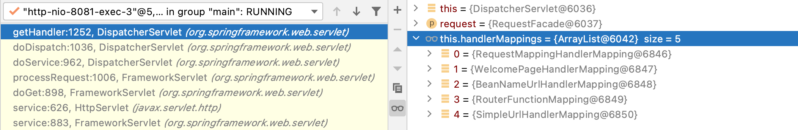
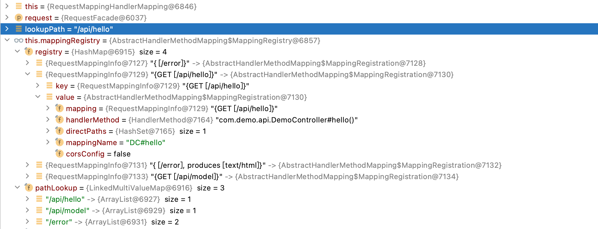
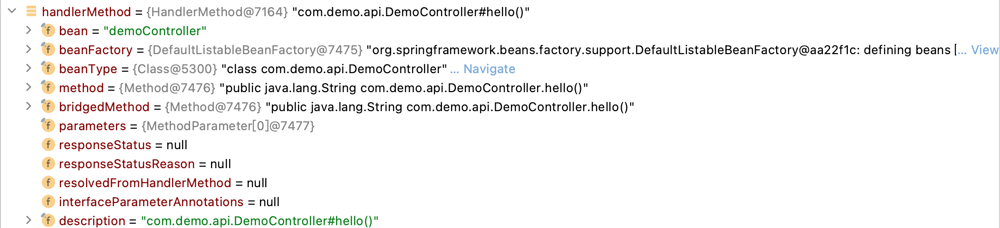
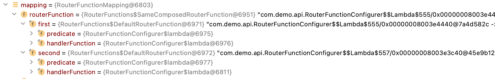
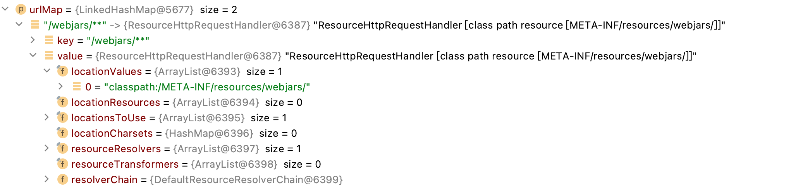
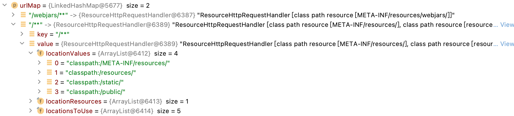
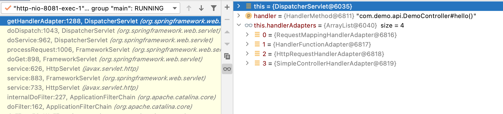
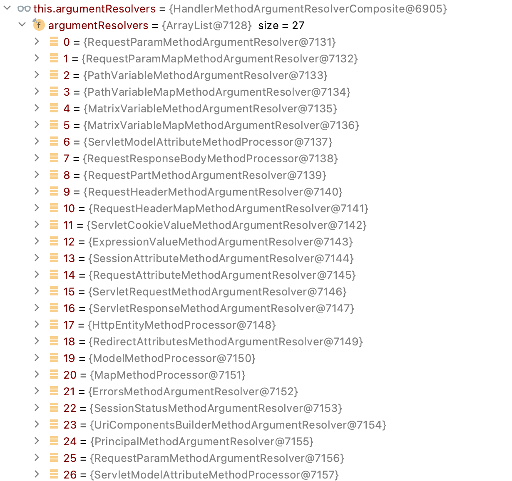
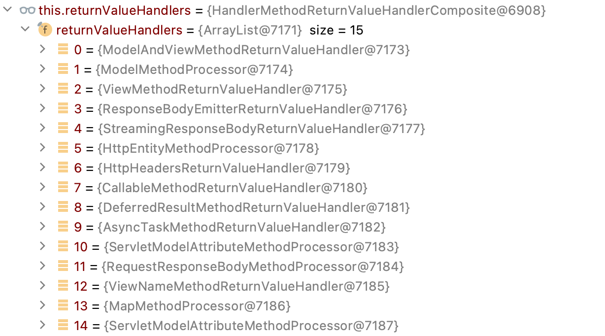

# SpringMVC 请求处理流程

* [一、获取Handler](#一、获取Handler)
	* [1.RequestMappingHandlerMapping](#1.RequestMappingHandlerMapping)
	* [2.BeanNameUrlHandlerMapping](#2.BeanNameUrlHandlerMapping)
	* [3.RouterFunctionMapping](#3.RouterFunctionMapping)
	* [4.SimpleUrlHandlerMapping](#4.SimpleUrlHandlerMapping)
* [二、获取Handler适配器](#二、获取Handler适配器)
	* [1.RequestMappingHandlerAdapter](#1.RequestMappingHandlerAdapter)
	* [2.HandlerFunctionAdapter](#2.HandlerFunctionAdapter)
	* [3.HttpRequestHandlerAdapter](#3.HttpRequestHandlerAdapter)
	* [4.SimpleControllerHandlerAdapter](#4.SimpleControllerHandlerAdapter)
* [三、Handler处理](#三、Handler处理)
	* [1.HandlerIntercetor预处理](#1.HandlerIntercetor预处理)
	* [2.RequestMappingHandlerAdapter处理](#2.RequestMappingHandlerAdapter处理)
		* [方法参数处理](#方法参数处理)
		* [返回值处理器](#返回值处理器)
	* [3.HandlerFunctionAdapter](#3.HandlerFunctionAdapter)
	* [4.HttpRequestHandlerAdapter](#4.HttpRequestHandlerAdapter)
	* [5.HandlerInterceptor后置处理](#5.HandlerInterceptor后置处理)

## 一、获取Handler

```java
// DispatcherServlet.java
protected void doDispatch(HttpServletRequest request, HttpServletResponse response) throws Exception {
    // ...
    mappedHandler = getHandler(processedRequest);
    // ...
}
```

从所有的`handlerMapping`中查找

```java
@Nullable
private List<HandlerMapping> handlerMappings;

@Nullable
protected HandlerExecutionChain getHandler(HttpServletRequest request) throws Exception {
    if (this.handlerMappings != null) {
        for (HandlerMapping mapping : this.handlerMappings) {
            HandlerExecutionChain handler = mapping.getHandler(request);
            if (handler != null) {
                return handler;
            }
        }
    }
    return null;
}
```

`getHandler`返回一个请求执行链`HandlerExecutionChain`, 请求执行链封装一个`handler`和若干`handlerInterceptor`. `handler`是请求处理器, `HandlerInterceptor`是请求拦截器, 在请求执行前、后、完成执行某些动作.

```java
public interface HandlerMapping {
    @Nullable
    HandlerExecutionChain getHandler(HttpServletRequest request) throws Exception;
}

public class HandlerExecutionChain {
	private final Object handler;
	private final List<HandlerInterceptor> interceptorList = new ArrayList<>();
}

public interface HandlerInterceptor {
    // 前
    default boolean preHandle(HttpServletRequest request, HttpServletResponse response, Object handler)
			throws Exception {
		return true;
	}
    // 后
	default void postHandle(HttpServletRequest request, HttpServletResponse response, Object handler,
			@Nullable ModelAndView modelAndView) throws Exception {
	}

    // 异常或完成
	default void afterCompletion(HttpServletRequest request, HttpServletResponse response, Object handler,
			@Nullable Exception ex) throws Exception {
	}
}
```

`HandlerMapping`的抽象实现中, getHandlerInternal(request)交给子类实现; 之后, 
```java
// AbstractHandlerMapping.java
@Override
@Nullable
public final HandlerExecutionChain getHandler(HttpServletRequest request) throws Exception {
    Object handler = getHandlerInternal(request);
    if (handler == null) {
        handler = getDefaultHandler();
    }
    if (handler == null) {
		return null;
	}
    // Bean name or resolved handler?
    if (handler instanceof String) {
        String handlerName = (String) handler;
        handler = obtainApplicationContext().getBean(handlerName);
    }

    HandlerExecutionChain executionChain = getHandlerExecutionChain(handler, request);
    // ...
    if (hasCorsConfigurationSource(handler) || CorsUtils.isPreFlightRequest(request)) {
        CorsConfiguration config = getCorsConfiguration(handler, request);
        // ...
        executionChain = getCorsHandlerExecutionChain(request, executionChain, config);
    }

    return executionChain;

}
```

当前有如下`HandlerMapping`:



### 1.RequestMappingHandlerMapping

```java
// AbstractHandlerMethodMapping.java
@Override
protected HandlerMethod getHandlerInternal(HttpServletRequest request) throws Exception {
    // 请求路径
    String lookupPath = initLookupPath(request);
    this.mappingRegistry.acquireReadLock();
    try {
        HandlerMethod handlerMethod = lookupHandlerMethod(lookupPath, request);
        return (handlerMethod != null ? handlerMethod.createWithResolvedBean() : null);
    }
    finally {
        this.mappingRegistry.releaseReadLock();
    }
}

```



```java
// AbstractHandlerMethodMapping.java
// 当前范型类型是RequestMappingInfo
protected HandlerMethod lookupHandlerMethod(String lookupPath, HttpServletRequest request) throws Exception {
    List<Match> matches = new ArrayList<>();
    // 先直接根据路径查找, 有没有匹配的RequestMappingInfo (@RequestMapping注解信息)
    List<T> directPathMatches = this.mappingRegistry.getMappingsByDirectPath(lookupPath);
    if (directPathMatches != null) {
        // 根据 requestMappingInfo中其它条件(请求方法, 消费条件, 生产条件) 决定是否加入到matches中
        addMatchingMappings(directPathMatches, matches, request);
    }
    if (matches.isEmpty()) {
        addMatchingMappings(this.mappingRegistry.getRegistrations().keySet(), matches, request);
    }

    if (!matches.isEmpty()) {
        // 寻找最佳匹配
        Match bestMatch = matches.get(0);
        if (matches.size() > 1) {
            Comparator<Match> comparator = new MatchComparator(getMappingComparator(request));
            matches.sort(comparator);
            bestMatch = matches.get(0);
        }
        // ...
        handleMatch(bestMatch.mapping, lookupPath, request);
		return bestMatch.getHandlerMethod();
    } else {
        // ....
    }
}

private void addMatchingMappings(Collection<T> mappings, List<Match> matches, HttpServletRequest request) {
    for (T mapping : mappings) {
        T match = getMatchingMapping(mapping, request);
        if (match != null) {
            matches.add(new Match(match, this.mappingRegistry.getRegistrations().get(mapping)));
        }
    }
}
```

```java
// RequestMappingHandlerMapping.java
@Override
protected RequestMappingInfo getMatchingMapping(RequestMappingInfo info, HttpServletRequest request) {
    return info.getMatchingCondition(request);
}
```

接下来看下`RequestMappingInfo`是如何匹配的

```java
public RequestMappingInfo getMatchingCondition(HttpServletRequest request) {
    // 请求方法
    RequestMethodsRequestCondition methods = this.methodsCondition.getMatchingCondition(request);
    if (methods == null) {
        return null;
    }
    // ...
    // 参数 ParamsRequestCondition
    // 请求头 HeadersRequestCondition
    // 消费 ConsumesRequestCondition
    // 生产 ProducesRequestCondition
    // PathPatternsRequestCondition  path/value
    // PatternsRequestCondition
    // 自定义 RequestConditionHolder 
     
    return new RequestMappingInfo(this.name, pathPatterns, patterns,
            methods, params, headers, consumes, produces, custom, this.options);
}
```

和@RequestMapping注解的信息一一对应

```java
@Mapping
public @interface RequestMapping {
    String[] value() default {};
    String[] path() default {};
    RequestMethod[] method() default {};
    String[] params() default {};
    String[] headers() default {};
    String[] consumes() default {};
    String[] produces() default {};
}
```

之后返回`Handler`如下:



### 2.BeanNameUrlHandlerMapping

BeanNameUrlHandlerMapping会在容器启动时, 将所有Bean名或别名以`/`开头的Bean名注册进来. 获取handler时, 如果请求的url能够命中, 则该bean名在容器对应的Bean实例
```java
// BeanNameUrlHandlerMapping.java
protected String[] determineUrlsForHandler(String beanName) {
    List<String> urls = new ArrayList<>();
    if (beanName.startsWith("/")) {
        urls.add(beanName);
    }
    String[] aliases = obtainApplicationContext().getAliases(beanName);
    for (String alias : aliases) {
        if (alias.startsWith("/")) {
            urls.add(alias);
        }
    }
    return StringUtils.toStringArray(urls);
}

// AbstractDetectingUrlHandlerMapping.java
protected void detectHandlers() throws BeansException {
    ApplicationContext applicationContext = obtainApplicationContext();
    String[] beanNames = (this.detectHandlersInAncestorContexts ?
            BeanFactoryUtils.beanNamesForTypeIncludingAncestors(applicationContext, Object.class) :
            applicationContext.getBeanNamesForType(Object.class));

    // Take any bean name that we can determine URLs for.
    for (String beanName : beanNames) {
        String[] urls = determineUrlsForHandler(beanName);
        if (!ObjectUtils.isEmpty(urls)) {
            // URL paths found: Let's consider it a handler.
            registerHandler(urls, beanName);
        }
    }
}
```

### 3.RouterFunctionMapping

从当前routerFunction中路由, 找到符合(predicate的test方法返回true)的HandlerFunction

```java
@Nullable
@Override
protected Object getHandlerInternal(HttpServletRequest servletRequest) throws Exception {
  if (this.routerFunction != null) {
    ServerRequest request = ServerRequest.create(servletRequest, this.messageConverters);
    setAttributes(servletRequest, request);
    return this.routerFunction.route(request).orElse(null);
  }
  else {
    return null;
  }
}
```



### 4.SimpleUrlHandlerMapping

SimpleUrlHandlerMapping用来处理静态资源, 初始化时将处理器(HttpRequestHandler)注册至`urlMap`中

```java
// WebMvcConfigurationSupport.java
@Bean
@Nullable
public HandlerMapping resourceHandlerMapping(
        @Qualifier("mvcContentNegotiationManager") ContentNegotiationManager contentNegotiationManager,
        @Qualifier("mvcConversionService") FormattingConversionService conversionService,
        @Qualifier("mvcResourceUrlProvider") ResourceUrlProvider resourceUrlProvider) {
    PathMatchConfigurer pathConfig = getPathMatchConfigurer();

    ResourceHandlerRegistry registry = new ResourceHandlerRegistry(this.applicationContext,
            this.servletContext, contentNegotiationManager, pathConfig.getUrlPathHelper());
    addResourceHandlers(registry);

    AbstractHandlerMapping handlerMapping = registry.getHandlerMapping();

    // ...
}

@Nullable
@SuppressWarnings("deprecation")
protected AbstractHandlerMapping getHandlerMapping() {
    if (this.registrations.isEmpty()) {
        return null;
    }

    Map<String, HttpRequestHandler> urlMap = new LinkedHashMap<>();
    for (ResourceHandlerRegistration registration : this.registrations) {
        for (String pathPattern : registration.getPathPatterns()) {
            ResourceHttpRequestHandler handler = registration.getRequestHandler();
            if (this.pathHelper != null) {
                handler.setUrlPathHelper(this.pathHelper);
            }
            if (this.contentNegotiationManager != null) {
                handler.setContentNegotiationManager(this.contentNegotiationManager);
            }
            handler.setServletContext(this.servletContext);
            handler.setApplicationContext(this.applicationContext);
            try {
                handler.afterPropertiesSet();
            }
            catch (Throwable ex) {
                throw new BeanInitializationException("Failed to init ResourceHttpRequestHandler", ex);
            }
            urlMap.put(pathPattern, handler);
        }
    }

    return new SimpleUrlHandlerMapping(urlMap, this.order);
}
```

如下是两个静态资源处理器, 第一个用于处理jar包中的静态资源, 第二个匹配任意请求




## 二、获取Handler适配器

```java
// DispatcherServlet.java
protected void doDispatch(HttpServletRequest request, HttpServletResponse response) throws Exception {
    // ...
    mappedHandler = getHandler(processedRequest);
    // ...
    
    // Determine handler adapter for the current request.
	HandlerAdapter ha = getHandlerAdapter(mappedHandler.getHandler());

    // ...
}

protected HandlerAdapter getHandlerAdapter(Object handler) throws ServletException {
    if (this.handlerAdapters != null) {
        for (HandlerAdapter adapter : this.handlerAdapters) {
            if (adapter.supports(handler)) {
                return adapter;
            }
        }
    }
    throw new ServletException("No adapter for handler [" + handler +
            "]: The DispatcherServlet configuration needs to include a HandlerAdapter that supports this handler");
}
```

```java
public interface HandlerAdapter {
	boolean supports(Object handler);

	@Nullable
	ModelAndView handle(HttpServletRequest request, HttpServletResponse response, Object handler) throws Exception;
}
```

当前有如下`HandlerAdapter`:




### 1.RequestMappingHandlerAdapter

```java
// AbstractHandlerMethodAdapter.java
@Override
public final boolean supports(Object handler) {
    return (handler instanceof HandlerMethod && supportsInternal((HandlerMethod) handler));
}
```

### 2.HandlerFunctionAdapter

```java
// HandlerFunctionAdapter.java
@Override
public boolean supports(Object handler) {
    return handler instanceof HandlerFunction;
}
```

```java
@FunctionalInterface
public interface HandlerFunction<T extends ServerResponse> {
	T handle(ServerRequest request) throws Exception;
}
```

### 3.HttpRequestHandlerAdapter

```java
// HttpRequestHandlerAdapter.java
@Override
public boolean supports(Object handler) {
    return (handler instanceof HttpRequestHandler);
}
```

```java
@FunctionalInterface
public interface HttpRequestHandler {
	void handleRequest(HttpServletRequest request, HttpServletResponse response)
			throws ServletException, IOException;
}
```

### 4.SimpleControllerHandlerAdapter

```java
// SimpleControllerHandlerAdapter.java
@Override
public boolean supports(Object handler) {
    return (handler instanceof Controller);
}
```

```java
@FunctionalInterface
public interface Controller {
	@Nullable
	ModelAndView handleRequest(HttpServletRequest request, HttpServletResponse response) throws Exception;
}
```

## 三、Handler处理

```java
// 
// DispatcherServlet.java
protected void doDispatch(HttpServletRequest request, HttpServletResponse response) throws Exception {
    // ...
    mappedHandler = getHandler(processedRequest);
    // ...
    
    // Determine handler adapter for the current request.
	HandlerAdapter ha = getHandlerAdapter(mappedHandler.getHandler());

    // ...
    if (!mappedHandler.applyPreHandle(processedRequest, response)) {
		return;
	}

    // Actually invoke the handler.
    mv = ha.handle(processedRequest, response, mappedHandler.getHandler());

    //...
    
    mappedHandler.applyPostHandle(processedRequest, response, mv);
}
```

### 1.HandlerIntercetor预处理

```java
// HandlerExecutionChain.java
boolean applyPreHandle(HttpServletRequest request, HttpServletResponse response) throws Exception {
    for (int i = 0; i < this.interceptorList.size(); i++) {
        HandlerInterceptor interceptor = this.interceptorList.get(i);
        if (!interceptor.preHandle(request, response, this.handler)) {
            triggerAfterCompletion(request, response, null);
            return false;
        }
        this.interceptorIndex = i;
    }
    return true;
}
```

### 2.RequestMappingHandlerAdapter处理

RequestMappingHandlerAdapter用来适配HandlerMethod

```java
// RequestMappingHandlerAdapter.java
@Override
protected ModelAndView handleInternal(HttpServletRequest request,
        HttpServletResponse response, HandlerMethod handlerMethod) throws Exception {
    // ...
    mav = invokeHandlerMethod(request, response, handlerMethod);
    // ...
    return mav;
}

protected ModelAndView invokeHandlerMethod(HttpServletRequest request,
			HttpServletResponse response, HandlerMethod handlerMethod) throws Exception {
    // ...
    ServletInvocableHandlerMethod invocableMethod = createInvocableHandlerMethod(handlerMethod);

    // 参数处理器
	if (this.argumentResolvers != null) {
		invocableMethod.setHandlerMethodArgumentResolvers(this.argumentResolvers);
	}
    // 返回值处理器
    if (this.returnValueHandlers != null) {
		invocableMethod.setHandlerMethodReturnValueHandlers(this.returnValueHandlers);
	}

    // ...

    // 调用
    invocableMethod.invokeAndHandle(webRequest, mavContainer);

    // ...
    return getModelAndView(mavContainer, modelFactory, webRequest);
}
```

#### 方法参数处理

```java
// InvocableHandlerMethod.java
protected Object[] getMethodArgumentValues(NativeWebRequest request, @Nullable ModelAndViewContainer mavContainer,
			Object... providedArgs) throws Exception {

    MethodParameter[] parameters = getMethodParameters();
    if (ObjectUtils.isEmpty(parameters)) {
        return EMPTY_ARGS;
    }

    Object[] args = new Object[parameters.length];
    for (int i = 0; i < parameters.length; i++) {
        MethodParameter parameter = parameters[i];
        parameter.initParameterNameDiscovery(this.parameterNameDiscoverer);
        args[i] = findProvidedArgument(parameter, providedArgs);
        if (args[i] != null) {
            continue;
        }
        // 能否处理
        if (!this.resolvers.supportsParameter(parameter)) {
            throw new IllegalStateException(formatArgumentError(parameter, "No suitable resolver"));
        }
        try {
            // 参数处理
            args[i] = this.resolvers.resolveArgument(parameter, mavContainer, request, this.dataBinderFactory);
        }
        catch (Exception ex) {
            // ...
        }
    }
    return args;
}
```

默认有如下方法参数处理器
```java
// RequestMappingHandlerAdapter.java
private List<HandlerMethodArgumentResolver> getDefaultArgumentResolvers() {
    	List<HandlerMethodArgumentResolver> resolvers = new ArrayList<>(30);

		// Annotation-based argument resolution 基于注解
		resolvers.add(new RequestParamMethodArgumentResolver(getBeanFactory(), false));
		resolvers.add(new RequestParamMapMethodArgumentResolver());
        // ....

        // Type-based argument resolution 基于类型
		resolvers.add(new ServletRequestMethodArgumentResolver());
        // ...

        // Custom arguments 自定义
		if (getCustomArgumentResolvers() != null) {
			resolvers.addAll(getCustomArgumentResolvers());
		}

        // ...
}
```

 

```java
public interface HandlerMethodArgumentResolver {

	boolean supportsParameter(MethodParameter parameter);

	@Nullable
	Object resolveArgument(MethodParameter parameter, @Nullable ModelAndViewContainer mavContainer,
			NativeWebRequest webRequest, @Nullable WebDataBinderFactory binderFactory) throws Exception;
}
```

```java
// 基于注解处理
RequestParamMethodArgumentResolver          处理@RequestParam
RequestParamMapMethodArgumentResolver       处理@RequestParam 标注的Map, MultiValueMap(多值Map, 其实是Map<String, List<String>>)

PathVariableMethodArgumentResolver          处理@Pathvariable
PathVariableMapMethodArgumentResolver       处理@Pathvariable 标注的Map

ServletModelAttributeMethodProcessor(false) 处理@ModelAttribute model.get(name)

RequestResponseBodyMethodProcessor          处理@RequestBody

RequestHeaderMethodArgumentResolver         处理@RequestHeader
RequestHeaderMapMethodArgumentResolver      处理@RequestHeader标注的Map, MultiValueMap(多值Map, 其实是Map<String, List<String>>)

ServletCookieValueMethodArgumentResolver    处理@CookieValue

ExpressionValueMethodArgumentResolver       处理@Value

SessionAttributeMethodArgumentResolver      处理@Session
RequestAttributeMethodArgumentResolver      处理@RequestAttribute

// 基于类型处理
ServletRequestMethodArgumentResolver        处理WebRequest、ServletRequest、HttpSession、InputStream、Reader等
ServletResponseMethodArgumentResolver       处理ServletResponse、OutputStream, Writer
HttpEntityMethodProcessor                   处理HttpEntity, RequestEntity
ModelMethodProcessor                        处理Model
MapMethodProcessor                          处理无注解的Map, 返回的是容器的model
SessionStatusMethodArgumentResolver         处理SessionStatus, 返回的是mavContainer.getSessionStatus()

// Catch-all 包罗万象?
RequestParamMethodArgumentResolver(true)    不要求@RequestParam, 处理普通属性 (BeanUtils.isSimpleProperty())
ServletModelAttributeMethodProcessor(true)  不要求@ModelAttribute, 处理POJO类型参数 (!BeanUtils.isSimpleProperty())
```

POJO参数处理

```java
// ModelAttributeMethodProcessor.java    
@Override
public boolean supportsParameter(MethodParameter parameter) {
    return (parameter.hasParameterAnnotation(ModelAttribute.class) ||
        // 非简单属性
        (this.annotationNotRequired && !BeanUtils.isSimpleProperty(parameter.getParameterType())));
}

public final Object resolveArgument(MethodParameter parameter, @Nullable ModelAndViewContainer mavContainer,
    NativeWebRequest webRequest, @Nullable WebDataBinderFactory binderFactory) throws Exception {
    // Create attribute instance
    try {
        attribute = createAttribute(name, parameter, binderFactory, webRequest);
    }
    // ...
    WebDataBinder binder = binderFactory.createBinder(webRequest, attribute, name);
    if (binder.getTarget() != null) {
        if (!mavContainer.isBindingDisabled(name)) {
            // 参数绑定
            bindRequestParameters(binder, webRequest);
        }
    }
}

// ModelAttributeMethodProcessor.java
protected Object createAttribute(String attributeName, MethodParameter parameter,
        WebDataBinderFactory binderFactory, NativeWebRequest webRequest) throws Exception {

    MethodParameter nestedParameter = parameter.nestedIfOptional();
    Class<?> clazz = nestedParameter.getNestedParameterType();
    // 对象构造器
    Constructor<?> ctor = BeanUtils.getResolvableConstructor(clazz);
    Object attribute = constructAttribute(ctor, attributeName, parameter, binderFactory, webRequest);
    if (parameter != nestedParameter) {
        attribute = Optional.of(attribute);
    }
    return attribute;
}
```

#### 返回值处理器

```java
// ServletInvocableHandlerMethod.java
public void invokeAndHandle(ServletWebRequest webRequest, ModelAndViewContainer mavContainer,
	    Object... providedArgs) throws Exception {
    
    // 处理器方法返回
    Object returnValue = invokeForRequest(webRequest, mavContainer, providedArgs);
    // ...
    // 返回值处理器处理返回值
	this.returnValueHandlers.handleReturnValue(returnValue, getReturnValueType(returnValue), 
        mavContainer, webRequest);
    // ...
}
```

默认有如下返回值处理器

```java
// RequestMappingHandlerAdapter.java
private List<HandlerMethodReturnValueHandler> getDefaultReturnValueHandlers() {
	
    // Single-purpose return value types
	handlers.add(new ModelAndViewMethodReturnValueHandler());
	handlers.add(new ModelMethodProcessor());
    // ...

    // Annotation-based return value types
	handlers.add(new ServletModelAttributeMethodProcessor(false));
    // ...

    // Multi-purpose return value types
	handlers.add(new ViewNameMethodReturnValueHandler());
	handlers.add(new MapMethodProcessor());

    // Custom return value types
	if (getCustomReturnValueHandlers() != null) {
		handlers.addAll(getCustomReturnValueHandlers());
	}

    // ...
}
```

```java
public interface HandlerMethodReturnValueHandler {

    boolean supportsReturnType(MethodParameter returnType);
    
    void handleReturnValue(@Nullable Object returnValue, MethodParameter returnType,
			ModelAndViewContainer mavContainer, NativeWebRequest webRequest) throws Exception;
}
```

 

 ```java
// Single-purpose
ModelAndViewMethodReturnValueHandler        处理ModelAndView, 将其相关值设置到mavContainer中
ModelMethodProcessor                        处理Model, 值添加到mavContainer中model的属性中
ViewMethodReturnValueHandler                处理View, 设置到mavContainer中
ResponseBodyEmitterReturnValueHandler       处理ResponseBodyEmitter, Reactive相关 TODO 有时间在看
StreamingResponseBodyReturnValueHandler     处理StreamingResponseBody
HttpEntityMethodProcessor                   处理HttpEntity, RequestEntity
HttpHeadersReturnValueHandler               处理HttpHeadersReturnValueHandler
CallableMethodReturnValueHandler            异步 处理Callable
DeferredResultMethodReturnValueHandler      异步 处理DeferredResult, ListenableFuture, CompletionStage
AsyncTaskMethodReturnValueHandler           异步 处理WebAsyncTask

// 基于注解
ServletModelAttributeMethodProcessor        处理@ModelAttribute
RequestResponseBodyMethodProcessor          处理@ResponseBody

// Multi-purpose
ViewNameMethodReturnValueHandler            处理void(无返回值), String 做为mavContainer的viewName
MapMethodProcessor                          处理Map, 和Model处理类型

// Catch-all
ServletModelAttributeMethodProcessor(true)  不要求@ModelAttribute, 将对象放入mavContainer中 (!BeanUtils.isSimpleProperty())
 ```

### 3.HandlerFunctionAdapter

HandlerFunctionAdapter用来适配HandlerFunction, 处理流程比较简单, 执行handle方法, 响应结果写入到servletResponse

```java
@Nullable
@Override
public ModelAndView handle(HttpServletRequest servletRequest,
        HttpServletResponse servletResponse,
        Object handler) throws Exception {
    // 异步相关处理
    // ...

    HandlerFunction<?> handlerFunction = (HandlerFunction<?>) handler;
    serverResponse = handlerFunction.handle(serverRequest);
    
    if (serverResponse != null) {
        return serverResponse.writeTo(servletRequest, servletResponse, new ServerRequestContext(serverRequest));
    }
    else {
        return null;
    }
}
```

### 4.HttpRequestHandlerAdapter

处理流程比较简单, 直接执行handler的handleRequest方法

```java
// HttpRequestHandlerAdapter.java
public ModelAndView handle(HttpServletRequest request, HttpServletResponse response, Object handler)
    throws Exception {
    ((HttpRequestHandler) handler).handleRequest(request, response);
    return null;
}
```

### 5.HandlerInterceptor后置处理

回调所有HandlerInterceptor的postHandle方法

```java
// HandlerExecutionChain.java
void applyPostHandle(HttpServletRequest request, HttpServletResponse response, @Nullable ModelAndView mv)
        throws Exception {

    for (int i = this.interceptorList.size() - 1; i >= 0; i--) {
        HandlerInterceptor interceptor = this.interceptorList.get(i);
        interceptor.postHandle(request, response, this.handler, mv);
    }
}
```